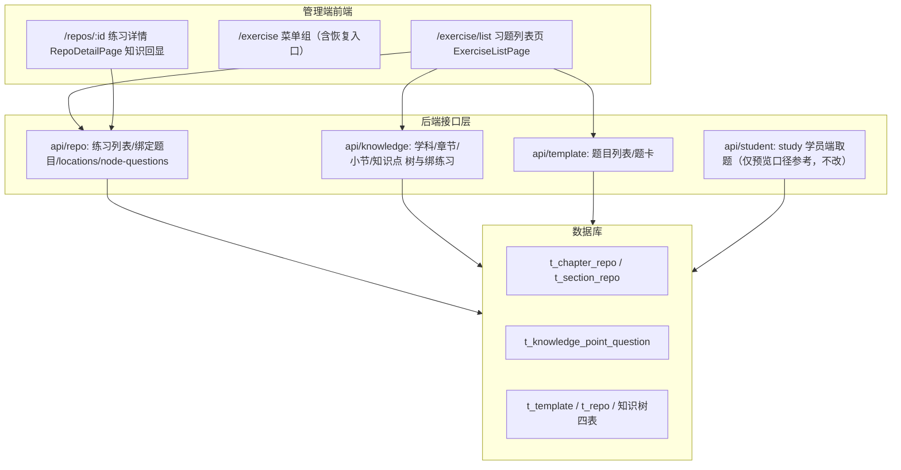

# 习题列表（知识树×练习）技术设计

Feature Name: exercise-list-knowledge-tree
Updated: 2026-09-07

## Description

将管理端「习题管理 → 习题列表」（/exercise/list）从空白占位建设为**按知识树组织的练习/题目总览页**，并恢复 2026-09-03 菜单重构（37ff6af）中误摘的真实功能入口。

知识组织采用四级：学科 → 章节（t_chapter）→ 小节（t_section）→ 知识点（t_knowledge_point）。练习（t_repo）通过 t_chapter_repo / t_section_repo 挂到章节/小节；题目（t_template）通过 t_knowledge_point_question 直挂知识点，并经 t_template.repo_id 归属练习（单值）。学员端取题语义：小节刷题 = 该节绑练习全部题目；知识点刷题 = 知识点直绑题目；订单权限在学员端过滤。

本特性只在管理端新增总览/绑定维护/预览能力并恢复入口，不改学员端取题与鉴权语义、不新增关系表，绑定写库复用既有接口。

## Architecture

数据流（节点绑定练习全量替换）：
`习题列表页选节点 → 弹窗勾选练习 → saveChapterRepos/saveSectionRepos（既有） → 刷新节点练习列表（listRepos 已补 total）与题量`。

数据流（预览学员端刷题内容）：
`习题列表页选节点 → node-questions(nodeType,nodeId) → 服务端聚合模板 → 题卡列表（可选带答案）`。

## Components and Interfaces

### 前端

- **ExerciseListPage.jsx（重写，原占位页替换）**
  - 左栏：学科/章节/小节/知识点四级目录树（含每层题量与绑定数徽标）。
  - 右栏：当前节点面板——章节/小节：绑定练习表（名称、题量、类型、操作：进详情组题 / 解绑 / 绑定练习）；知识点：直绑题目表（题干摘要、题型、难度、操作：移除 / 绑定题目）。面板顶部提供「预览学员端题目」。
  - URL 定位参数：`/exercise/list?subjectId=&chapterId=&sectionId=&kpId=`（回显/跨页跳转）。
  - 依赖接口：listSubjects、listChapters({subjectId})（前端按 grade 归组）、listSections({chapterId})、listKnowledgePoints({sectionId})、listChapterRepos / listSectionRepos、saveChapterRepos / saveSectionRepos、saveKnowledgePointQuestions / listKnowledgePointQuestions、node-questions、listRepo。
- **MainLayout.jsx**：习题管理组下恢复「练习列表 /repos」「练习分配 /repo-assign」「错题管理 /wrong-questions」「在线练习 /practice」入口；删除指向占位页的「错题管理 /exercise/wrong-book」。
- **App.jsx**：注册 `/exercise/list` 路由（AuthGuard，repo 权限），清理未用 import（ExerciseListPage 原占位、WrongBookPage）。
- **WrongBookPage.jsx**：占位页删除（错题管理指向已实现的 /wrong-questions）。
- **RepoDetailPage.jsx**：调用 locations 反查接口，详情区展示绑定章节/小节（含学科年级），点击跳 `/exercise/list?chapterId=` 定位。

### 后端

- **GET /api/repo/locations?repoId=**（新增，RepoApi/RepoServiceImpl）
  - 按 t_chapter_repo / t_section_repo 反查该练习绑定位置，返回绑定的章节/小节信息（nodeId、名称、grade、term、subjectId、父章节名）。
  - 权限：repo:list / repo:detail 其一。
- **GET /api/repo/node/questions?nodeType=chapter|section|knowledgePoint&nodeId=&withAnswer=**（新增）
  - 聚合语义（与学员端一致）：
    - section：该节绑练习的题目（t_template.repo_id ∈ section_repo.repo_ids）∪ 该节下各知识点直绑题（并集去重）。
    - knowledgePoint：t_knowledge_point_question 直绑题。
    - chapter：该章直接绑练习 + 下属各小节绑练习的全部题目 ∪ 全章知识点直绑题（并集去重，整章汇总预览）。
  - withAnswer=true 时题卡附带正确答案与解析；默认 false。
  - 题目上限 100，按创建时间倒序。
- **listRepos(chapterId/sectionId) 补题量**：两处实现由 `repoViewMapper.toView` 结果补 `total`（Template.repo_id ∈ repo_ids 分组计数），返回 RepoView.total 供绑定练习表直接展示题量。向后兼容（既有页面不感知新增字段）。

## Data Models

无新表。新增查询不影响既有写路径。绑定写库语义（全量替换）沿用：
- 章节：saveChapterRepos({chapterId, repoIds}) → 清 t_chapter_repo 后重插。
- 小节：saveSectionRepos({sectionId, repoIds}) → 清 t_section_repo 后重插。
- 知识点：saveKnowledgePointQuestions({knowledgePointId, questionIds}) → 清 t_knowledge_point_question 后重插。
- 练习-题目：repo.bind/unbind 仅改 t_template.repo_id（题目单归属练习）。

## Correctness Properties

1. 页面展示的节点题量口径 = 学员端取题口径（练习题目 + 知识点直绑题目并集）。
2. 绑定保存全量替换事务内完成，成功后接口返回即与库一致；失败不产生部分写入。
3. 题目单归属练习（t_template.repo_id 单值）约束不被习题列表页破坏——本页只绑定练习到节点，不改题-练习归属。
4. 管理端预览不受管理员学员订单权限过滤（管理端无学员身份），但须复用学员端同一节点取题语义。
5. 菜单恢复后不残留指向占位页的路径；/exercise/list 唯一对应本页。

## Error Handling

| 场景 | 处理 |
|---|---|
| 节点绑定练习保存失败 | 弹出后端业务 message，保持弹窗打开并回显原勾选 |
| 预览节点无任何绑定题目 | 空态提示「该节点暂无绑定练习/题目，请先绑定」 |
| locations 反查无结果 | 练习详情显示空态「该练习尚未绑定到章节/小节」 |
| 定位参数指向已删除节点 | 页面忽略参数渲染学科列表，给出轻提示 |
| 未具备 repo 权限 | 路由 AuthGuard 拦截跳登录/无权限提示 |

## Test Strategy

- 后端：curl 走查 4 接口（章节/小节/知识点绑练习回显带 total、locations、node-questions 三种 nodeType + withAnswer）。
- 前端：`npm run build` + `npx oxlint`。
- 端到端：知识管理新增小节并绑练习 → 习题列表页该小节题量/预览正确 → 练习详情回显该小节 → 学员端（真实数据）按小节刷出同一批题；知识点直绑题在小节预览与知识点预览中均出现且不重复。
- 回归：/repos 练习列表与详情组题不受影响；知识管理章/节绑定弹窗回显正常。

## References

- (requirement) 本目录 requirements.md
- (commit) 37ff6af 菜单重构摘除练习入口、新增空白占位页
- (File#L159) server/api/.../ChapterApi.java saveRepos/listRepos
- (File#L138) server/api/.../SectionApi.java saveRepos/listRepos
- (File#L146) server/api/.../KnowledgePointApi.java saveQuestions/listQuestions
- (File#L86) server/api/.../RepoApi.java bindTemplates/unbind
- (File#L451) server/rdbms/.../StudentServiceImpl.java studyQuestions 取题语义
