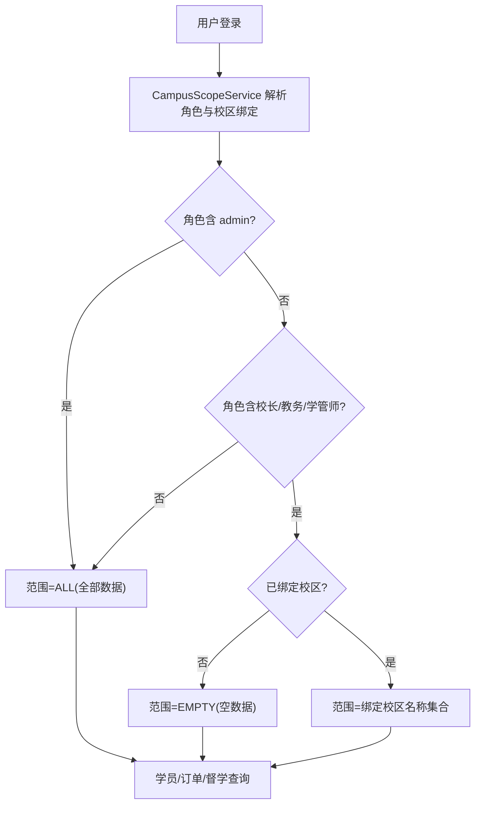

# 校区管理（2026-09-08）

Feature Name: campus-management
Updated: 2026-09-08

## Description

将 `行政管理-校区管理`（当前占位页 `/admin/campus`）实现为正式校区档案功能：校区以唯一名称标识（含启用/停用/备注）；校区名称是学员主数据 `t_student.campus` 的取值来源；员工账号（校长/教务/学管师）可绑定多校区，绑定校区构成其学员业务数据（学员管理/订单/督学）的可见范围。管理员与不受限角色全量可见；教师不参与。

范围约束（依据需求文档 R6）：不涉及学生端、内容域隔离、首页仪表盘过滤。

## Architecture



架构说明：新建独立 `CampusApi/CampusService` 负责校区档案 CRUD 与统计；新建 `CampusScopeService`（共享服务）解析当前账号数据范围；学员、订单、督学三个业务服务在查询与单对象访问处接入该范围过滤。校区下拉数据统一由校区接口提供，不再由前端写死。

## Components and Interfaces

### 后端

#### 1. CampusApi（新增，挂载 `api.prefix + /system/campus`）

| 接口 | 权限 | 说明 |
| --- | --- | --- |
| GET `/list` | `campus:list` | 返回当前账号可见校区（受数据范围约束，见 R3.7），每行含 `id,name,status,remark,studentCount` 及 `roleCounts{principal,consultant,academic}`（该校区引用学员数=studentCount、绑定三角色员工数） |
| POST `/create` | `campus:create` | 入参 `{name,status?,remark?}`，名称查重（存在即报错），状态默认启用 |
| POST `/update` | `campus:update` | 入参 `{id,name?,status?,remark?}`；改名时同事务同步 `t_student.campus`，保证引用学员跟随 |
| POST `/delete` | `campus:delete` | 仅当无引用学员且无绑定员工时物理删除（含清 `t_user_campus`）；否则拒绝并提示先停用 |
| GET `/options` | 见下 | 校区选择数据源：拥有 `campus:list` 或任一 `student:*`/`order:list`/`student:supervision`/`system:user:list` 权限即可调用；返回当前数据范围内校区 `[{id,name,status}]`，默认仅启用，`includeDisabled=true` 时含停用 |

#### 2. CampusScopeService（新增，共享服务）

- 输入：当前登录后台账号（沿用现有登录态/角色解析基础设施，如 `t_account`+`t_user_role`）。
- 输出：`Scope { mode: ALL | EMPTY | SCOPED, campusNames: Set<String> }`。
- 规则：
  1. 角色含 `admin` → ALL；
  2. 角色不含 `principal/consultant/academic` 任一 → ALL（教师、自定义普通角色不受限）；
  3. 否则按 `t_user_campus join t_campus` 取绑定校区名称：无绑定 → EMPTY；有绑定 → SCOPED（绑定集不含停用校区概念，停用校区仍留在范围内）。

#### 3. 业务服务接入点（过滤）

| 模块 | 位置（现状） | 做法 |
| --- | --- | --- |
| 学员管理 | `StudentServiceImpl` 列表查询、单学员访问/编辑/删除前校验、学员统计 | SCOPED：`campus IN (scope)`；EMPTY：恒空条件；单对象访问校验目标学员校区在范围内，否则拒绝 |
| 学员订单 | `OrderServiceImpl`（订单关联学员） | 按订单所属学员校区过滤（订单行本身若无校区字段则 join `t_student` 判定，实现时核实订单表实际关联键） |
| 督学 | `StudentSupervisionApi`/`StudentTaskApi` 及学币/活动等学员运营查询 | 按查询目标学员逐条（或批量 IN）校验学员校区在范围内 |

- 学员 `create/update` 时校区取值校验：新赋值必须为启用校区名称；更新时允许保留学员当前停用校区值（防重送当前值被拒）。
- 范围规则对所有入口一致；服务层强制，不依赖前端隐藏。

#### 4. 权限与角色授权

- `PermissionConsts` 新增权限点常量 `campus:list/create/update/delete` 及权限树分组（置于行政管理菜单对应分组），`RoleManagePage` 权限树自动读取。
- `init-h2.sql` 幂等收敛内置角色 `authority`：admin 增补 4 点；principal/academic/consultant 增补 `campus:list`（沿用现有「整串 UPDATE 覆盖」写法）。
- 菜单 `MainLayout.jsx`：`/admin/campus` 增加 `required:['campus:list']`。

### 前端

| 文件 | 改动 |
| --- | --- |
| `src/pages/admin/CampusManagePage.jsx` | 重写为校区表格（含状态 Tag、学员数/三角色员工数统计列）+ 新建/编辑 Modal + 启用/停用/删除操作；交互惯例参照 `system/DeptManagePage.jsx` |
| `src/api/campus.js` | 新增 `campus.js`（list/create/update/delete/options） |
| `src/pages/student/StudentManagePage.jsx` | 删除 `CAMPUS_OPTIONS` 写死常量；表单校区下拉与列表「按校区筛选」改由校区接口数据源驱动 |
| `src/pages/system/UserManagePage.jsx` | 角色包含校长/教务/学管师（需 `RoleView.code`，缺则补）时展示「校区」多选；保存/回显用户校区绑定 |
| `src/api/user.js` 及 `UserView/UserRequest` | `UserView` 增加 `campuses:[{id,name}]`；用户新增/编辑请求增加 `campusIds` |

### 数据模型

`init-h2.sql` 新增（仿 `t_dept` 风格字段）：

```sql
CREATE TABLE IF NOT EXISTS t_campus (
  id varchar(64) NOT NULL COMMENT 'ID',
  name varchar(50) NOT NULL COMMENT '校区名称(唯一)',
  status tinyint(1) NOT NULL DEFAULT '1' COMMENT '1启用 0停用',
  remark varchar(256) DEFAULT NULL COMMENT '备注',
  is_deleted tinyint(1) NOT NULL DEFAULT '0' COMMENT '是否删除',
  create_at timestamp NOT NULL DEFAULT CURRENT_TIMESTAMP COMMENT '创建时间',
  create_by varchar(256) DEFAULT NULL,
  update_at timestamp NULL DEFAULT NULL ON UPDATE CURRENT_TIMESTAMP COMMENT '更新时间',
  update_by varchar(256) DEFAULT NULL,
  PRIMARY KEY (id),
  CONSTRAINT uk_campus_name UNIQUE (name)
);

CREATE TABLE IF NOT EXISTS t_user_campus (
  id varchar(64) NOT NULL COMMENT 'ID',
  user_id varchar(64) NOT NULL COMMENT '员工用户ID',
  campus_id varchar(64) NOT NULL COMMENT '校区ID',
  create_at timestamp NOT NULL DEFAULT CURRENT_TIMESTAMP COMMENT '创建时间',
  create_by varchar(256) DEFAULT NULL,
  update_at timestamp NULL DEFAULT NULL ON UPDATE CURRENT_TIMESTAMP COMMENT '更新时间',
  update_by varchar(256) DEFAULT NULL,
  PRIMARY KEY (id)
);
CREATE INDEX IF NOT EXISTS idx_user_campus_user ON t_user_campus (user_id);
CREATE INDEX IF NOT EXISTS idx_user_campus_campus ON t_user_campus (campus_id);
```

- 实体仿 `Dept/Position`（`cn.wisestar.server.domain.model`）新增 `Campus`；`UserCampus` 仿 `UserPosition`。
- `t_student.campus` 列语义不变（存校区名称），不改表结构、不改 `StudentApi` 出入参，兼容既有学生端与管理端字段契约。

## Design Decisions

1. **校区引用用名称文本而非 ID**：`t_student.campus` 为既有占位文本列且已有多处契约使用，本次不改列；通过「名称全局唯一 + 改名事务同步学员引用」保证一致性，改动面最小。校区删除仅允许零引用。
2. **校区列表页本身受数据范围约束**：三角色只看到自己绑定校区行（含停用），避免其从列表统计推断其它校区规模；管理员全量。
3. **停用=软下线**：停用校区保留历史学员、绑定与数据权限；仅阻止作为新学员取值。
4. **数据权限服务层强制**：过滤同时在列表 SQL 与单对象访问执行，防止按 ID 直取越权；不依赖前端。
5. **教师与自定义普通角色不受校区隔离**：仅校长/教务/学管师三类内置角色参与（需求口径），避免影响现有教师工作流。

## Correctness Properties

1. 校区名称全局唯一；重名创建/改名被拒。
2. 改名（`t_campus.name` 与引用学员 `t_student.campus`）同事务提交；任一步失败整体回滚。
3. SCOPED/EMPTY 账号对范围外学员数据（列表/详情/订单/督学）访问恒被拒。
4. EMPTY 账号列表恒空、单对象恒被拒。
5. 停用校区：不出现于新学员可选列表；出现于数据范围（含校区列表）与历史展示。
6. 删除校区仅在零引用时允许，且同事务清理 `t_user_campus` 绑定。

## Error Handling

| 场景 | 处理 |
| --- | --- |
| 创建/改名重名 | 业务异常提示「校区名称已存在」，不落库 |
| 删除有引用校区 | 提示「校区下存在学员或绑定员工，请先停用」 |
| 学员赋值不存在/已停用校区（新赋值） | 提示「校区不存在或已停用」，拒绝保存 |
| SCOPED/EMPTY 账号访问范围外数据 | 与未授权一致：列表过滤、单对象返回无权限异常 |
| 用户保存校区绑定但用户无三类角色 | 静默忽略绑定并清空该字段（提示可选项，不阻断保存） |

## Test Strategy

1. **后端单测/接口自测（curl 三账号矩阵）**：admin、绑定校区的学管师/教务/校长（各造 1-2 校区）、未绑定三角色账号、教师账号；核对学员/订单/督学列表与单对象访问的过滤/越权拦截。
2. **校区 CRUD 规则**：重名拒绝、改名后学员引用同步、停用后新学员不可选且历史可见、删除有引用被拒。
3. **绑定管理**：用户新增/编辑多校区保存与清空、无三类角色账号字段隐藏。
4. **前端冒烟**：校区管理增删改启停、学员表单下拉与校区筛选、用户管理校区多选回显、三角色账号登录后仅见自己校区菜单与数据。
5. **构建回归**：后端 `mvn install`+`package`、前端 `npm run build` 通过；预览环境按角色实测。

## References

- 需求规格：`.monkeycode/specs/2026-09-08-campus-management/requirements.md`
- 占位页：`wisestar-client/src/pages/admin/CampusManagePage.jsx`
- 学员校区占位字段：`server/rdbms/src/main/java/cn/wisestar/server/domain/model/Student.java`（`campus`，注释「本迭代仅占位」）
- 权限权威清单：`server/shared/src/main/java/cn/wisestar/server/core/constant/PermissionConsts.java`
- 角色种子/内置角色收敛：`server/rdbms/src/main/resources/scripts/init-h2.sql`（`t_role` 段）
- 用户管理/部门管理参照：`wisestar-client/src/pages/system/UserManagePage.jsx`、`DeptManagePage.jsx`
- 学员订单/督学接口：`server/api/.../api/OrderApi.java`、`StudentSupervisionApi.java`
