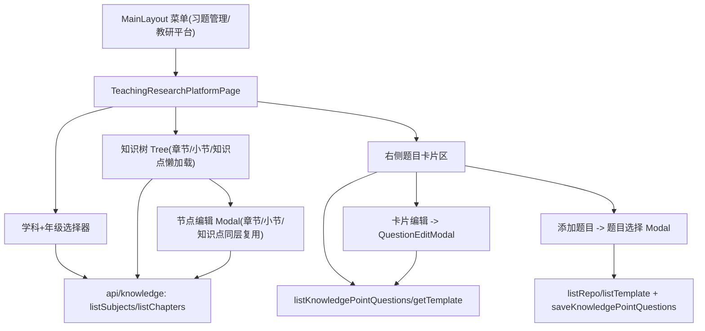

# 教研平台 技术设计

Feature Name: teaching-research-platform
Updated: 2026-09-08

## Description

将管理端「习题列表（知识树 × 练习总览）」(pages/exercise/ExerciseListPage.jsx, /exercise/list) 整体改造为教研平台：左侧学科 + 年级 + 章节树（章节 → 小节 → 知识点，懒加载），右侧选中知识点后展示直绑题目卡片并可编辑 / 添加绑定。原页面的练习绑定总览功能移除（知识管理页仍提供绑定维护）。

## Architecture

复用既有层：`api/knowledge.js`（学科/章节/小节/知识点 CRUD 与 listKnowledgePointQuestions / saveKnowledgePointQuestions）、`api/template.js`（listTemplate / updateTemplate）、`components/question/QuestionEditModal.jsx`、`utils/practiceHelpers.js`（答案格式化展示）、antd Tree。

## Components and Interfaces

### 前端（wisestar-client）

| 文件 | 职责 |
|---|---|
| `pages/exercise/TeachingResearchPlatformPage.jsx`（新增） | 教研平台主页面；替换 App.jsx 中 /exercise/list 的 element 并删除对旧 ExerciseListPage 的引用 |
| `components/research/ResearchQuestionCard.jsx`（新增） | 题目卡片：题干/题型/难度/答案/解析显隐、筛选标签、点击回调 |
| `components/research/NodeEditModal.jsx`（新增） | 章节/小节/知识点三层共用一个编辑弹窗壳（按 nodeType 渲染表单字段） |
| `components/research/KnowledgePointEditFields.jsx`（新增） | 知识点字段（含简介 textarea → content.intro）与内容要点维护 |
| `components/research/AddQuestionModal.jsx`（新增） | 题库题目选择器（先选题库 listRepo → listTemplate 加载题目 → 勾选） |
| `components/layout/MainLayout.jsx`（修改） | 「习题列表」菜单 label 改为「教研平台」 |
| `App.jsx`（修改） | /exercise/list 渲染 TeachingResearchPlatformPage |

树数据流（懒加载 loadData）：

- 学科选中 → listChapters({subjectId}) 得到含 grade 的章节全集 → 按年级过滤成根数组。
- 章节展开 → listSections({chapterId}) → 生成章节 children。
- 小节展开 → listKnowledgePoints({sectionId}) → 生成小节 children；知识点节点文案 = name + intro 摘要（content JSON 解析 intro；解析失败/为空显示「暂无简介」）。
- 点击知识点（非展开）→ setSelectedKp → 加载直绑题目：listKnowledgePointQuestions(kpId) 得绑定题（含题目信息）或绑定 id 列表，id 情形用 getTemplate 逐题补齐 → 卡片数组。

节点编辑（R4）：

- 章节/小节/知识点点击名称调用 NodeEditModal；保存分别调 updateChapter/updateSection/updateKnowledgePoint。
- 知识点保存合并逻辑：读原 content（JSON）→ 保留 points，写入 intro → 提交 { id, sectionId, name, sort, grade, term, content: JSON.stringify({ points, intro }), imageUrl: 原值 }。
- 保存成功后仅更新本地树节点文本（fetch 或 patch），不整体重建树、不重置展开状态。

题目卡片区（R5/R6/R7）：

- 答案/解析展示：解析题目 attribute JSON（options/examCorrectAnswer 等），展示复用 practiceHelpers 的答案文案格式化；设「显示答案」开关。
- 编辑：点击卡片以该题 getTemplate 完整记录为 record 打开 QuestionEditModal（onSave → updateTemplate），成功后重新加载该知识点题目。
- 添加：AddQuestionModal 中多选目标题目 → 与现有绑定集合合并 → saveKnowledgePointQuestions({ knowledgePointId, questionIds }) 全量替换 → 重载列表。

### 后端

无后端改动。知识点简介持久化利用既有 content JSON 可选键 `intro`，updateKnowledgePoint 已支持整体写入 content 字段；未命中既有读端逻辑（均按 JSON 解析取 points），兼容性通过既有 JSON 结构保持。

## Data Models

- t_knowledge_point.content：原 `{"points": ["要点1", ...]}`；本特性后可含 `{"points": [...], "intro": "一句话简介"}`。
- t_knowledge_point_question：不动（saveKnowledgePointQuestions 全量替换语义不变）。
- t_template：不动。

## Correctness Properties

- 树每层懒加载一次并缓存（展开状态内），避免重复请求。
- 知识点 content 变更必须完整保留 points / imageUrl；intro 丢失视作「暂无简介」而不得清空既有要点。
- 添加题目后绑定集合 = 原集合 ∪ 新增（全量替换实现，需先读旧集合再保存），不得覆盖丢失既有绑定。
- 编辑题目不改变该题与知识点的绑定关系。
- 年级筛选只作用于章节加载；切换学科/年级时清空树与选中知识点。

## Error Handling

- 节点/题目加载失败：节点处轻提示「加载失败，点击重试」；右侧题目区展示错误空态与重试按钮。
- 保存失败（名称/简介/题目更新）：弹窗保留当前输入并提示后端 message；不刷新树。
- 无权限（守卫不通过）：沿用 AuthGuard 行为。
- 绑定保存并发冲突：全量替换前校验集合与保存返回 message 冲突时提示刷新重试。

## Test Strategy

- 接口自测（curl）：listChapters 按 grade、listSections、listKnowledgePoints、知识点 update 携带 intro 后 list 回读含 intro、listKnowledgePointQuestions、updateTemplate、saveKnowledgePointQuestions 合并保存。
- 前端 build / lint；人工走查：学科+年级切换重建树；三层名称点击编辑并刷新；知识点简介编辑往返；题目卡片显隐答案；卡片编辑保存后刷新；添加题目全量替换不丢旧绑定。
- 回归：学员端学习页加载（content JSON 兼容 intro）、既有题目管理页 CRUD。

## Implementation Plan

1. 菜单与路由：MainLayout label 改「教研平台」，App.jsx /exercise/list 指向新页面，删除旧 ExerciseListPage 引用。
2. 主页面框架：学科 + 年级选择、左树右卡布局、antd Tree 懒加载骨架（先读章节→小节→知识点，知识点简介展示）。
3. NodeEditModal 三层编辑 + 知识点简介（content.intro 合并保存）。
4. 题目卡片区：直绑题目加载与卡片渲染、答案显隐、筛选。
5. 卡片编辑（QuestionEditModal 复用）与「添加题目」绑定保存。
6. lint / build / 接口与人工走查；追加开发维护日志新节。

## References

- 需求文档：`.monkeycode/specs/2026-09-08-teaching-research-platform/requirements.md`
- 基础页（将被替换）：`wisestar-client/src/pages/exercise/ExerciseListPage.jsx`
- 复用组件：`wisestar-client/src/components/question/QuestionEditModal.jsx`
- 知识 API：`wisestar-client/src/api/knowledge.js`
- 题目 API：`wisestar-client/src/api/template.js`
