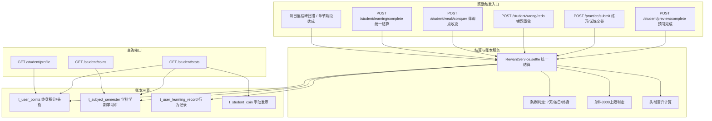

# 学员积分·学币计算体系 技术设计

Feature Name: student-points-coin-ledger
Updated: 2026-09-10

## Description

将学员端数值体系从「`t_practice_record` 派生 + 前端 mock」迁移为「三表账本 + 统一结算服务」。新增 `t_user_points`（终身学海积分/头衔）、`t_subject_semester`（学科学期学习币）、`t_user_learning_record`（学习行为与防刷）；新增 `RewardService` 承接 8.2 全部奖励规则（含 7 天防刷、单科 3000 上限、头衔晋升），并由预习完成、练习/试炼交卷、错题订正、薄弱点攻克、每日里程碑、章节阶段等入口调用。`GET /api/student/stats` 改为读账本，保持响应结构不变；预习完成不再写伪造练习记录。

## Architecture



**数据流**：行为入口 → `RewardService.settle(userId, actionType, subjectId, targetId, refId, durationMs)` → 防刷判定 → 计算应发币/分 → 单科上限裁剪 → 写 `t_user_learning_record` → upsert `t_user_points` + `t_subject_semester` → 头衔晋升 → 返回结算结果。查询接口直接聚合三表。

## Components and Interfaces

### 新增：`RewardService`（`shared` 接口 + `rdbms` 实现）

```java
public interface RewardService {
    RewardResultView settle(RewardContext context);
}
```

`RewardContext` 关键字段：`userId / actionType / subjectId / knowledgePointId / sectionId / chapterId / refId / durationMs / correctRate`。

`RewardResultView` 关键字段：`ok / coins / points / firstTime / coinsCapped / titleUpgraded / titleLevel / titleName`。

### 奖励规则常量与映射

| action_type | 触发入口 | 币 | 积分 | 防刷维度 |
|---|---|---|---|---|
| `preview` | `POST /student/preview/complete` | 5 | 3 | 知识点 7 天 |
| `practice` | `POST /practice/submit`（mode=practice/special） | 12 | 6 | 知识点 7 天 |
| `trial` | `POST /practice/submit`（mode=trial） | 20 | 10 | 知识点 7 天 |
| `trial_bonus` | 试炼正确率 ≥90%（随 trial 追加） | 15 | 8 | 同 trial 的 refId |
| `wrong_correct` | 错题订正完成 | 8 | 4 | 知识点 7 天 |
| `weak_conquer` | `POST /student/weak/conquer` | 25 | 12 | 知识点 7 天 |
| `daily_kp` | 每日完成 2 个知识点练习 | 8 | 5 | 自然日 |
| `daily_wrong` | 每日订正错题 ≥3 道 | 6 | 3 | 自然日 |
| `daily_time` | 每日有效学习 30 分钟 | 7 | 4 | 自然日 |
| `chapter_stage` | 学科累计达标章节里程碑 | 80/100/120/150/180/200 | 40/50/60/75/90/100 | 里程碑终身一次 |

奖励数值抽为常量类 `StudentRewardConstants`（币/分/阈值），避免散落魔法值。

### 后端接口变更

| 接口 | 变更 |
|---|---|
| `GET /api/student/stats` | 改为读 `t_user_points`/`t_subject_semester`/`t_student_coin`；`today` 由 `t_user_learning_record` 当日聚合；保持字段结构 |
| `GET /api/student/profile` | 新增，读 `t_user_points` 头衔与积分 |
| `GET /api/student/points` | 新增，积分评价板块：当前积分、头衔、下一头衔进度、积分规则列表、最近 20 条积分明细 |
| `GET /api/student/today` | 扩展返回 `guides`（当天可获取积分的引导项：行为、可获币/分、完成状态与进度） |
| `GET /api/student/coins` | 新增，读 `t_subject_semester` 本学期各科币与上限 |
| `POST /api/student/learning/complete` | 新增，统一结算入口（`actionType` 分发） |
| `POST /api/student/preview/complete` | 改为调用 `RewardService.settle(preview)`，不再写 `t_practice_record` |
| `POST /api/student/coin` | 保留，`t_student_coin` 增加可选 `subject_id` |
| `POST /api/student/semester/rollover` | 新增（系统定时/管理触发），按新学期键自然分账 |

权限：统一 `@PreAuthorize("isAuthenticated()")`；服务层校验当前用户为学员。

### 结算 Hook（`PracticeServiceImpl.submitPractice`）

1. 保留现有判分落库逻辑；
2. 落库后按 `mode` 映射 `actionType`（`practice`/`trial`），调用 `RewardService.settle`，`refId=record.id`；
3. 试炼正确率 ≥90% 时追加 `trial_bonus`；
4. 结算结果写入 `PracticeResultView`（新增 `coins/points/titleUpgraded/coinsCapped` 字段）；
5. 结算异常不阻断交卷主流程，记录日志并返回 `ok=false`（交卷判分结果仍可用）。

### 前端变更

- `useStudentStore`：删除 `REWARDS`/`PROFILE.points`/`TITLES` mock 用法，改由接口注入；保留展示结构。
- `api/student.js`：新增 `getProfile / getPoints / getCoins / getTodayGuides / completeLearning`。
- `KnowledgePage.finishPreview`：改用真实结算返回展示到账；`previewDone` 由知识点详情 `previewed` 字段或本地态维护。
- `StudentLayout`/`StudentHomePage`：`totalCoins` 取接口总学习币（含手动发币）；主页新增「积分获取引导」模块，渲染 `today.guides` 并支持点击跳转。
- `ProfilePage`：新增「积分板块」，展示当前积分、头衔、下一头衔进度条、积分规则与最近明细，文案明确区分「学习币可兑换 / 学海积分荣誉值」。

### 用途分离与稳定性设计

1. **用途隔离**：兑换链路只读取 `t_subject_semester.coins` 与 `t_student_coin`；荣誉链路（头衔/证书）只读取 `t_user_points.points`。接口与页面文案显式区分二者，服务层拒绝交叉使用（积分兑换、学习币晋升）。
2. **规则与内容解耦**：奖励金额由 `StudentRewardConstants` 中「行为类型 → 币/分」映射决定，章节/小节/知识点仅作为行为发生时的定位与防刷维度，不参与金额计算。教学内容增删改不影响任何已发放数值。
3. **账本为唯一事实源**：`t_user_points.points`、`t_subject_semester.coins` 只由结算写入、由查询读取；数值查询不对当前教学内容重新扫描或重算，避免内容调整导致数值跳变。
4. **历史记录不可变**：`t_user_learning_record` 中的学科/知识点标识按发生时刻保存，内容调整不级联修改/删除历史记录；内容采用逻辑删除，标识长期可用。
5. **里程碑防重复**：章节阶段奖励在 `t_user_learning_record` 以 `action_type=chapter_stage`、`ref_id={subjectId}:{阶段}` 记录，内容重组后既不重复发放也不追回已发。

## Data Models

### t_user_points（用户学海积分/头衔，终身）

| 字段 | 类型 | 说明 |
|---|---|---|
| id | varchar(64) PK | 主键 |
| user_id | varchar(64) | 学员ID，唯一 |
| points | int | 累计学海积分 |
| title_level | int | 头衔等级 1..5 |
| title_name | varchar(32) | 头衔名称 |
| is_deleted / create_at / create_by / update_at / update_by | BaseModel | 审计字段 |

唯一索引：`uk_user_points (user_id, is_deleted=0 语义由业务保证)`。

### t_subject_semester（学科学期学习币）

| 字段 | 类型 | 说明 |
|---|---|---|
| id | varchar(64) PK | 主键 |
| user_id | varchar(64) | 学员ID |
| subject_id | varchar(64) | 学科ID(t_subject.id) |
| semester | varchar(16) | 学期键，如 `2026-1` |
| coins | int | 本学期该学科学习币（0..3000） |
| reached_limit | tinyint(1) | 是否已达上限 |
| is_deleted / create_at / create_by / update_at / update_by | BaseModel | 审计字段 |

唯一索引：`uk_subject_semester (user_id, subject_id, semester)`。

### t_user_learning_record（学习行为记录/防刷）

| 字段 | 类型 | 说明 |
|---|---|---|
| id | varchar(64) PK | 主键 |
| user_id | varchar(64) | 学员ID |
| subject_id | varchar(64) | 学科ID，可空 |
| knowledge_point_id | varchar(64) | 知识点ID，可空 |
| section_id | varchar(64) | 小节ID，可空 |
| action_type | varchar(32) | 行为类型 |
| ref_id | varchar(64) | 业务关联ID（练习会话/任务日期等） |
| coins | int | 本次发放学习币（上限裁剪后实际值） |
| points | int | 本次发放学海积分 |
| semester | varchar(16) | 学期键 |
| learned_at | timestamp | 行为发生时间 |
| is_deleted / create_at / create_by / update_at / update_by | BaseModel | 审计字段 |

索引：`idx_ulr_user_action (user_id, action_type, knowledge_point_id, learned_at)`；`idx_ulr_ref (user_id, action_type, ref_id)`。
幂等：`ref_id` 非空时按 `(user_id, action_type, ref_id)` 判重。

### t_student_coin 变更

新增 `subject_id varchar(64) DEFAULT NULL`，用于手动发币按学科归集。

### DDL 落地

在 `server/rdbms/src/main/resources/scripts/init-h2.sql` 与 `init-mysql.sql` 中以 `CREATE TABLE IF NOT EXISTS` 幂等新增三表，`ALTER TABLE t_student_coin ADD COLUMN IF NOT EXISTS subject_id`。实体放 `cn.wisestar.server.domain.model`，Mapper 放 `cn.wisestar.server.mapper`，DTO 放 `cn.wisestar.server.domain.dto.student`。

## Correctness Properties

1. **幂等性**：同一 `(user_id, action_type, ref_id)` 只结算一次；同一 `(user_id, action_type, 目标, 自然日)` 的每日里程碑只结算一次；章节阶段里程碑终身一次。
2. **7 天防刷**：同一 `(user_id, action_type, knowledge_point_id)` 距最近一次成功记录 <7 天时 `coins=points=0` 且 `firstTime=false`。
3. **上限不变量**：任意结算后 `0 ≤ t_subject_semester.coins ≤ 3000`；达到 3000 后同行为 `coins=0` 而 `points` 照发，`reached_limit=true`。
4. **积分单调不减**：`t_user_points.points` 在正常结算路径下只增不减。
5. **头衔单调不降**：`title_level` 仅在新阈值更高时更新。
6. **账实一致**：`t_user_points.points` 等于该学员 `t_user_learning_record.points` 求和（含历史迁移数据）；`t_subject_semester.coins` 等于对应 `(user_id,subject_id,semester)` 行为记录 `coins` 求和（上限裁剪后）。
7. **权限收敛**：结算目标必须落在学员有效订单权限学科链内，否则拒绝。
8. **用途隔离**：学习币只出现在兑换链路，学海积分只出现在荣誉链路；任何接口不得以积分扣减兑换商品，也不得以学习币变更头衔。
9. **内容无关性**：奖励金额仅由 `action_type` 决定；章节/小节/知识点的增删改不改变学员已累计的 `t_user_points.points` 与 `t_subject_semester.coins`。
10. **账本即事实源**：`stats`/`profile`/`points`/`coins` 的数值均来自账本表，不因当前教学内容结构变化而重算或跳变。

## Error Handling

| 场景 | 处理 |
|---|---|
| 未登录/非学员 | 抛 `AuthenticationException`/`ValidationException`，全局处理器返回 `{code,message,data}` |
| 目标缺失（无 kp/section） | `ValidationException("缺少学习目标")`，不写账本 |
| actionType 非法 | `ValidationException("未知学习行为")`，不写账本 |
| 超单科上限 | 正常结算积分，币裁剪至上限并返回 `coinsCapped=true` |
| 命中 7 天防刷 | 返回 `firstTime=false`、`coins=0`、`points=0`，HTTP 200 |
| 结算内部异常（交卷链路） | 记录日志，返回 `ok=false`，不阻断交卷判分结果 |

## Test Strategy

1. **单元测试**：`RewardService` 的奖励映射、防刷窗口（第 6/7 天边界）、上限裁剪（2999→+5）、头衔阈值（299/300、1599/1600 边界）、幂等键。
2. **集成测试（H2）**：登录学员 → 预习首次/重复结算；练习交卷自动结算并写记录；试炼 ≥90% 追加 bonus；错题订正/薄弱攻克结算；`stats`/`profile`/`coins` 读取一致。
3. **端到端脚本**：扩展现有 `/tmp/opencode/test_preview.py`，断言 `firstTime`、`coins`、`points`、`coinsCapped`、`titleUpgraded`；校验行为记录与账本求和一致。
4. **回归**：`GET /api/student/stats` 字段兼容；预习迁移后旧 `mode=preview` 练习记录不再新增，历史记录迁移脚本可对账。
5. **前端**：`npx oxlint` 通过；首页/档案/知识点页展示真实数值，结算提示正确。
6. **积分板块与引导**：`GET /api/student/points` 返回积分、头衔进度、规则与最近明细；`GET /api/student/today` 的 `guides` 状态随行为结算实时变化；个人中心与主页文案区分「学习币可兑换 / 学海积分荣誉值」。
7. **稳定性**：模拟章节/小节/知识点新增、删除、移动后，重复调用数值接口，断言学员积分与学习币总量不变；章节阶段里程碑不重复发放、不追回。

## References

- [^1]: (`docs/Wisestar智习系统学生端需求文档V2.0-完善版.md#L205`) - 8.1/8.2/8.3 双轨数值、奖励体系、防刷规则
- [^2]: (`docs/Wisestar智习系统学生端需求文档V2.0-完善版.md#L307`) - 数值与学习进度预设计新表
- [^3]: (`server/rdbms/src/main/java/cn/wisestar/server/impl/StudentServiceImpl.java#L544`) - 当前 stats 派生口径
- [^4]: (`server/rdbms/src/main/java/cn/wisestar/server/impl/StudentServiceImpl.java#L631`) - 当前 completePreview 伪造练习记录
- [^5]: (`server/rdbms/src/main/java/cn/wisestar/server/impl/PracticeServiceImpl.java#L103`) - 交卷判分落库锚点
- [^6]: (`server/rdbms/src/main/resources/scripts/init-h2.sql#L1379`) - t_practice_record 现状
- [^7]: (`wisestar-client/src/stores/useStudentStore.js#L33`) - 五级评级定义
