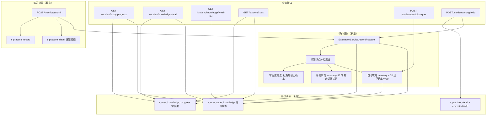

# 学员薄弱点·学习结果评价体系 技术设计

Feature Name: student-weakness-evaluation
Updated: 2026-09-10

## Description

将学员端「掌握度/评级/薄弱点/学情总览」从 mock 迁移为基于真实练习明细的计算体系。新增 `t_user_knowledge_progress`（知识点掌握度）与 `t_user_weak_knowledge`（薄弱点研判）两表；新增 `EvaluationService` 在每次交卷落库后按题目知识点刷新掌握度、研判薄弱、自动攻克；新增错题订正标记与重做接口；`GET /api/student/study/progress`、`GET /api/student/knowledge/detail`、`GET /api/student/knowledge/weak-list`、`GET /api/student/stats` 改为读真实数据。薄弱点攻克奖励由 `RewardService`（配套特性）结算。

## Architecture



**数据流**：交卷落库 `t_practice_record/detail` → `EvaluationService.recordPractice` 按知识点聚合明细 → 更新掌握度 → 研判薄弱/自动攻克 → 查询接口读 `t_user_knowledge_progress`/`t_user_weak_knowledge`；错题重做更新 `t_practice_detail.corrected` 并触发同源刷新。

## Components and Interfaces

### 新增：`EvaluationService`（`shared` 接口 + `rdbms` 实现）

```java
public interface EvaluationService {
    void recordPractice(String userId, PracticeRecord record,
                        List<PracticeDetail> details, List<Template> templates);
    boolean conquer(String userId, String knowledgePointId, int correctRate);
}
```

### 掌握度算法（可解释、可复现）

1. 一次交卷中，按 `Template.knowledgePoint`（明细级知识点）将 `PracticeDetail` 分组；`record.knowledgePointId` 作为兜底（题目未配知识点时）。
2. 对每个知识点取最近 `W=5` 次涉及该知识点的练习会话（按 `t_practice_record.create_at` 倒序），每次会话的正确率 `rate_i = correct_i / total_i`。
3. 权重 `w_i = W - i`（i=0 为最近一次，权重 5；依次 4,3,2,1），不足 5 次时按实际条数归一化：
   `mastery = round( Σ(w_i * rate_i) / Σ(w_i) * 100 )`，结果 clamp 到 0–100。
4. 同步更新：`times += 本次涉及该知识点的会话数(1)`、`total_count/correct_count` 累计、`last_correct_rate=最近一次 rate`、`last_practice_at=now`。
5. 参数 `W=5`、权重策略、薄弱阈值 `55`、攻克阈值（正确率 80 / 掌握度 70）集中到 `EvaluationConstants`，便于调参。

### 薄弱研判与攻克

- `weak(active)` 条件：`mastery < 55`，或该知识点在当前学员下存在 `is_correct=0 且 corrected=0` 的明细。
- `conquered` 条件：显式攻克（`POST /student/weak/conquer`，正确率 ≥80）或交卷后 `mastery ≥70 且 本次该知识点正确率 ≥80`。
- 首次 `active → conquered`：`conquer_times+1`、`conquered_at=now`，并由 `RewardService.settle(action_type=weak_conquer, refId=kpId)` 发奖一次。
- `conquered → active` 回退：后续掌握度跌破阈值或出现未订正错题时重新置为 `active`（`first_weak_at` 保持首次时间）。

### 后端接口

| 接口 | 变更 |
|---|---|
| `GET /api/student/study/progress` | 章节 knowledge 的 `mastery/level/weak` 改由 `t_user_knowledge_progress` + `t_user_weak_knowledge` 填充 |
| `GET /api/student/knowledge/detail` | 返回真实 `mastery/level/weak` 与 `previewed` |
| `GET /api/student/knowledge/weak-list` | 返回 `status=active` 清单（kpId/name/subjectId/conquerReward） |
| `POST /api/student/weak/conquer` | `{kpId, correctRate}` → 状态流转 + 触发奖励结算 |
| `POST /api/student/wrong/redo` | `{questionId, answer}` → 判分、标记 corrected、刷新评价、触发错题订正奖励 |
| `GET /api/student/wrong-list` | 聚合查询增加 `corrected=0` 过滤 |
| `GET /api/student/stats` | `kps/chapters/weak` 改由评价表计算，`points` 取积分账本 |

权限：统一 `@PreAuthorize("isAuthenticated()")`，服务层校验学员身份与有效订单权限。

### 交卷 Hook（`PracticeServiceImpl.submitPractice`）

在现有判分落库（`save(record)` + 明细插入）之后，调用 `evaluationService.recordPractice(userId, record, details, templates)`。评价异常捕获并记录日志，不阻断交卷返回。

### 前端变更

- `useStudentStore`：移除 mock `chapters[].kps.mastery` 的渲染依赖；新增 `fetchStudyProgress/fetchKnowledgeDetail/fetchWeakList`，注入真实 `mastery/level/weak`。
- `StudyPage`：章节/知识点掌握度、评级、薄弱标记取接口；保留本地兜底缓存与加载失败提示。
- `KnowledgePage`：知识点详情掌握度、薄弱标记取接口；错题重做走 `wrong/redo`。
- `ProfilePage`/`StudentHomePage`：学情总览 `kps/chapters/weak` 取 `stats`。

## Data Models

### t_user_knowledge_progress（知识点掌握度）

| 字段 | 类型 | 说明 |
|---|---|---|
| id | varchar(64) PK | 主键 |
| user_id | varchar(64) | 学员ID |
| subject_id | varchar(64) | 学科ID |
| version_id | varchar(64) | 教材版本ID |
| chapter_id | varchar(64) | 章节ID |
| knowledge_point_id | varchar(64) | 知识点ID |
| mastery | int | 掌握度 0–100 |
| level | varchar(16) | 评级标签 |
| times | int | 涉及该知识点的练习会话次数 |
| total_count | int | 累计题数 |
| correct_count | int | 累计正确题数 |
| last_correct_rate | int | 最近一次正确率(0–100) |
| last_practice_at | timestamp | 最近练习时间 |
| is_deleted / create_at / create_by / update_at / update_by | BaseModel | 审计字段 |

唯一索引：`uk_kp_progress (user_id, subject_id, version_id, knowledge_point_id)`。

### t_user_weak_knowledge（薄弱点研判）

| 字段 | 类型 | 说明 |
|---|---|---|
| id | varchar(64) PK | 主键 |
| user_id | varchar(64) | 学员ID |
| subject_id | varchar(64) | 学科ID |
| knowledge_point_id | varchar(64) | 知识点ID |
| status | varchar(16) | active / conquered |
| conquer_times | int | 攻克次数 |
| first_weak_at | timestamp | 首次薄弱时间 |
| conquered_at | timestamp | 最近攻克时间 |
| is_deleted / create_at / create_by / update_at / update_by | BaseModel | 审计字段 |

唯一索引：`uk_weak (user_id, subject_id, knowledge_point_id)`；索引 `idx_weak_status (user_id, status)`。

### t_practice_detail 变更

新增 `corrected tinyint(1) DEFAULT 0`、`corrected_at timestamp NULL`，用于错题订正标记；错题本聚合查询过滤 `is_correct=0 AND corrected=0`。

### DDL 落地

`init-h2.sql` / `init-mysql.sql` 幂等新增两表与 `ALTER TABLE t_practice_detail ADD COLUMN IF NOT EXISTS corrected/corrected_at`。实体、Mapper、DTO 按项目现有包结构新增。

## Correctness Properties

1. **同源一致**：`t_user_knowledge_progress`、`t_user_weak_knowledge`、错题本、`stats` 均由 `t_practice_detail`/`t_practice_record` 派生，不存在第二套判分来源。
2. **掌握度有界**：任意时刻 `0 ≤ mastery ≤ 100`，且 `level` 与阈值映射严格一致。
3. **薄弱一致性**：`weak(active)` ⇔ `mastery<55` 或存在未订正错题；攻克后不满足该条件则不在清单中。
4. **攻克幂等**：同一知识点首次 `active→conquered` 发奖一次，后续重复攻克不重复发奖。
5. **权限收敛**：评价/攻克/重做目标必须落在学员有效订单权限学科链内。
6. **主流程隔离**：评价更新失败不影响交卷判分与落库结果。

## Error Handling

| 场景 | 处理 |
|---|---|
| 未登录/非学员 | `ValidationException`，全局处理器返回 `{code,message,data}` |
| 知识点无练习数据 | 返回 `mastery=0`、`level=待攻克`，不判为异常 |
| 明细无知识点 | 跳过该明细，记录 debug 日志 |
| 攻克正确率未达阈值 | 保持 `active`，返回 `weakCleared=false`，不发奖 |
| 错题重做作答错误 | 保留错题标记，返回 `removed=false` |
| 评价更新异常 | 捕获记录日志，交卷正常返回 |

## Test Strategy

1. **单元测试**：掌握度加权算法（1/3/5 次会话边界、全对/全错、空数据）、评级映射、薄弱研判、攻克幂等。
2. **集成测试（H2）**：登录学员交卷 → 掌握度/薄弱刷新；错题重做正确 → 从错题本移除且薄弱消除；`weak/conquer` 达标与不达标；`stats` 与清单/进度一致。
3. **端到端脚本**：扩展 `/tmp/opencode` 脚本，断言 `study/progress` 的 `mastery/level/weak`、`weak-list` 条数、`wrong-list` 订正后条数。
4. **回归**：错题本既有聚合口径不变；`stats` 字段兼容；无练习数据时不出现 mock。
5. **前端**：`npx oxlint` 通过；研习页/知识点页展示真实掌握度与薄弱标记。

## References

- [^1]: (`docs/Wisestar智习系统学生端需求文档V2.0-完善版.md#L295`) - 学生端预设计新表（掌握度/薄弱点）
- [^2]: (`docs/Wisestar智习系统学生端需求文档V2.0-完善版.md#L404`) - 薄弱点清单与攻克接口
- [^3]: (`server/rdbms/src/main/java/cn/wisestar/server/impl/PracticeServiceImpl.java#L103`) - 交卷判分落库锚点
- [^4]: (`server/rdbms/src/main/resources/scripts/init-h2.sql#L1400`) - t_practice_detail 现状
- [^5]: (`wisestar-client/src/stores/useStudentStore.js#L33`) - 五级评级 LEVELS
- [^6]: (`wisestar-client/src/pages/student/StudyPage.jsx`) - 研习页掌握度/薄弱展示现状
- [^7]: (`server/rdbms/src/main/java/cn/wisestar/server/impl/StudentServiceImpl.java#L544`) - 当前 stats 聚合现状
