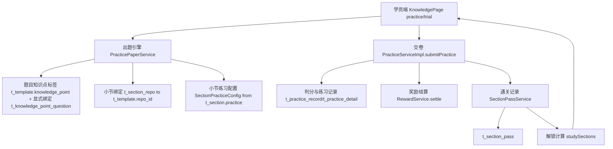

# 专项练习与小节通关

Feature Name: 2026-09-11-practice-drill-clear
Updated: 2026-09-11

## Description

将学员端「专项练习湾」（`tab=practice`）与「小节通关」（`tab=trial`）从当前同源同题的实现，改造为由统一出题引擎驱动的两个差异场景：

- 专项练习：学员进入上下文的小节后无需选择知识点与题型，引擎以当节全部知识点为单位，按题目知识点标签（并兼容显式绑定）逐个知识点抽题，每个知识点至少 1 题，模式标识 `special`，按既有练习奖励结算。
- 小节通关：引擎按 `t_section.practice` 配置对整节绑定题库组卷，交卷后以正确率阈值判定通关，持久化 `t_section_pass` 记录（最佳正确率、星级、首次通关），并支持按 `unlockNext` 顺序解锁下一小节。

本设计与既有实现保持一致：专项练习题目范围来自 `t_template.knowledge_point` 标签匹配（并兼容 `t_knowledge_point_question` 显式绑定），小节通关题目范围来自 `t_section_repo`，交卷判分仍走 `PracticeServiceImpl.submitPractice`，奖励仍走 `RewardService.settle`，前端仍复用知识点页的练习渲染与本地即时判分。

## Architecture



出题引擎是唯一组卷入口，专项练习与小节通关只在「范围来源」与「策略来源」上不同：

- 专项练习：范围来源为当节全部知识点，出题按知识点标签逐个知识点抽题（每知识点至少 1 题），题型不限定；不提供学员即时选择。
- 小节通关：范围来源为整节绑定题库，策略来源为 `t_section.practice` 配置。

## Components and Interfaces

### 出题引擎 `PracticePaperService`

新增服务接口位于 `shared`，实现在 `rdbms`：

- `List<StudentQuestionView> buildPaper(PracticePaperQuery query)`

`PracticePaperQuery` 字段：

| 字段 | 类型 | 说明 |
| --- | --- | --- |
| sectionId | String | 小节范围（小节通关主范围） |
| knowledgePointIds | List<String> | 知识点范围（专项练习主范围，多选） |
| knowledgePointId | String | 单知识点范围（兼容既有调用） |
| repoId | String | 题库直练范围 |
| questionId | String | 单题重做（保持既有语义，优先） |
| count | Integer | 题量，为空不截断 |
| perKp | Integer | 每个知识点抽取题数，为空则全局截断 |
| types | List<String> | 题型过滤 |
| difficulty | String | 难度过滤 |
| random | Boolean | 是否随机排序 |
| exposeAnswer | Boolean | 是否带标准答案（本地即时判分用） |

实现要点：在既有 `StudentServiceImpl.studyQuestions`（`StudentServiceImpl.java` L591）基础上扩展。候选集聚合逻辑：

1. 有 `questionId`：仅取本人未订正错题，直接返回。
2. 权限校验：由 `sectionId` 或任一 `knowledgePointIds` 反查章节，校验 `hasPermission(subjectId, grade)`。
3. 范围并集：`knowledgePointIds` 每个知识点关联的题目（题目顶层 `knowledge_point` 列或 `template` JSON 内 `attribute.knowledgePoint` 精确命中知识点名称；并集含 `t_knowledge_point_question` 显式绑定）∪（`sectionId` 命中 `t_section_repo` → `t_template.repo_id` 的题目）∪ `repoId` 题目。
4. 过滤：按 `types`、`difficulty` 过滤。
5. 排序：`random=true` 时打乱，否则保持检索顺序。
6. 分组截断：`perKp` 有值时按知识点顺序分桶，每桶最多 N 题，同一题仅归入首个未满桶，最终按知识点顺序拼接（同知识点题目相邻），并给每题回填所属知识点 `knowledgePointId`；否则按 `count` 全局截断，上限 50。
7. 空卷兜底：按知识点分组未取到任何题时，退回整节候选题，避免专项练习空卷。

保留 `StudentApi.studyQuestions` 既有签名与行为，同时新增参数 `knowledgePointIds`、`random`、`perKp`，由 `knowledgePointIds` 为空时回退到 `knowledgePointId` 单值路径。

### 配置解析 `SectionPracticeConfig`

`t_section.practice` 为 JSON 字符串，新增 DTO 解析并集中提供缺省值。

| 字段 | 类型 | 缺省 | 说明 |
| --- | --- | --- | --- |
| mode | String | normal | normal 常规 / random 随机 |
| questionCount | Integer | null | random 模式题量 |
| difficulty | String | null | 难度 |
| types | List<String> | null | 题型集合 |
| passRate | Integer | 80 | 通关阈值（正确率百分比） |
| unlockNext | Boolean | false | 通关后是否解锁下一节 |

新增 `SectionPracticeService`：

- `SectionPracticeConfig getConfig(String sectionId)`：读取 `Section.practice` 反序列化，解析失败或字段缺失时补缺省值并 `log.warn`。

后台 `SectionManagePage.jsx` 的 `savePractice` 负责写入 `passRate` 与 `unlockNext` 两个新字段，写入前保持对无 `mode` 旧 JSON 的向后兼容。

### 通关记录 `SectionPassService`

新增服务接口，实现在 `rdbms`：

- `SectionPassResult recordAttempt(SectionPassAttempt attempt)`：交卷后写入或更新通关记录。

`SectionPassAttempt` 字段：`userId`、`sectionId`、`rate`（本次正确率）、`score`、`totalScore`、`passRate`。

`SectionPassResult` 字段：`passed`、`firstPass`、`rate`、`stars`、`bestRate`、`bestStars`、`unlockedNext`。

判定与更新规则：

1. `passed = rate >= passRate`。
2. `stars = starOf(rate)`，`starOf` 复用 `>=80→5 / >=60→4 / >=40→3 / >=20→2 / >0→1 / 否则 0`。
3. 按 `(user_id, section_id)` 查记录：不存在则插入；存在则更新。
4. `attempt_count` 自增；`best_rate = max(best_rate, rate)`；`best_stars = max(best_stars, stars)`。
5. `passed` 由 false 变 true 时置 `first_pass_at`，此后保持 true；未通关不清除既有通关标记。
6. `last_attempt_at` 刷新为当前时间。
7. 解析 `unlockNext` 作为 `unlockedNext` 返回，供前端提示。

### 交卷集成 `PracticeServiceImpl`

在既有 `submitPractice` 中（`PracticeServiceImpl.java` L141）扩展：

- 模式映射：`special` → `ACTION_PRACTICE`；`trial` → `ACTION_TRIAL`（保持现状并保留 `TRIAL_BONUS_RATE=90` 奖励）；其余保持 `ACTION_PRACTICE`。
- `trial` 且 `sectionId` 有值时，判分与奖励结算后调用 `SectionPassService.recordAttempt`，并将结果写入 `PracticeResultView`。
- 通关记录写入异常时记录 `log.warn` 并跳过，不阻断交卷。

### 解锁计算与学员端小节列表

扩展 `StudentServiceImpl.studySections` 返回项（`SectionView` 增字段）：

| 字段 | 类型 | 说明 |
| --- | --- | --- |
| passed | Boolean | 是否已通关 |
| stars | Integer | 历史最佳星级 |
| bestRate | Integer | 历史最佳正确率 |
| locked | Boolean | 是否锁定 |

锁定规则：同一章节内按 `sort` 升序，第一个小节 `locked=false`；对第 i 个小节，若第 i-1 个小节的 `unlockNext=true` 且第 i-1 个未通关，则 `locked=true`，否则 `locked=false`。`unlockNext=false` 的上一节不产生锁定。

### 前端改造

- `KnowledgePage.jsx` `tab=practice`：移除知识点与题型选择面板，改为只读展示当节全部知识点清单；开始练习时把当节全部知识点与 `perKp=1`、`random=true` 传给扩展后的 `getStudyQuestions`，答题区按题回填的 `knowledgePointId` 展示「知识点 x/N」单元标签；交卷时 `submitPractice` 的 `mode` 使用 `special`。
- `KnowledgePage.jsx` `tab=trial`：进入时读取小节配置摘要（题量/难度/题型/通过线），按配置组卷；交卷时 `submitPractice` 的 `mode` 保持 `trial`；交卷后展示通关结果（是否通关、正确率、星级、最佳），未通关展示「再练一次」。
- `StudyPage.jsx`：小节条目展示通关星级，锁定小节禁用进入入口。
- `api/student.js`：扩展 `getStudyQuestions` 支持新参数；新增 `getSectionPracticeConfig(sectionId)`。

### 接口清单

| 方法 | 路径 | 变更 |
| --- | --- | --- |
| GET | `/student/study/questions` | 新增 `knowledgePointIds`、`random`、`perKp` 参数 |
| GET | `/student/study/sections` | 返回项新增 `passed`、`stars`、`bestRate`、`locked` |
| GET | `/student/practice/config` | 新增，返回 `SectionPracticeConfig` |
| POST | `/student/practice/submit` | 请求沿用 `mode`/`sectionId`；响应新增通关字段 |

## Data Models

新增表 `t_section_pass`（`init-h2.sql`、`init-mysql.sql` 同步）：

```sql
CREATE TABLE IF NOT EXISTS t_section_pass (
  id varchar(64) NOT NULL COMMENT '主键ID',
  user_id varchar(64) DEFAULT NULL COMMENT '学员ID',
  section_id varchar(64) DEFAULT NULL COMMENT '小节ID(t_section.id)',
  best_rate int DEFAULT '0' COMMENT '历史最佳正确率(百分比)',
  best_score double DEFAULT '0' COMMENT '历史最佳得分',
  stars tinyint NOT NULL DEFAULT '0' COMMENT '历史最佳星级0-5',
  passed tinyint(1) NOT NULL DEFAULT '0' COMMENT '是否已通关',
  attempt_count int NOT NULL DEFAULT '0' COMMENT '交卷次数',
  first_pass_at timestamp NULL DEFAULT NULL COMMENT '首次通关时间',
  last_attempt_at timestamp NULL DEFAULT NULL COMMENT '最近交卷时间',
  is_deleted tinyint(1) NOT NULL DEFAULT '0',
  create_at timestamp NOT NULL DEFAULT CURRENT_TIMESTAMP,
  create_by varchar(256) DEFAULT NULL,
  update_at timestamp NULL DEFAULT NULL ON UPDATE CURRENT_TIMESTAMP,
  update_by varchar(256) DEFAULT NULL,
  PRIMARY KEY (id),
  UNIQUE KEY uk_section_pass (user_id, section_id)
) ENGINE=InnoDB DEFAULT CHARSET=utf8mb4 COLLATE=utf8mb4_bin ROW_FORMAT=DYNAMIC COMMENT='小节通关记录';
```

新增模型与 Mapper：`shared` 下 `domain/model/SectionPass.java`，`rdbms` 下 `mapper/SectionPassMapper.java`。

`t_section.practice` JSON 扩展（向后兼容，无 `passRate`/`unlockNext` 时取缺省）：

```json
{
  "mode": "random",
  "questionCount": 10,
  "difficulty": "medium",
  "types": ["Radio", "FillBlank"],
  "passRate": 80,
  "unlockNext": false
}
```

`PracticeResultView` 新增字段：`passed`、`rate`、`stars`、`bestRate`、`bestStars`、`firstPass`、`passRate`、`unlockedNext`（仅 `trial` 场景填充）。

`PracticeRecord` 的 `mode` 取值新增 `special`（`t_practice_record.mode` 注释已预留「special 专项」）。

## Correctness Properties

- **P1 唯一性**：任意 `(user_id, section_id)` 在 `t_section_pass` 中至多一条未删除记录。
- **P2 最佳值单调**：随交卷次数增加，`best_rate`、`best_stars`、`best_score` 只增不减。
- **P3 通关不可逆**：`passed=true` 一经写入，后续未通关交卷不将其改回 false。
- **P4 范围闭包**：出题引擎返回的每题均属于请求的知识点范围或小节范围之内，且满足题型与难度过滤。
- **P5 截断有序**：题量截断发生在过滤与随机排序之后，返回题目数 `<= min(count, 50)`。
- **P6 权限隔离**：范围反查的章节不在学员有效权限内时返回空列表，不泄露题目。
- **P7 配置缺省安全**：`t_section.practice` 为空或非法时，组卷与判定使用缺省值，不抛业务异常。

## Error Handling

- 配置 JSON 解析失败：`SectionPracticeService.getConfig` 补缺省值并 `log.warn`，不阻断组卷。
- 交卷单题判分异常：沿用既有逻辑跳过该题并 `log.warn`（`PracticeServiceImpl` L205）。
- 奖励结算异常：沿用既有 try/catch，不阻断交卷。
- 通关记录写入异常：try/catch 记录 `log.warn`，交卷结果仍正常返回，通关字段按本次计算值返回。
- 锁定小节组卷请求：返回空题目列表，前端提示「请先通关上一小节」。
- 未选知识点开始专项练习：前端校验并提示，后端对空范围返回空列表。
- 专项练习知识点无匹配题目：按知识点分组为空时退回整节候选题（空卷兜底），保证练习可进行。

## Test Strategy

- 单元测试（后端）：
  - 出题引擎：多知识点并集去重、题型/难度过滤、随机排序、`perKp` 分组抽题、`count` 上限 50、空范围返回空。
  - 配置解析：完整 JSON、无 `mode` 旧 JSON、非法 JSON、字段缺失，验证缺省值。
  - 星级与判定边界：正确率 0、20、40、60、80、90 对应的星级与通关结果；阈值 80 时 79 与 80 的差异。
  - 通关记录：首次插入、多次更新、最佳值单调、`passed` 不可逆、`attempt_count` 累加。
  - 解锁：`unlockNext=true` 且未通关时下一节锁定；已通关或开关关闭时不锁定；第一节始终可进入。
- 集成测试：`special` 交卷写入 `t_practice_record` 且奖励为练习奖励；`trial` 交卷写入 `t_section_pass` 且首次通关返回 `firstPass=true`。
- 前端验证：`npx oxlint` 通过；通过 Vite HMR 日志与接口 `curl` 验证专项选题、通关结果与锁定展示。

## References

[^1]: (File) - [StudentServiceImpl.java 取题入口](wisestar/server/rdbms/src/main/java/cn/wisestar/server/impl/StudentServiceImpl.java)
[^2]: (File) - [PracticeServiceImpl.java 交卷与奖励](wisestar/server/rdbms/src/main/java/cn/wisestar/server/impl/PracticeServiceImpl.java)
[^3]: (File) - [StudentApi.java 学员端接口](wisestar/server/api/src/main/java/cn/wisestar/server/api/StudentApi.java)
[^4]: (File) - [Section.java 含 practice 字段](wisestar/server/shared/src/main/java/cn/wisestar/server/domain/model/Section.java)
[^5]: (File) - [StudentRewardConstants.java 奖励动作](wisestar/server/shared/src/main/java/cn/wisestar/server/core/constant/StudentRewardConstants.java)
[^6]: (File) - [SectionManagePage.jsx 练习设置](wisestar/wisestar-client/src/pages/knowledge/SectionManagePage.jsx)
[^7]: (File) - [KnowledgePage.jsx 学员端练习页](wisestar/wisestar-client/src/pages/student/KnowledgePage.jsx)
[^8]: (File) - [StudyPage.jsx 学海研习页](wisestar/wisestar-client/src/pages/student/StudyPage.jsx)
[^9]: (File) - [init-h2.sql 表结构](wisestar/server/rdbms/src/main/resources/scripts/init-h2.sql)
