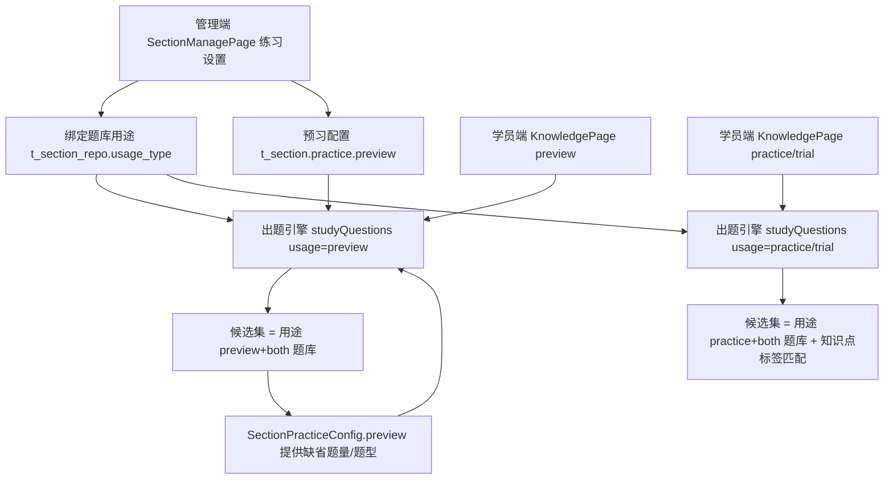

# 预习例题配置与用途区分

Feature Name: 2026-09-11-preview-example-config
Updated: 2026-09-11

## Description

为「知识点预习」增加独立的例题配置与题源区分能力。现状为预习（`tab=preview`/`preview_practice`）、专项练习（`tab=practice`）与小节通关（`tab=trial`）共用同一题池（小节绑定题库 ∪ 知识点显式绑定 ∪ 知识点标签匹配），后台无法分别指定，预习仅在学员端硬编码取前 3 题。

本设计引入两项后台配置：

1. **题库用途标记**：在 `t_section_repo` 绑定上增加 `usage_type`（`preview` 预习专用 / `practice` 练习专用 / `both` 通用）。预习只取 `preview` + `both` 题库，专项练习与小节通关只取 `practice` + `both` 题库。
2. **预习配置**：在 `t_section.practice` JSON 中增加 `preview` 对象（`questionCount`、`types`），控制预习题量与题型。

出题引擎 `StudentServiceImpl.studyQuestions` 新增 `usage` 参数，按用途收敛候选题库，并对知识点标签匹配结果施加同一范围约束；预习配置在请求未显式传参时作为缺省策略。历史绑定缺少 `usage_type` 时按 `both` 处理，配置缺省题量 3、题型不限，行为与改造前一致。

## Architecture



用途收敛发生在候选集构建阶段，三处题源（绑定题库、显式绑定、标签匹配）统一受同一 `allowedRepoIds` 约束：

- `usage=preview`：`allowedRepoIds = {usage_type ∈ (preview, both)}`。
- `usage=practice` 或 `usage=trial`：`allowedRepoIds = {usage_type ∈ (practice, both)}`。
- `usage` 为空：不过滤，取全部绑定题库（历史行为）。
- 兜底：当按用途过滤后 `allowedRepoIds` 为空时，退回全部绑定题库，避免空卷。

## Components and Interfaces

### 数据模型变更

`t_section_repo` 新增列：

| 列 | 类型 | 缺省 | 说明 |
| --- | --- | --- | --- |
| usage_type | varchar(16) | both | preview 预习专用 / practice 练习专用 / both 通用 |

`t_section.practice` JSON 新增嵌套对象：

| 字段 | 类型 | 缺省 | 说明 |
| --- | --- | --- | --- |
| preview.questionCount | Integer | 3 | 预习例题题量 |
| preview.types | List<String> | 空 | 预习题型过滤，空表示不限 |

### 领域模型 `SectionRepo`

`SectionRepo` 增加 `usageType` 字段，与 `t_section_repo.usage_type` 映射。新增枚举常量集中于服务层，避免散落字符串：

- `SectionRepoUsage.PREVIEW = "preview"`
- `SectionRepoUsage.PRACTICE = "practice"`
- `SectionRepoUsage.BOTH = "both"`

### DTO

`SectionRepoRequest`（`POST /section/repos`）扩展：

| 字段 | 类型 | 说明 |
| --- | --- | --- |
| sectionId | String | 小节ID |
| repoIds | List<String> | 绑定的题库ID（全量替换） |
| usageByRepo | Map<String,String> | 可选，repoId → usageType |

保存规则：

1. 全量替换该小节绑定。
2. 对每个 `repoIds` 中的题库，用途取 `usageByRepo` 的值；缺失或非法时回退为 `both`。
3. 为保护未提交用途的调用方（如习题列表页），保存前读取既有绑定，对未在 `usageByRepo` 中出现的 repoId 复用其既有用途，仍缺失时用 `both`。

`listRepos` 返回新增 `SectionRepoView extends RepoView`，在既有题库信息上追加 `usageType`，`SectionService.listRepos` 返回类型改为 `List<SectionRepoView>`。既有字段保持不变，前端兼容。

### 配置解析 `SectionPracticeConfig`

新增嵌套静态类 `PreviewConfig`（`questionCount`、`types`）与字段 `preview`。`applyDefaults()` 补全 `preview`：为空时新建，`questionCount` 缺省 3，`types` 缺省空列表。

### 出题引擎 `studyQuestions`

`StudentApi.studyQuestions` 新增 `@RequestParam(required=false) String usage`；`StudentService.studyQuestions` 与实现同步新增 `usage` 参数。实现要点：

1. 解析 `usage`：仅接受 `preview`/`practice`/`trial`，其余值按空处理。
2. 计算 `allowedRepoIds`：按用途读取 `scopeSectionId` 的 `t_section_repo` 绑定并过滤；为空则退回全部绑定。
3. 候选集构建保持既有顺序（repoId 直练 → 小节绑定 → 显式绑定 → 标签匹配），随后在 `candidates` 阶段统一过滤 `repo_id ∈ allowedRepoIds`（`usage` 有值且 `allowedRepoIds` 非空时），使标签匹配结果同样受限。
4. 预习缺省策略：当 `usage=preview` 且请求未传 `count` 时，取 `SectionPracticeService.getConfig(sectionId).getPreview().getQuestionCount()`；请求 `types` 为空时取 `preview.types`。
5. 其余过滤、排序、`perKp` 分桶与空卷兜底逻辑不变。

`studentId` 归属校验仍走既有 `hasQuestionScopePermission`。

### 学员端 `KnowledgePage`

- 预习（`tab=preview` / `preview_practice`）：请求增加 `usage: 'preview'`；`count` 改为「显式 `countParam` 优先，否则不传由后端按配置补全」；`types` 显式传入优先。
- 专项练习（`tab=practice`）：请求增加 `usage: 'practice'`。
- 小节通关（`tab=trial`）：请求增加 `usage: 'trial'`。
- `exposeAnswer: true` 保持不变，继续支持即时判分与解析。

### 管理端 `SectionManagePage`

- 「练习设置」绑定题库列表：每个已选题库提供用途选择（预习专用 / 练习专用 / 通用），保存时随 `saveSectionRepos` 提交 `usageByRepo`。
- 「练习设置」表单：新增「预习例题」区块，含预习题量与预习题型，保存时并入 `t_section.practice` JSON。
- 习题列表页 `ExerciseListPage` 继续以 `repoIds` 保存，后端复用既有用途，不丢失标记。

## Data Models

`t_section.practice` 示例：

```json
{
  "mode": "random",
  "questionCount": 10,
  "difficulty": "基础",
  "types": ["Radio"],
  "passRate": 80,
  "unlockNext": false,
  "preview": { "questionCount": 3, "types": [] }
}
```

## Correctness Properties

1. 对同一小节与题库，`saveRepos` 后 `usage_type` 与应用内用途一致。
2. 未出现在 `usageByRepo` 的 repoId，其用途在保存前后保持不变。
3. `usage=preview` 时返回题目的 `repo_id` 只可能属于 `preview` 或 `both` 绑定；当无此类绑定时退回全部绑定。
4. `usage=practice`/`trial` 时返回题目的 `repo_id` 只可能属于 `practice` 或 `both` 绑定。
5. `usage` 为空时返回结果与改造前一致。
6. 预习组卷题量不超过配置的 `questionCount`，且题型落在配置 `types` 内（`types` 为空时不限）。
7. 历史行 `usage_type` 为空按 `both` 解释，历史配置 `preview` 缺失按题量 3、题型不限解释。

## Error Handling

- `usage` 传入未知值：按空处理，使用全部绑定题库并记录调试日志。
- `usageByRepo` 存在非法用途值：该 repoId 回退为 `both`。
- 指定用途下无绑定题库：退回全部绑定题库，不返回空卷。
- 小节不存在或练习配置非法：沿用 `SectionPracticeServiceImpl` 的缺省配置。
- 预习配置题型全部过滤后无题：退回整节候选并应用题量上限，避免空卷。

## Test Strategy

- 单元测试：
  - `SectionPracticeConfig.applyDefaults`：`preview` 缺省题量 3、题型空。
  - 用途收敛映射：`preview`、`practice`、`trial`、空值与非法值。
  - `saveRepos`：用途保存、缺失回退、未提交用途复用。
- 集成测试：
  - `studyQuestions` 在 `usage=preview` 下只返回预习题库题目，且应用预习配置题量/题型。
  - `usage=practice` 下标签匹配题目受用途范围约束。
  - 无预习绑定时退回全部绑定。
  - 历史数据（无 `usage_type`）行为与改造前一致。
- 前端：`npx oxlint` 校验改动文件，Vite HMR 与 `curl` 200 验证请求参数与渲染。

## References

- [^1]: `server/shared/src/main/java/cn/wisestar/server/domain/dto/knowledge/SectionPracticeConfig.java`
- [^2]: `server/rdbms/src/main/java/cn/wisestar/server/impl/SectionServiceImpl.java`（saveRepos/listRepos）
- [^3]: `server/rdbms/src/main/java/cn/wisestar/server/impl/StudentServiceImpl.java`（studyQuestions）
- [^4]: `server/api/src/main/java/cn/wisestar/server/api/SectionApi.java`（/section/repos）
- [^5]: `server/api/src/main/java/cn/wisestar/server/api/StudentApi.java`（/student/study/questions）
- [^6]: `wisestar-client/src/pages/student/KnowledgePage.jsx`（预习/专项/通关取题）
- [^7]: `wisestar-client/src/pages/knowledge/SectionManagePage.jsx`（练习设置）
- [^8]: `server/rdbms/src/main/resources/scripts/init-h2.sql`、`init-mysql.sql`（t_section_repo）
