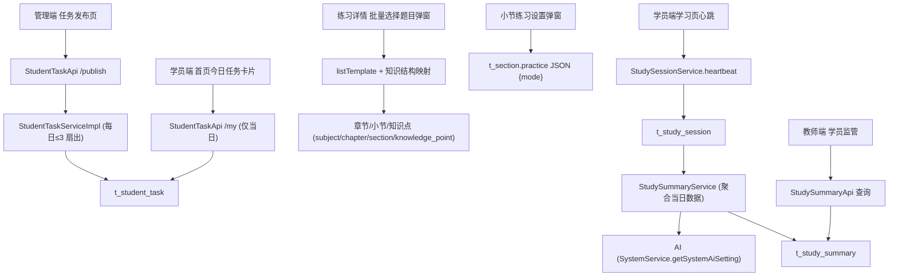

# 学员学习增强（任务 / 选题 / 学习总结）

Feature Name: 2026-09-11-student-learning-enhancements
Updated: 2026-09-11

## Description

本设计覆盖需求文档中的五项能力：任务发布多文本框与每人每日≤3、学员端今日任务卡片、练习选题的知识结构筛选与知识点回溯、小节练习「常规」模式、以及学习会话超 1 小时自动生成当日学习总结。设计以最小侵入为原则：任务沿用既有 `t_student_task`，选题在既有批量选择弹窗内做知识结构映射，小节模式扩展 `t_section.practice` JSON，学习总结新增会话与总结两张表。

## Architecture



## Components and Interfaces

### 1. 任务发布（需求 1、2）

- **DTO** `StudentTaskPublishDTO`：字段由 `studentIds + content` 改为 `studentIds + contents: List<String>`。
- **API** `StudentTaskApi`
  - `POST /api/student/task/publish`：入参改为多任务内容列表。
  - `GET /api/student/task/my`：仅返回当日任务。
- **Service** `StudentTaskServiceImpl.publishTasks`
  - 校验 `studentIds` 非空、`contents` 数量 1..3、每条 trim 后非空且 ≤500 字。
  - 对每个学员统计 `create_at >= 当日 00:00:00` 的任务数，若 `已有 + contents.size() > 3` 抛 `ValidationException`（`@Transactional` 整体回滚）。
  - 每个学员 × 每条内容插入一行 `t_student_task`。
  - `listMyTasks` 增加 `create_at >= 当日 00:00:00` 过滤，按创建时间升序。
- **前端**
  - `TaskAssignmentPage.jsx`：`Form.List` 动态任务输入框，最多 3 条，提交 `contents`。
  - `StudentHomePage.jsx`：移除右下角悬浮 Label 与 `listMyStudentTasks` 之外的旧 `studentTasks`（`api/task`）来源；「今日任务」卡片改读 `listMyStudentTasks` 的 `taskContent`。
  - `StudentHomePage.css`：移除 `.sh-home-task-fab*` 样式。
  - 旧「今日任务」（`t_task`）停用：移除 `MainLayout` 菜单项与 `App.jsx` 路由 `/tasks`（保留旧文件不删除）。

### 2. 练习选题（需求 3）

- **前端** `SelectTemplateModal.jsx`
  - 打开时并行加载：`listTemplate({current:1,pageSize:500})` 与 `listKnowledgePoints({current:1,pageSize:10000})`。
  - 由知识点列表构建 `kpName → {subjectName, chapterName, sectionName}` 映射。
  - 对每道题计算有效归属：自身 `subject/chapter/section` 与「由其 `knowledgePoint` 名称回溯到的章节/小节」取并集（按名称去重）。
  - 级联下拉选项与匹配均基于有效归属，章节/小节值的来源为知识结构。
  - 不改后端 `listTemplate`。
- **后端**：无需新增接口。

### 3. 小节练习「常规」模式（需求 4）

- **数据**：`t_section.practice` JSON 增加 `mode` 字段，取值 `normal`（默认）或 `random`；`normal` 时不再要求 `questionCount/difficulty/types`。
- **前端** `SectionManagePage.jsx`：练习设置弹窗顶部增加模式单选；`normal` 隐藏自动出题配置；保存时写入 `mode`。摘要列按模式展示。
- **前端** `ChapterManagePage.jsx`：小节练习摘要按模式展示。
- **学员端**：`normal` 沿用现有「按小节绑定练习取题」逻辑，无需改动。

### 4. 学习会话与总结（需求 5）

- **数据模型**（新增）
  - `t_study_session`：`id, student_id, subject_id, session_date, start_at, last_heartbeat_at, end_at, duration_ms, status, create_at, update_at, is_deleted`。
  - `t_study_summary`：`id, student_id, summary_date, session_id, content, model, status, create_at, update_at, is_deleted`；以 `student_id + summary_date` 定位当日唯一总结（更新覆盖）。
- **接口**（`StudentStudyApi` 或并入 `StudentApi`）
  - `POST /api/student/study/heartbeat`：入参 `{subjectId?}`；返回 `{durationMs, generated}`；服务端按 30 分钟间隔续会话或开新会话，累计达 60 分钟触发总结。
  - `GET /api/student/study/summary`：学员查本人当日总结。
  - `GET /api/student/study/summary/student?studentId=&date=`：教师/管理员查指定学员总结，权限 `student:supervision` 或 admin。
- **服务** `StudySessionService` / `StudySummaryService`
  - 心跳：读取最近一条当日会话，若 `now - last_heartbeat_at <= 30min` 续用，否则新会话；更新 `duration_ms = last_heartbeat_at - start_at`。
  - 总结聚合：当日 `t_practice_record`（题量、正确数、时长）+ `t_practice_detail`（错题数）+ `t_user_learning_record`（行为与积分）+ `t_user_knowledge_progress`/`t_user_weak_knowledge`（掌握度、薄弱点）。
  - 生成：复用系统 AI 设置（`SystemService.getSystemAiSetting`）调用兼容 OpenAI 的 `chat/completions`；未启用/失败时用规则模板拼接文本。
- **前端**
  - 在 `StudentLayout` 挂载统一心跳副作用：进入学员端后每 5 分钟及页面可见性变化时上报，避免逐页改动。
  - `StudentSupervisionPage.jsx`：学员行增加「学习总结」入口，弹窗展示当日总结。

## Data Models

```
t_student_task（复用）
  id, school_id, student_id, task_content, task_type, task_target,
  status, create_by, create_at, update_at, is_deleted

t_study_session（新增）
  id varchar(64) PK, student_id varchar(64), subject_id varchar(64),
  session_date varchar(10), start_at timestamp, last_heartbeat_at timestamp,
  end_at timestamp NULL, duration_ms bigint, status varchar(20),
  create_at, update_at, is_deleted
  index (student_id, session_date)

t_study_summary（新增）
  id varchar(64) PK, student_id varchar(64), summary_date varchar(10),
  session_id varchar(64), content text, model varchar(100), status varchar(20),
  create_at, update_at, is_deleted
  index (student_id, summary_date)
```

## Correctness Properties

1. 任意学员任意自然日，`t_student_task` 当日有效记录数不超过 3。
2. 任务发布为原子操作，任一目标学员超限则整批不落库。
3. 学员端当日任务查询不返回历史日期任务。
4. 练习选题：题目通过知识点能命中小节筛选，与题目自身章节/小节文本是否填写无关。
5. 小节练习模式缺省为 `normal`，向后兼容旧的无 `mode` 的 `practice` JSON。
6. 学习会话：心跳间隔 ≤30 分钟视为同一次会话；总结在会话累计 ≥60 分钟时生成。
7. 同一学员同一日仅保留最新一条学习总结。
8. AI 不可用时总结仍可生成（规则模板）。

## Error Handling

| 场景 | 处理 |
|---|---|
| 未选学员 / 任务内容全空 | 返回业务校验提示，不写库 |
| 任务内容超过 500 字 | 返回业务校验提示，不写库 |
| 某学员当日任务将超过 3 条 | 抛出校验异常，整批回滚 |
| 知识点列表加载失败 | 选题弹窗降级为仅使用题目自身标签筛选，提示但不阻塞 |
| AI 未启用 / 调用超时 | 使用规则模板生成总结，`model` 标记为 `rule` |
| 学员心跳 subjectId 缺失 | 允许空学科，会话仍可记录 |

## Test Strategy

- 后端：对任务发布执行 3 条上限、跨日隔离、多学员扇出与事务回滚的单测/接口测试；对心跳续会话/切会话与总结聚合的边界测试。
- 前端：`npx oxlint` 静态校验；手动验证任务发布多输入框、学员首页卡片、选题按小节命中、小节模式切换、教师查看总结。
- 端到端：使用测试学员账号（学号 54271032）与管理员账号，走完发布 → 学员查看 → 心跳 → 总结 → 教师查看链路。

## References

[^1]: (File) - [StudentTaskServiceImpl.java](../../server/rdbms/src/main/java/cn/wisestar/server/impl/StudentTaskServiceImpl.java)
[^2]: (File) - [SelectTemplateModal.jsx](../../wisestar-client/src/components/repo/SelectTemplateModal.jsx)
[^3]: (File) - [SectionManagePage.jsx](../../wisestar-client/src/pages/knowledge/SectionManagePage.jsx)
[^4]: (File) - [StudentHomePage.jsx](../../wisestar-client/src/pages/student/StudentHomePage.jsx)
