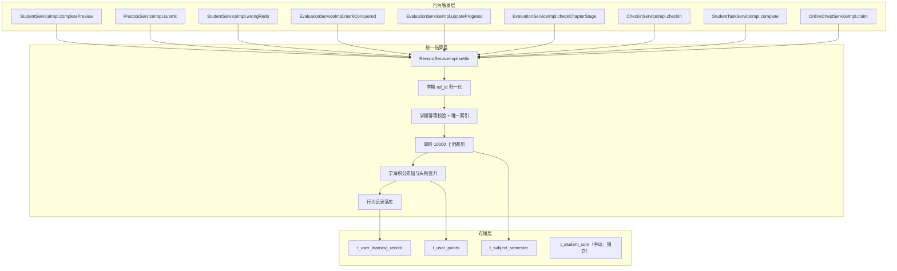
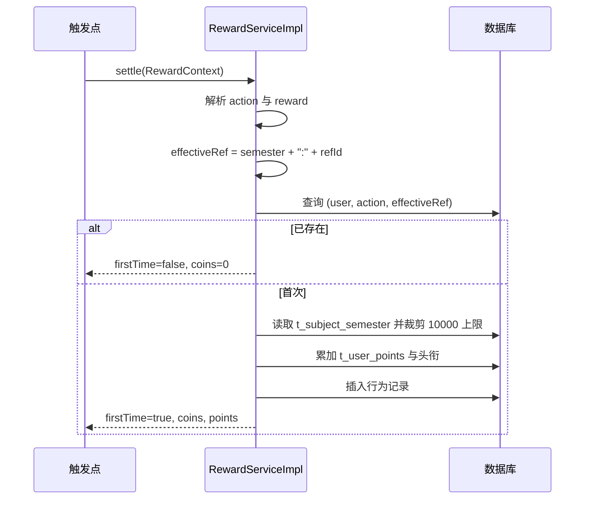
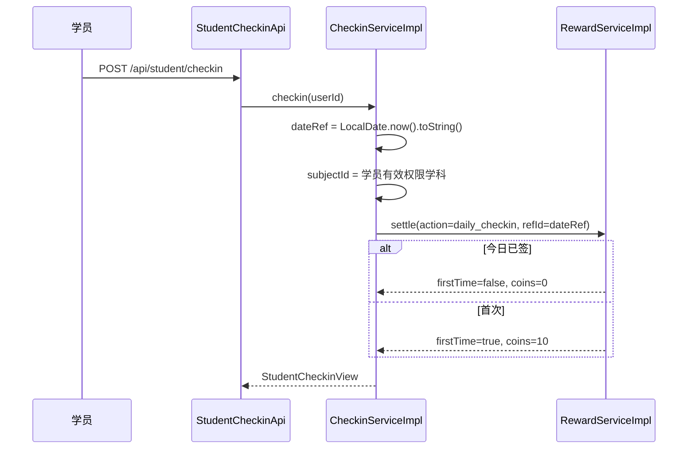

# 学习币体系重构 技术设计文档

Feature Name: coin-system-revamp
Updated: 2026-09-12

## 1. 概述

本设计在不改动学海积分与头衔体系的前提下，重构学习币的产出规则与上限。核心改动集中在后端统一结算层 `RewardServiceImpl` 与行为触发点：把 `ref_id` 从「终身幂等」升级为「学期幂等」，删除 7 天防刷逻辑，单科单学期上限由 3000 提升到 10000，并新增消灭知识点、每日签到、任务完成三类学习币行为。所有金额与业务判定只在后端服务层执行，前端只负责展示与触发。

## 2. 目标与非目标

### 2.1 目标

1. 单科单学期自动学习币上限提升到 10000；老师手动发币继续独立记账且不占用上限。
2. 预习、专项练习、小节通关、消灭知识点、薄弱点攻克、错题订正、章节阶段、任务完成均改为「每学期每内容一次」。
3. 新增每日签到（固定 +10/天）与消灭知识点（掌握度 ≥85，+60/点）。
4. 保留学海积分发放值、头衔阈值、商城兑换流程不变。
5. 通过唯一索引 + 事务保证并发下的幂等。

### 2.2 非目标

1. 不修改学海积分累加口径与头衔阈值。
2. 不修改商城商品、兑换流程、校区定价策略。
3. 不新增学科/知识点/章节内容。
4. 不实现连续签到天数玩法。

## 3. 奖励表（币值已确认）

| 行为 | action | 币 | 积分 | ref_id（存储时统一加 `{semester}:` 前缀） | 频率 |
|------|--------|----|----|------------------------------------------|------|
| 知识点预习 | `preview` | 5 | 3 | `preview:{kpId 或 sectionId}` | 每学期每内容一次 |
| 专项练习 | `practice` | 20 | 6 | `practice:{targetId}` | 每学期每内容一次 |
| 小节通关（试炼） | `trial` | 30 | 10 | `trial:{targetId}` | 每学期每内容一次 |
| 通关优秀 | `trial_bonus` | 15 | 8 | `trial_bonus:{targetId}` | 每学期每内容一次 |
| 消灭知识点 | `kp_master` | 60 | 0 | `master:{kpId}` | 每学期每知识点一次 |
| 薄弱点攻克 | `weak_conquer` | 25 | 12 | `weak:{kpId}` | 每学期每知识点一次 |
| 错题订正 | `wrong_correct` | 5 | 4 | `wrong:{questionId}` | 每学期每题一次 |
| 章节阶段 | `chapter_stage` | 300/350/400/450/500/600 | 40/50/60/75/90/100 | `chapter_stage:{subjectId}:{stage}` | 每学期每阶段一次 |
| 每日签到 | `daily_checkin` | 10 | 0 | `{yyyy-MM-dd}` | 每自然日一次 |
| 任务完成 | `task_done` | 15 | 0 | `task:{taskId}` | 每学期每任务一次 |
| 每日知识点里程碑 | `daily_kp` | 8 | 5 | `{yyyy-MM-dd}` | 每自然日一次 |
| 每日错题里程碑 | `daily_wrong` | 6 | 3 | `{yyyy-MM-dd}` | 每自然日一次 |
| 每日有效学习 | `daily_time` | 7 | 4 | `{yyyy-MM-dd}` | 每自然日一次 |
| 在线宝箱 | `online_chest_30/60/120` | 5/10/20 | 0 | `{yyyy-MM-dd}:{tier}` | 每自然日每档一次 |

产出池校验（数学 91 知识点 / 62 小节 / 6 章节阶段）：

```
预习        5  × 91  =  455
消灭知识点  60 × 91  = 5460
专项练习    20 × 62  = 1240
小节通关    30 × 62  = 1860
章节阶段    300+350+400+450+500+600 = 2600
------------------------------------------------
内容型满额            = 11615
90% × 11615           = 10453  >  10000
```

## 4. 架构设计

### 4.1 组件关系



### 4.2 后端职责

| 组件 | 职责 | 改动类型 |
|------|------|----------|
| `StudentRewardConstants` | 行为常量、奖励值、上限、学期键、行为标签 | 修改 |
| `RewardServiceImpl` | 统一结算：ref_id 归一化、学期幂等、上限裁剪、积分累加 | 修改 |
| `EvaluationServiceImpl` | 掌握度刷新时触发消灭知识点结算 | 修改 |
| `CheckinServiceImpl` | 每日签到查询与领取 | 新增 |
| `StudentTaskServiceImpl` | 任务完成奖励结算 | 新增/修改 |
| `StudentServiceImpl` | 预习/错题订正 ref_id 对齐内容标识 | 修改 |
| `PracticeServiceImpl` | 练习/试炼 ref_id 对齐内容标识 | 修改 |
| `OnlineChestServiceImpl` | 宝箱结算 refId 保持日期维度，随学期前缀自动隔离 | 复用 |

### 4.3 前端职责

| 组件 | 职责 | 改动类型 |
|------|------|----------|
| `MallPage.jsx` | 单科上限文案由 3000 改为 10000 | 修改 |
| `useStudentStore.js` | 规则说明中的学币数值与上限 | 修改 |
| `StudentHomePage.jsx` | 新增每日签到卡片与状态 | 修改 |
| `student.js` / `studentStudy.js` | 签到接口封装 | 修改 |
| 规则说明区 | 展示调整后的行为币值 | 修改 |

## 5. 数据模型

### 5.1 `t_user_learning_record`（复用，语义升级）

现有字段 `user_id`、`action_type`、`ref_id`、`coins`、`points`、`semester` 保持。变化点：`ref_id` 存储值统一带 `{semester}:` 前缀，作为学期幂等键。

```sql
-- 新增唯一索引，保证并发下同一学员同一行为同一 ref_id 只落一条
CREATE UNIQUE INDEX IF NOT EXISTS uk_ulr_user_action_ref
    ON t_user_learning_record (user_id, action_type, ref_id);
```

> 迁移注意：应用前需确认历史数据不存在 `(user_id, action_type, ref_id)` 重复；若有重复先归档。H2/MySQL 唯一索引允许多个 NULL，无 ref_id 的历史行不受影响。

### 5.2 `t_subject_semester`（复用）

字段不变，`coins` 上限由常量控制（`SUBJECT_COIN_LIMIT=10000`），`reached_limit` 语义不变。

### 5.3 `t_student_coin`（复用，手动发币）

老师手动发币独立表，不写入 `t_user_learning_record`，天然不计入 10000 上限。本特性不改其结构。

### 5.4 DDL 变更清单

| 文件 | 变更 |
|------|------|
| `rdbms/src/main/resources/scripts/init-h2.sql` | 新增 `uk_ulr_user_action_ref` 唯一索引 |
| `rdbms/src/main/resources/scripts/init-mysql.sql` | 新增 `uk_ulr_user_action_ref` 唯一索引 |

`init-h2.sql` 使用 `mode: always`，索引语句幂等（`IF NOT EXISTS`），启动即生效。

## 6. `ref_id` 归一化设计

`RewardServiceImpl.settle` 在计算学期后统一归一化：

```java
String semester = StudentRewardConstants.currentSemester();
String rawRef = context.getRefId();
String effectiveRef = StringUtils.hasText(rawRef) ? semester + ":" + rawRef : null;
// 幂等校验与落库均使用 effectiveRef
```

由此获得三个收益：

1. **学期隔离自动成立**：上一学期的 `ref_id` 是 `2026-1:xxx`，新学期是 `2026-2:xxx`，无需额外清账逻辑即可跨学期重发。
2. **调用方无需感知学期**：各触发点只负责传「内容标识」，学期前缀由结算层统一补齐，避免遗漏。
3. **长度可控**：学期键 6 位 + 冒号 + 最长内容 ref_id（`chapter_stage:` + 19 位 subjectId + `:` + 1 位 stage ≈ 36），总长 < 64，符合列宽。

`ref_id` 长度校验：`effectiveRef.length() > 64` 时截断或抛 `ValidationException`，防止写入失败。设计采用超长抛错并记录告警，便于尽早发现调用方传参错误。

## 7. 关键流程

### 7.1 内容一次性发币



### 7.2 消灭知识点

掌握度在 `EvaluationServiceImpl.updateProgress`（练习按知识点聚合）与 `recordConquerRate`（攻克复测）两处刷新。设计在两处刷新后统一检查：

```java
private void settleKpMaster(String userId, KpContext ctx, String kpId) {
    if (ctx == null || !StringUtils.hasText(ctx.subjectId)) return;
    UserKnowledgeProgress p = findProgress(userId, ctx, kpId);
    int mastery = p == null || p.getMastery() == null ? 0 : p.getMastery();
    if (mastery < MASTER_THRESHOLD) return;   // MASTER_THRESHOLD = 85
    RewardContext rc = new RewardContext();
    rc.setUserId(userId);
    rc.setSubjectId(ctx.subjectId);
    rc.setKnowledgePointId(kpId);
    rc.setActionType(StudentRewardConstants.ACTION_KP_MASTER);
    rc.setRefId("master:" + kpId);
    try { rewardService.settle(rc); }
    catch (Exception e) { log.warn("kp master reward failed: user={}, kp={}", userId, kpId, e); }
}
```

幂等由 `semester + master:{kpId}` 保证，重复刷新掌握度不会重复发放。

### 7.3 每日签到



- `GET /api/student/checkin` 返回 `checkedToday` 与 `coins`。
- 签到无学科语义，为计入 10000 上限，`subjectId` 取学员有效权限中的首个学科（与在线宝箱 `resolveSubject` 同口径）；该策略已确认（用户 2026-09-12 拍板）。

### 7.4 任务完成

任务奖励由任务完成触发点调用 `settle(action=task_done, refId="task:" + taskId)`。任务是否达成由任务服务判定；未达成时抛 `ValidationException`，不进入结算。幂等键 `semester + task:{taskId}` 保证每学期每任务一次。

## 8. 正确性与并发

1. **幂等双保险**：先 `existsRef` 查询短路重复请求；再由 `uk_ulr_user_action_ref` 唯一索引兜底并发穿透。捕获 `DuplicateKeyException` 时按「已发放」返回 `firstTime=false`。
2. **事务边界**：`settle` 标注 `@Transactional`，行为记录、学期币值、积分、头衔在同一事务内提交。
3. **上限裁剪原子性**：读改写 `t_subject_semester` 在同一事务内完成；`uk_subject_semester` 保证一行一学期。高并发下唯一索引 + 事务可避免超发，必要时对学期行加 `SELECT ... FOR UPDATE`。
4. **积分不受上限影响**：记录 `coins=裁剪后值`、`points=基准值`，达到上限后仍持续发积分。
5. **每日里程碑防递归**：`action` 以 `daily_` 开头时不触发 `checkDailyMilestones`，签到与在线宝箱的 `daily_`/`online_` 行为不会造成递归。

## 9. 错误处理

| 场景 | 处理 |
|------|------|
| 缺少 userId / actionType | 返回 `ok=false`，不写库 |
| 未知 action | 返回 `ok=false`，提示未知行为 |
| ref_id 超长 | 抛 `ValidationException`，记录告警 |
| 并发唯一键冲突 | 捕获 `DuplicateKeyException`，按已发放返回 |
| 消灭知识点结算异常 | 记录 warn，不阻断掌握度刷新主流程 |
| 签到重复 | 返回 `firstTime=false`，不报错 |
| 任务未达成 | 抛 `ValidationException`，不写库 |

## 10. 接口变更

| 方法 | 路径 | 说明 | 鉴权 |
|------|------|------|------|
| GET | `/api/student/checkin` | 查询当日签到状态 | 学员登录 |
| POST | `/api/student/checkin` | 领取当日签到奖励 | 学员登录 |
| GET | `/api/student/coins` | 返回 `limit=10000` | 学员登录 |
| POST | `/api/student/task/{id}/complete` | 完成任务并结算（若任务模块已有完成接口则复用） | 学员登录 |

## 11. 前端变更

1. `MallPage.jsx`：上限展示 3000 → 10000，文案同步。
2. `useStudentStore.js`：`rules` 中币值更新，新增签到、消灭知识点说明。
3. `StudentHomePage.jsx`：新增签到卡片，调用 `GET /api/student/checkin` 初始化，点击调用 `POST`，成功后刷新学币。
4. `student.js`：新增 `getCheckin`、`checkin`。
5. 规则说明区：按 §3 奖励表展示。

## 12. 测试策略

### 12.1 后端

1. 单元/集成：`settle` 学期前缀归一化、重复 ref_id 拦截、10000 裁剪。
2. 消灭知识点：构造掌握度从 <85 到 ≥85，验证首次发 60 币、重复刷新不再发。
3. 签到：首次 +10、当日重复 0、跨自然日再发。
4. 任务：达成发 15、未达成报错、每学期一次。
5. 上限：连续触发行为至 10000，验证裁剪、`reachedLimit`、积分继续累加。
6. 并发：并行提交同一 ref_id，验证仅一条记录、仅发一次。

### 12.2 验证手段

- 后端打包：`cd /workspace/wisestar/server && mvn clean package -pl api -am -DskipTests -q`。
- 重启 preview（:1991），使用学员凭证 `/tmp/opencode/scookie.txt` 冒烟。
- 前端：`npx oxlint`，经 Vite（:3000，代理 `/api` → 1991）验证接口 200。

## 13. 风险与迁移

| 风险 | 说明 | 缓解 |
|------|------|------|
| 历史 ref_id 无学期前缀 | 升级后旧记录与新键不匹配，可能多补发一次 | 仅测试环境数据，接受一次补发；如需严格，可在上线时归档旧行为记录 |
| 唯一索引与历史重复数据冲突 | 建索引失败 | 建索引前执行重复检查，先归档重复行 |
| 金额未确认 | §3 币值可能调整 | 数值集中在常量类，改一处即可，不散落 |
| 签到学科归属 | 签到无学科，需落到某学科上限 | 取首个有效权限学科；已确认 |
| 跨学期头衔 | 头衔基于终身积分，不随学期清零 | 保持现状，符合非目标 |

## 14. 已确认事项（原待确认，2026-09-12 用户拍板）

1. **奖励表币值**：全部采用拟定值——`preview=5/3`、`practice=20/6`、`trial=30/10`、`trial_bonus=15/8`、`kp_master=60/0`、`weak_conquer=25/12`、`wrong_correct=5/4`、`task_done=15/0`、`daily_checkin=10/0`、`chapter_stage=300/350/400/450/500/600 币 + 40/50/60/75/90/100 分`（已写入 `StudentRewardConstants`）。
2. **错题订正币值**：由 8 降为 5 为预期。
3. **签到学科归属**：签到 10 币计入学员首个有效权限学科的 10000 上限。
4. **任务模块**：新增 `POST /api/student/task/complete?id=` 接口与任务达成判定（`StudentTaskService.completeTask`），任务未达成不结算。
5. **消灭知识点**：掌握度达精通（≥85）每知识点每学期发一次；学海积分与头衔体系保持现状不变。

## 15. 参考资料

1. 需求文档：`.monkeycode/specs/2026-09-12-coin-system-revamp/requirements.md`
2. 现有数值体系：`.monkeycode/specs/2026-09-10-student-points-coin-ledger/requirements.md`
3. 在线宝箱设计：`.monkeycode/specs/2026-09-12-online-duration-chest/design.md`
4. 关键代码：`shared/.../constant/StudentRewardConstants.java`、`rdbms/.../impl/RewardServiceImpl.java`、`rdbms/.../impl/EvaluationServiceImpl.java`、`rdbms/.../scripts/init-h2.sql`
