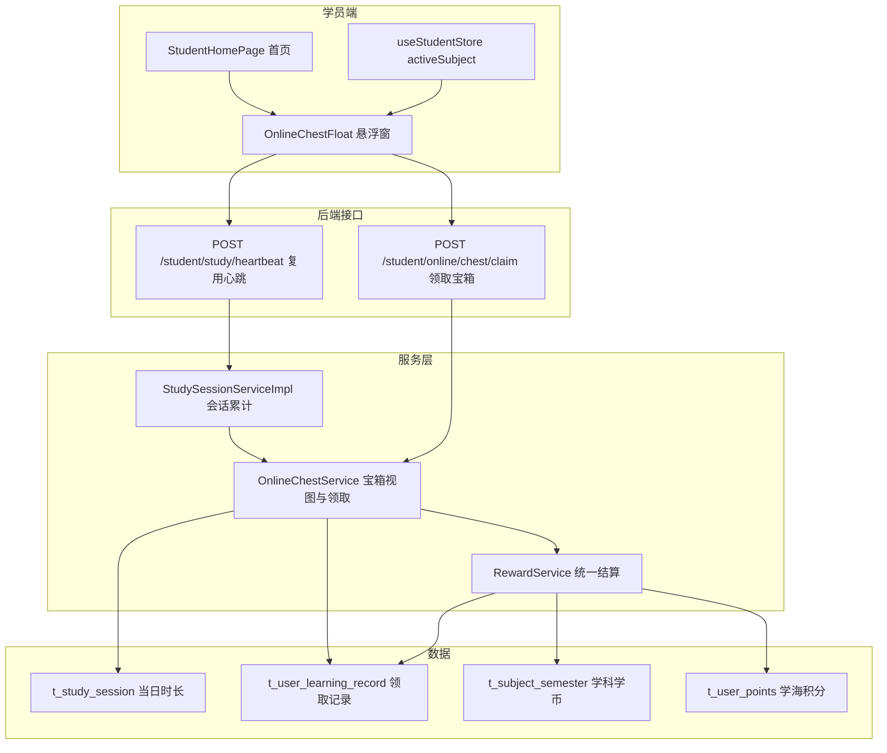

# 学员端在线时长宝箱 技术设计

Feature Name: 2026-09-12-online-duration-chest
Updated: 2026-09-12

## Description

在学员端首页新增「在线时长宝箱」：以自然日心跳在线会话累计时长为进度，设置 30/60/120 分钟三档宝箱，达到档位可领取学习币（5/10/20），以悬浮窗常驻首页。复用现有 `t_study_session` 心跳会话与 `RewardService` 统一账本，不新增表、不新增心跳链路。在线时长取会话时长，领取以「学员 + 档位 + 日期」幂等；与现有「每日有效学习 30 分钟」里程碑并存、互不影响。

## Architecture



**数据流**：心跳 → 续会话并刷新 `duration_ms` → `OnlineChestService` 汇总当日会话时长 → 结合当日领取记录推导三档状态 → 返回悬浮窗渲染；领取 → 校验达标与未领 → `RewardService.settle(online_chest_{tier})` → 写行为记录并入学科学习币账本 → 返回最新宝箱状态。

## Components and Interfaces

### 新增：`OnlineChestService`（`shared` 接口 + `rdbms` 实现）

```java
public interface OnlineChestService {
    StudentOnlineChestView view(String userId);
    StudentOnlineChestClaimView claim(String userId, Integer tierMinutes, String subjectId);
}
```

### 新增常量（`StudentRewardConstants`）

| action_type | 触发 | 币 | 积分 | 幂等键 |
|---|---|---|---|---|
| `online_chest_30` | 领取 30 分钟宝箱 | 5 | 0 | `{date}:30` |
| `online_chest_60` | 领取 60 分钟宝箱 | 10 | 0 | `{date}:60` |
| `online_chest_120` | 领取 120 分钟宝箱 | 20 | 0 | `{date}:120` |

- `reward()` 增加这三个 case；`actionLabel()` 返回「在线宝箱（30 分钟）」等。
- 不加入 `isTargetBased`（无需 7 天防刷，靠 `refId` 按日幂等）。

### DTO

```text
StudentOnlineChestView
  long onlineMinutes            // 当日在线分钟（向下取整）
  List<Chest> chests
    int tierMinutes             // 30 / 60 / 120
    int coins                   // 5 / 10 / 20
    String state                // locked / claimable / claimed

StudentOnlineChestClaimView
  boolean ok
  int coins                     // 本次实际到账（上限裁剪后）
  boolean coinsCapped
  boolean firstTime             // false 表示当日已领取
  String message
  StudentOnlineChestView onlineChest
```

### 接口变更

| 接口 | 变更 |
|---|---|
| `POST /api/student/study/heartbeat` | `StudyHeartbeatView` 增加 `onlineChest`（当日时长 + 三档状态），心跳内刷新会话后返回 |
| `POST /api/student/online/chest/claim` | 新增，入参 `{ tier, subjectId? }`，返回 `StudentOnlineChestClaimView` |
| `StudentService` / `StudentServiceImpl` | 注入 `OnlineChestService` 供接口调用 |

### 时长与状态计算

1. 当日在线毫秒 = `selectList(t_study_session where student_id=? and session_date=? today)` 的 `duration_ms` 求和；分钟数 = `ms / 60000` 向下取整。
2. 当日已领集合 = `t_user_learning_record where user_id=? and action_type in (online_chest_30/60/120) and learned_at >= 今日 0 点`，按 `action_type` 映射档位。
3. 状态：已领 → `claimed`；否则当日分钟 ≥ 档位 → `claimable`；否则 `locked`。

### 领取流程

1. 校验 `tier ∈ {30,60,120}`，否则抛 `ValidationException("未知宝箱档位")`。
2. 取当日在线分钟，`< tier` 抛 `ValidationException("在线时长未达标")`。
3. 组装 `RewardContext`：`actionType=online_chest_{tier}`、`refId={date}:{tier}`、`subjectId`（请求学科，缺省回退学员有效权限学科的第一个）。
4. 调 `RewardService.settle`；`firstTime=false` 表示当日已领，返回提示不重复发币。
5. 重新计算 `StudentOnlineChestView` 一并返回。

## Data Models

不新增表。数据来源：

- `t_study_session`（既有）：`student_id / session_date / duration_ms / last_heartbeat_at`，在线时长唯一事实源。
- `t_user_learning_record`（既有）：领取行为与幂等，`action_type` + `ref_id={date}:{tier}`。
- `t_subject_semester`（既有）：领取学习币按学科累计，继承单科 3000 上限。
- `t_user_points`（既有）：本特性积分发放为 0，不改变积分。

## Correctness Properties

1. **按日重置**：在线分钟完全由当日会话推导；领取集合按 `learned_at >= 今日 0 点` 过滤，跨日自动归零。
2. **幂等领取**：同一 `(user, online_chest_{tier}, {date}:{tier})` 只实际发放一次，重复请求 `firstTime=false`、`coins=0`。
3. **达标才可领**：领取前二次校验当日分钟 ≥ 档位，防止前端伪造。
4. **上限不变量**：领取后对应学科学期学习币不超过 3000；达上限时 `coinsCapped=true` 且不溢出。
5. **状态自洽**：`onlineMinutes ≥ tier` 且未领取 ⇔ `claimable`；已领 ⇔ `claimed`。
6. **无表依赖**：宝箱状态可完全由既有两张表推导，刷新/换设备结果一致。

## Error Handling

| 场景 | 处理 |
|---|---|
| 未登录 / 非学员 | 沿用 `currentStudentId`/`hasPermission` 校验，返回未授权结果 |
| 档位非法 | `ValidationException("未知宝箱档位")`，不写账本 |
| 未达标 | `ValidationException("在线时长未达标")`，不写账本 |
| 当日已领 | 正常返回 `firstTime=false`、提示「今日已领取」 |
| 单科达上限 | 正常发币裁剪，`coinsCapped=true`，提示上限文案 |
| 悬浮窗接口异常 | 前端捕获后隐藏内容或保留上次值，不影响首页其他模块 |

## Test Strategy

1. **后端单元/H2 集成**：构造当日 `t_study_session`（如 29 分、30 分、61 分、121 分）断言三档状态；连续领取同一档与不同档；跨日重置（改 `session_date`）；单科上限裁剪。
2. **接口冒烟**：学员登录 → `POST /student/study/heartbeat` 断言 `onlineChest.onlineMinutes` 与三档状态 → `POST /student/online/chest/claim` 断言 `coins`、`firstTime`、`coinsCapped` 与重复领取。
3. **前端**：`npx oxlint` 通过；首页悬浮窗渲染三档状态、可领取高亮、领取后即时刷新；纯净学习模式隐藏。
4. **回归**：现有每日 30 分钟里程碑（`daily_time`）仍按练习时长独立触发；心跳既有字段与学习总结逻辑不受影响。

## References

- [^1]: (`server/rdbms/src/main/java/cn/wisestar/server/impl/StudySessionServiceImpl.java`) - 心跳会话累计与会话间隔
- [^2]: (`server/rdbms/src/main/java/cn/wisestar/server/impl/RewardServiceImpl.java#L51`) - 统一结算与幂等
- [^3]: (`server/shared/src/main/java/cn/wisestar/server/core/constant/StudentRewardConstants.java`) - 行为常量与奖励映射
- [^4]: (`wisestar-client/src/api/studentStudy.js`) - 心跳接口封装
- [^5]: (`wisestar-client/src/pages/student/StudentHomePage.jsx`) - 首页挂载点
