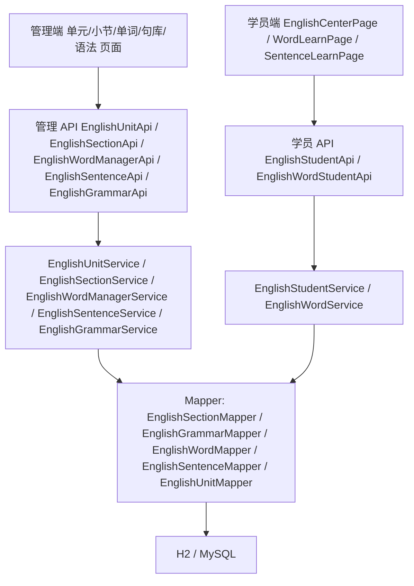
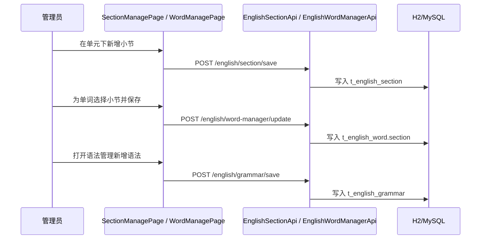

# 英语后台内容管理与前端对接 技术设计文档

Feature Name: 2026-09-18-english-admin-hub
Created: 2026-09-18
Status: 已确认（2026-09-18）
Related: `requirements.md`、`../student-english-hub/design.md`

## 1. 概述

### 1.1 目标

在英语模块既有实现上完成「管理端内容组织」与「学员端内容消费」的对接：

- 内容层级从四级扩展为五级：版本 → 年级 → 学期/册别 → 单元 → 小节。
- 语法库独立成板块，具备与词库/句库一致的层级维度与独立管理入口。
- 管理端英语入口收敛到「英语板块」，修正路由与菜单选中不一致。
- 学员端按小节分组消费单词与句子。

### 1.2 范围

**包含**

- 新增 `t_english_section` 小节目录表。
- `t_english_word`、`t_english_sentence` 新增 `section` 字段。
- `t_english_grammar` 扩展 `version / term / unit / section / sort` 与 `BaseModel` 审计列。
- 新增小节目录服务与 API、语法服务与 API。
- 管理端新增小节管理页、语法管理页；单词/句库管理页增加小节筛选与录入。
- 管理端菜单、路由、菜单选中修正；新增权限点并在初始化脚本登记。
- 学员端单词/句子按小节分组展示（语法学员端首期不做，见待确认）。

**不包含**

- 不改变现有复习算法（`EnglishReviewScheduler`）、学币发放口径、在线时长统计。
- 不改动 AI 生成算法本身，仅扩展语法同步落库字段。
- 不引入第三方音频版权内容，音频缺失继续回退浏览器语音合成。

### 1.3 设计原则

- 复用现有分层（MyBatis-Plus + `BaseModel` + `PaginationResponse` + 统一响应包装 `{code,data,message}`）。
- 小节目录与 `t_english_unit` 目录保持同构，降低认知成本。
- 所有 DDL 变更幂等（`CREATE TABLE IF NOT EXISTS` + `ADD COLUMN IF NOT EXISTS`），H2 与 MySQL 双脚本同步。
- 历史数据向后兼容：`section` 允许为空，展示层归入「未分节」。

## 2. 架构总览



分层落位：

- 接口层：`server/api/src/main/java/cn/wisestar/server/api/`
- 服务接口：`server/shared/src/main/java/cn/wisestar/server/service/`
- DTO/View：`server/shared/src/main/java/cn/wisestar/server/domain/dto/english/`
- 实体：`server/rdbms/src/main/java/cn/wisestar/server/domain/model/`
- Mapper：`server/rdbms/src/main/java/cn/wisestar/server/mapper/`
- 服务实现：`server/rdbms/src/main/java/cn/wisestar/server/impl/`
- 初始化脚本：`server/rdbms/src/main/resources/scripts/init-h2.sql`、`init-mysql.sql`
- 权限常量：`server/shared/src/main/java/cn/wisestar/server/core/constant/PermissionConsts.java`

## 3. 数据模型设计

### 3.1 小节目录表

```sql
CREATE TABLE IF NOT EXISTS t_english_section (
  id varchar(64) NOT NULL,
  version varchar(32) COMMENT '教材版本',
  grade varchar(16) COMMENT '年级',
  term varchar(16) COMMENT '学期（上册/下册）',
  unit varchar(128) COMMENT '单元',
  section varchar(128) COMMENT '小节',
  sort int DEFAULT 0 COMMENT '排序',
  create_at timestamp DEFAULT CURRENT_TIMESTAMP,
  create_by varchar(256),
  update_at timestamp,
  update_by varchar(256),
  is_deleted tinyint DEFAULT 0,
  PRIMARY KEY (id),
  UNIQUE KEY uk_section (version, grade, term, unit, section)
);
```

### 3.2 现有表扩展（幂等 ALTER）

```sql
-- 单词/句子新增小节
ALTER TABLE t_english_word ADD COLUMN IF NOT EXISTS section varchar(128);
ALTER TABLE t_english_sentence ADD COLUMN IF NOT EXISTS section varchar(128);

-- 语法扩展层级与审计列
ALTER TABLE t_english_grammar ADD COLUMN IF NOT EXISTS version varchar(32);
ALTER TABLE t_english_grammar ADD COLUMN IF NOT EXISTS term varchar(16);
ALTER TABLE t_english_grammar ADD COLUMN IF NOT EXISTS unit varchar(128);
ALTER TABLE t_english_grammar ADD COLUMN IF NOT EXISTS section varchar(128);
ALTER TABLE t_english_grammar ADD COLUMN IF NOT EXISTS sort int DEFAULT 0;
ALTER TABLE t_english_grammar ADD COLUMN IF NOT EXISTS create_at timestamp DEFAULT CURRENT_TIMESTAMP;
ALTER TABLE t_english_grammar ADD COLUMN IF NOT EXISTS create_by varchar(256);
ALTER TABLE t_english_grammar ADD COLUMN IF NOT EXISTS update_at timestamp;
ALTER TABLE t_english_grammar ADD COLUMN IF NOT EXISTS update_by varchar(256);
ALTER TABLE t_english_grammar ADD COLUMN IF NOT EXISTS is_deleted tinyint DEFAULT 0;
UPDATE t_english_grammar SET create_at = created_at WHERE create_at IS NULL AND created_at IS NOT NULL;
```

同时把 `t_english_word` 的 `term varchar(16)` 直接写入建表语句（保留既有 `ALTER ... ADD COLUMN IF NOT EXISTS term` 以兼容旧库），消除后置 ALTER 依赖。

### 3.3 数据兼容

- 现有 `t_english_word` / `t_english_sentence` 记录的 `section` 为 `NULL`，展示层归入「未分节」。
- 现有 `t_english_grammar` 记录仅有 `grade`，扩展后 `version/term/unit/section` 为 `NULL`，按「未分节」展示，`sort` 取默认 0。
- `t_english_grammar` 由非 `BaseModel` 改为 `BaseModel` 后，实体需补 `@EqualsAndHashCode(callSuper = false)`。

## 4. 后端设计

### 4.1 实体

- 新增 `EnglishSection extends BaseModel`：`version / grade / term / unit / section / sort`。
- `EnglishWord` 新增 `section`。
- `EnglishSentence` 新增 `section`。
- `EnglishGrammar` 改为 `extends BaseModel`，新增 `version / term / unit / section / sort`。

### 4.2 Mapper

- 新增 `EnglishSectionMapper extends BaseMapper<EnglishSection>`。
- `EnglishGrammarMapper` 保持 `BaseMapper`。

### 4.3 DTO / View

- 新增 `EnglishSectionQuery` / `EnglishSectionView`（version/grade/term/unit/section/sort）。
- `EnglishWordQuery` / `EnglishWordView` 新增 `section`。
- `EnglishSentenceQuery` / `EnglishSentenceView` 新增 `section`。
- 新增 `EnglishGrammarQuery` / `EnglishGrammarView`（version/grade/term/unit/section/title/content/examples/exercises/sort + 审计回显）。

### 4.4 Service

**EnglishSectionService（管理端）**

- `PaginationResponse<EnglishSectionView> list(EnglishSectionQuery query)`
- `List<EnglishSectionView> listByUnit(String version, String grade, String term, String unit)`
- `void saveOrUpdate(EnglishSectionView view)`：唯一键冲突时抛出业务异常（同名小节）。
- `void delete(String id)`

**EnglishGrammarService（管理与 AI 共用）**

- `PaginationResponse<EnglishGrammarView> list(EnglishGrammarQuery query)`
- `void saveOrUpdate(EnglishGrammarView view)`
- `void delete(String id)`
- `void upsertFromAi(String version, String grade, String term, String unit, String section, String title, String content, String examples, String exercises)`：按「版本 + 年级 + 学期 + 单元 + 小节 + 标题」判定新增或更新，供 `EnglishAiPackServiceImpl.syncToBank` 复用。

**EnglishWordManagerService / EnglishSentenceService（增强）**

- 查询条件增加 `section`；创建/更新/导入写入 `section`。
- `importWords` 增加小节列；`importSentences` 增加小节列，去重键追加 `section`（空值按空串参与比较）。

**EnglishStudentService（学员端增强）**

- `sentences(...)` 返回含 `section` 的视图。
- `EnglishWordService.wordBook(...)` 返回含 `section` 的视图。
- 分组在学员端前端完成，后端不新增分组接口。

### 4.5 API

**管理端**

| 方法 | 路径 | 权限 | 说明 |
|------|------|------|------|
| GET | `/api/english/section/list` | `english:section:list` | 小节分页/条件列表 |
| POST | `/api/english/section/save` | `hasAnyAuthority('english:section:create','english:section:update')` | 新增/更新小节 |
| POST | `/api/english/section/delete` | `english:section:delete` | 删除小节 |
| GET | `/api/english/grammar/list` | `english:grammar:list` | 语法分页列表 |
| POST | `/api/english/grammar/save` | `hasAnyAuthority('english:grammar:create','english:grammar:update')` | 新增/更新语法 |
| POST | `/api/english/grammar/delete` | `english:grammar:delete` | 删除语法 |

现有 `/api/english/unit/*`、`/api/english/word-manager/*`、`/api/english/sentence/*` 保持路径不变，仅在 DTO 与实现中增加 `section`。

**学员端**

现有 `/api/english/student/*`、`/api/english/word/*` 路径不变，响应视图新增 `section`。

### 4.6 核心逻辑

**小节目录与内容的关系**：小节目录只维护名称与排序，不强制内容必须挂到目录项；单词/句子/语法的 `section` 为自由文本。页面下拉候选取「小节目录 ∪ 内容中已出现的 section」，以保证历史数据可选。

**未分节归组**：展示层将 `section` 为空或空白的内容归入「未分节」分组，置于所有小节之后。

**语法去重键变更**：`syncToBank` 原按 `grade + title` 查重，调整为「version + grade + term + unit + section + title」，避免不同教材/单元同名语法互相覆盖。历史无层级数据仍可通过 `title` 命中回填（可选迁移，见 4.7）。

**学期列前置**：`t_english_word` 建表直接声明 `term`，避免新库在脚本后段前查询报错。

### 4.7 历史数据迁移（可选，幂等）

- 语法历史数据回填：对 `version/term/unit` 为空的语法记录，按 `grade` 与标题匹配同年级 AI 内容包，尽力回填；无法匹配的记录保留为空并按「未分节」展示。
- 本期不强制迁移，迁移脚本以 `UPDATE ... WHERE ... IS NULL` 形式幂等执行，可后续按需补。

## 5. 前端设计

### 5.1 管理端页面

**`/english/section` SectionManagePage（新增）**

- 筛选：版本、年级、学期、单元、小节关键字。
- 列表列：单元、小节、排序、操作。
- 操作：新增、编辑、删除；表单字段 version/grade/term/unit/section/sort。
- 风格：裸 div + `Title level={4}` + antd `Table`/`Modal`，不用 Card 包裹。

**`/english/grammar` GrammarManagePage（新增）**

- 筛选：版本、年级、学期、单元、小节、标题关键字。
- 列表列：版本、年级、学期、单元、小节、标题、更新时间、操作。
- 操作：新增、编辑、删除；表单字段含标题、讲解内容、例句（多行）、练习题（多行/JSON）、排序。
- 例句与练习题以多行文本编辑，提交时保持既有 JSON 结构。

**`/english/word` WordManagePage（增强）**

- 筛选与表单增加小节，版本/年级/学期/单元变更时联动刷新小节候选。
- 列表增加小节列。

**`/english/sentence` SentenceManagePage（增强）**

- 筛选与表单增加小节，列表增加小节列，导入模板增加小节列。

**路由修正**

- `WordBookManagePage` 的「学习」跳转由 `/english/word?wordId=` 改为 `/english/study?wordId=`。
- `App.jsx` 新增 `/english/section`、`/english/grammar` 路由并挂 `AuthGuard required`。
- `MainLayout.jsx`「英语板块」children 增加「小节管理」「语法管理」；将 `/english` 前缀纳入菜单选中判定，保证英语页面高亮。

**API 层**

- 新增 `wisestar-client/src/api/englishAdmin.js`，集中管理新增/改动的小节与语法接口（沿用 axios `request` 实例）。
- 现有管理页的裸 `fetch` 可保留，本轮只做必要改动，避免无关重构。

### 5.2 学员端页面

**课件分组**

- `EnglishWordLearnPage`、`EnglishSentenceLearnPage`：将返回内容按 `section` 分组渲染，分组标题显示小节名，「未分节」固定在最后；无小节或无内容时按单元整体展示。
- 分组仅改变渲染组织，不改变做题、判分与记录逻辑。

**入口一致性**

- 版本、年级、学期继续复用 `useStudentStore` 与页面内 term 选择，保证与英语学习中心一致。

### 5.3 视觉与合规

- 管理端遵循现有页面风格，不新增 UI 框架。
- 学员端延续海洋童趣风格 `student.css`，分组标题使用现有卡片样式。
- 功能命名使用通用教育术语，不复制第三方品牌元素。

## 6. 关键流程



## 7. 正确性属性

- 同一「版本 + 年级 + 学期 + 单元 + 小节」唯一（`uk_section`）。
- 单词/句子/语法查询在给定版本、年级、学期、单元下返回的记录，其 `section` 必属于该单元已定义小节集合或为空。
- 语法按「版本 + 年级 + 学期 + 单元 + 小节 + 标题」唯一命中，重复同步更新而非新增。
- 初始化脚本可对空库与既有库各执行至少两次且结果一致。

## 8. 错误处理

- 小节重名：返回业务错误「同一单元下已存在同名小节」，前端表单提示。
- 删除被内容引用的小节：本期仅删除目录项，不级联删除内容，内容 `section` 保留为原文本并归入对应分组。
- 权限不足：`@PreAuthorize` 拦截返回统一无权响应，前端 403 提示。
- 语法 JSON 解析失败：保存时保留原始文本并提示格式错误，不写入非法 JSON。

## 9. 测试策略

- **单元测试**：小节唯一性校验、语法 upsert 去重键、导入包含小节时的去重更新。
- **接口测试**：admin cookie 验证小节与语法 CRUD；验证单词/句子 save 携带 `section` 后可查询回显。
- **回环冒烟**：新增单元 → 新增小节 → 新增单词/句子挂小节 → 学员端按小节分组查看 → 复习记录正常。
- **前端验证**：`npm run build`，菜单高亮与路由跳转实测；单词本「学习」跳转修正实测。
- **脚本校验**：对 H2 空库执行 `init-h2.sql` 验证幂等；确认 `init-mysql.sql` 同步。
- **审计列一致性**：新增表与扩展表审计列与 `BaseModel` 对齐，H2 INSERT 列数与列名一致。

## 10. 实施任务拆解

1. 更新 `init-h2.sql` 与 `init-mysql.sql`：新增 `t_english_section`，为单词/句子加 `section`，扩展语法表，前置 `t_english_word.term`，登记新权限点到管理员角色 authority。
2. `PermissionConsts` 新增 `english:section:*`、`english:grammar:*`。
3. 后端实体：新增 `EnglishSection`，改造 `EnglishGrammar`（继承 `BaseModel` + 层级字段），`EnglishWord`/`EnglishSentence` 加 `section`。
4. 后端 Mapper、DTO/Query/View。
5. 后端 Service：`EnglishSectionService`、`EnglishGrammarService`，增强 `EnglishWordManagerService`/`EnglishSentenceService`/`EnglishStudentService`，改造 `EnglishAiPackServiceImpl.syncToBank`。
6. 后端 API：`EnglishSectionApi`、`EnglishGrammarApi`。
7. 管理端前端：新增小节管理页、语法管理页；增强单词/句库页；新增 `api/englishAdmin.js`；修菜单、路由、选中与「学习」跳转。
8. 学员端前端：单词/句子按小节分组渲染。
9. 后端 `clean package`、前端 `build`，接口与页面联调。
10. 端到端冒烟，导出 H2 快照并提交。

## 11. 风险与待定项

- **语法扩展影响 AI 同步**：去重键变更可能使历史同名语法在新键下新增记录，可通过可选迁移回填规避。
- **小节内容来源**：小节目录需人工维护，历史内容 `section` 为空按「未分节」展示，不影响可用性。
- **语法学员端**：是否首期开放需确认；若开放需追加学员端接口与页面。
- **导入模板列变更**：单词/句子导入模板新增小节列，需同步更新模板下载与文档说明。

## References

[^1]: (File) `requirements.md` - 本功能需求文档。
[^2]: (File) `../student-english-hub/design.md` - 英语学习中心既有技术设计。
[^3]: (File) `server/rdbms/src/main/resources/scripts/init-h2.sql#L2224` - 英语模块建表段。
[^4]: (File) `server/rdbms/src/main/java/cn/wisestar/server/impl/EnglishAiPackServiceImpl.java` - 语法同步逻辑（`syncToBank`）。
[^5]: (File) `server/rdbms/src/main/java/cn/wisestar/server/impl/EnglishUnitServiceImpl.java` - 单元目录聚合逻辑（小节可参照）。
[^6]: (File) `wisestar-client/src/App.jsx#L352` - 英语管理端路由。
[^7]: (File) `wisestar-client/src/components/layout/MainLayout.jsx#L114` - 英语板块菜单。

---

**文档状态**：已确认（2026-09-18，决策 1A/2A/3A）
**下一步**：按 `tasklist.md` 实施
