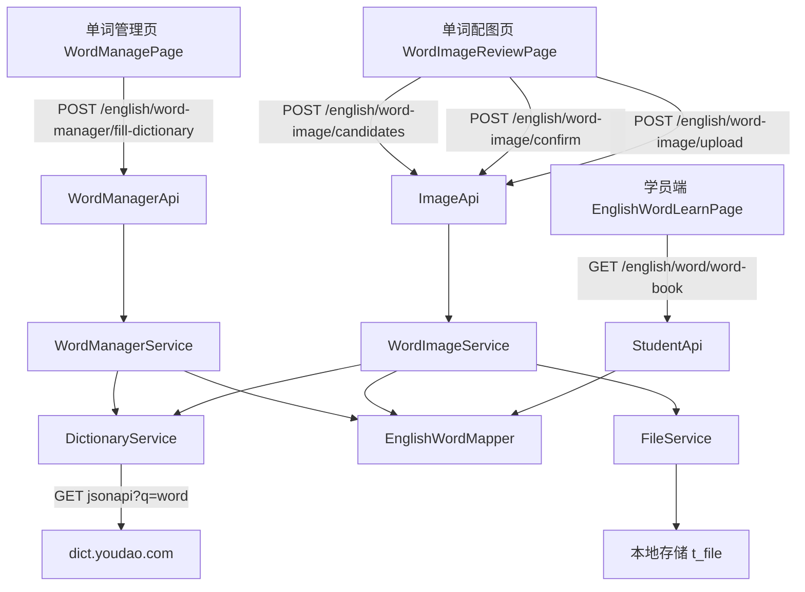

# 英语单词词典补全与图片配图

Feature Name: english-word-image
Updated: 2026-09-18

## Description

在英语板块新增两项能力：

1. **词典补全**：老师在单词管理页选中单词后，后端调用免费的公开词典接口（有道 `dict.youdao.com/jsonapi`），把音标、中文释义、双语例句回填到词库单词的空字段。
2. **单词配图**：新增「单词配图」页，老师筛选出无图片的单词，批量为它们抓取候选图（有道附图），逐张人工审核；确认后后端把图片下载并存储到系统文件服务，回写 `t_english_word.image_url`。也支持直接上传本地图片。学员端单词卡片按 `image_url` 展示配图，实现看图记单词。

## Architecture

数据流：
- 词典补全：老师选中 ID → 服务逐词查询有道 → 只填空字段 → 更新 `t_english_word` → 返回统计。
- 候选图：老师选中 ID → 服务逐词读取有道 `pic_dict` → 返回候选 URL 列表（不落库）。
- 确认入库：老师选定 URL → 服务下载图片字节 → `FileService.upload` 存储 → `image_url=/api/file?id=<fileId>` → 更新单词。
- 手动上传：老师上传文件 → `FileService.upload` → 同上回写。

## Components and Interfaces

### 后端（shared 模块）

- `domain/dto/english/DictionaryEntryView.java`：词典条目视图，字段 `word / phonetic / meaning / exampleSentence`。
- `domain/dto/english/WordImageCandidateView.java`：单词候选图视图，字段 `wordId / spell / meaning / candidates(List<String>)`。
- `domain/dto/english/WordImageView.java`：单词配图视图，字段 `wordId / spell / imageUrl`。
- `domain/dto/english/EnglishWordQuery.java`：新增 `hasImage` 字段（`false` 仅无图，`true` 仅有图，`null` 不限）。
- `service/EnglishDictionaryService.java`：`DictionaryEntryView lookup(String word)`。
- `service/EnglishWordImageService.java`：
  - `List<WordImageCandidateView> fetchCandidates(List<String> wordIds)`
  - `WordImageView confirmCandidate(String wordId, String imageUrl)`
  - `WordImageView uploadForWord(String wordId, MultipartFile file)`
- `service/EnglishWordManagerService.java`：新增 `ImportResult fillFromDictionary(List<String> wordIds)`。

### 后端（rdbms 模块）

- `impl/YoudaoDictionaryServiceImpl.java`：实现 `EnglishDictionaryService`，用 `RestTemplate` 请求有道，Jackson 解析。
- `impl/EnglishWordImageServiceImpl.java`：实现 `EnglishWordImageService`。
- `impl/EnglishWordManagerServiceImpl.java`：实现 `fillFromDictionary`，并在 `listWords` 应用 `hasImage` 过滤。
- `impl/ByteArrayMultipartFile.java`：把下载到的图片字节包装成 `MultipartFile` 供 `FileService.upload` 使用。

### 后端（api 模块）

- `api/EnglishWordManagerApi.java`：新增 `POST /english/word-manager/fill-dictionary`。
- `api/EnglishWordImageApi.java`：新增（前缀 `/english/word-image`）
  - `POST /candidates`（body `{wordIds:[...]}`）
  - `POST /confirm`（body `{wordId, imageUrl}`）
  - `POST /upload`（multipart `wordId` + `file`）

### 前端

- `api/englishAdmin.js`：新增 `fillDictionary / getWordImageCandidates / confirmWordImage / uploadWordImage`。
- `pages/english/WordManagePage.jsx`：表格加行选择，工具栏加「词典补全（音标/释义/例句）」。
- `pages/english/WordImageReviewPage.jsx`：新增配图审核页。
- `App.jsx`：新增路由 `/english/word-image`，权限 `english:word:update`。
- `components/layout/MainLayout.jsx`：英语板块菜单新增「单词配图」，并加入 `SUB_PATH_KEYS`。

权限沿用既有 `english:word:update`，不新增权限点，避免改动种子脚本与角色授权。

## Data Models

无新增表与字段。复用 `t_english_word`：
- `image_url`：由 `/api/file?id=<fileId>` 写入。
- `phonetic / meaning / example_sentence`：由词典补全写入。

文件元数据沿用 `t_file`（`FileService.upload` 落库）。

## Correctness Properties

1. 词典补全只写入空字段，已有内容保持不变。
2. 配图候选为只读查询，不修改数据库。
3. 图片确认或上传成功后，`image_url` 必须指向系统文件服务地址（`/api/file?id=`）。
4. 图片确认失败时，单词记录保持不变。
5. `/api/file?id=` 免登录可访问，`` 可直接加载。

## Error Handling

- 词典接口超时或无结果：记入失败原因，继续处理其余单词，接口返回统计而非整体报错。
- 候选图下载失败/内容为空：确认接口返回失败提示，`image_url` 不变。
- 单词 ID 不存在：记入失败原因。
- 手动上传非图片或空文件：由 `FileService` 现有校验处理并返回错误。

## Test Strategy

- 后端接口用 curl + 管理员 cookie 端到端验证：词典补全、候选图、手动上传、确认入库、无图筛选。
- 数据库核对：被确认单词的 `image_url` 变为 `/api/file?id=...`，并以 `GET /api/file?id=` 200 验证图片可访问。
- 学员端：`GET /english/word/word-book` 返回的单词含 `imageUrl`，页面渲染 ``。
- 前端 `npm run build` 通过。

## References

[^1]: (server/shared/src/main/java/cn/wisestar/server/service/FileService.java) - 文件上传/读取接口
[^2]: (server/rdbms/src/main/java/cn/wisestar/server/impl/FileServiceImpl.java) - 文件落盘与元数据实现
[^3]: (server/rdbms/src/main/java/cn/wisestar/server/domain/model/EnglishWord.java) - 单词实体
[^4]: (wisestar-client/src/pages/student/EnglishWordLearnPage.jsx) - 学员端单词卡片（已渲染 imageUrl）
