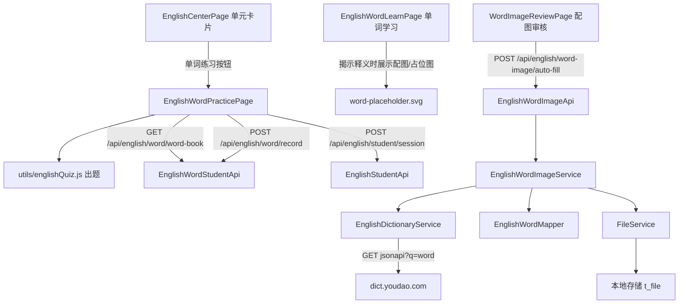

# 英语单词选择题练习与名词形容词配图

Feature Name: english-word-choice-practice
Updated: 2026-09-27

## Description

为学员端英语单词新增「选择题练习」，并从外研版名词、形容词补齐配图。

1. **单词练习（学员端）**：在英语学习中心的单元卡片新增「单词练习」入口，进入 `/student/english/practice?unit=xxx`，在单元内做三种选择题——看图选单词、看中文选单词、看单词选中文；作答复用既有熟练度记录接口，练习与智能复习共享熟练度与复习队列。
2. **名词形容词一键补图（管理端）**：新增「一键补图」接口与按钮，对指定条件的、缺图且释义词性为名词或形容词的单词，自动取词典候选图首图下载入库；取不到图的单词保留缺图状态。
3. **学习页配图随释义出现**：单词学习卡片改为揭示释义时同时展示配图；缺图统一展示占位图。

## Architecture

数据流：

- **出题**：`EnglishWordPracticePage` 用 `word-book` 拉取本单元单词 → `englishQuiz.buildQuiz(words)` 生成题目（含 1 正确 + 3 同单元干扰项）→ 学员作答 → `record` 回写熟练度 → 会话结束 `session` 记录。
- **补图**：老师触发一键补图 → 服务按条件筛选目标配图单词 → 逐词 `lookupImages(spell)` 取首图 → 下载 → `FileService.upload` 落盘 → `image_url=/api/file?id=<fileId>` → 更新单词。
- **占位**：前端在缺 `image_url` 或加载失败时改用 `word-placeholder.svg`。

## Components and Interfaces

### 前端（学员端）

- `pages/student/EnglishWordPracticePage.jsx`（新增）：读取 `unit/version/grade/term`，加载单元单词，按题型出题、判分、记录会话。URL `/student/english/practice?unit=xxx`。
- `utils/englishQuiz.js`（新增）：纯函数出题模块。
  - `buildQuiz(words, options)`：返回题目数组，每题 `{ wordId, type, prompt, options:[{key,label,correct}], imageUrl, answerText }`。
  - `pickType(word, hasImage)`：按是否有图选择可用题型。
  - `buildDistractors(target, pool, key)`：从同单元词池取 3 个不同干扰项。
- `pages/student/EnglishCenterPage.jsx`（改）：单元卡片新增「单词练习」按钮，跳转 `goPractice(unit)`；单词数 < 4 时禁用并提示。
- `pages/student/EnglishWordLearnPage.jsx`（改）：配图随释义一起揭示；缺图用占位图。
- `public/word-placeholder.svg`（新增）：统一占位图。
- `pages/student/EnglishCenterPage.css`（改）：练习页与选项、占位图样式。
- `App.jsx`（改）：新增学员路由 `/student/english/practice`。
- 复用 `api/englishStudent.js` 的 `getEnglishWordBook / recordEnglishWord / recordEnglishSession`，不新增接口封装。

### 前端（管理端）

- `pages/english/WordImageReviewPage.jsx`（改）：工具栏新增「一键补图（名词/形容词）」按钮，按当前筛选条件调用补图接口并展示统计。
- `api/englishAdmin.js`（改）：新增 `autoFillWordImages(payload)`。

### 后端（shared 模块）

- `service/EnglishWordImageService.java`（改）：新增
  `ImportResult autoFillByCondition(String version, String grade, String term, String unit)`。
- 复用 `domain/dto/english/ImportResult`（total/success/failed/errors）。

### 后端（rdbms 模块）

- `impl/EnglishWordImageServiceImpl.java`（改）：实现 `autoFillByCondition`。
  - 查询条件：`version/grade/term/unit`（空则不限）+ `image_url IS NULL OR image_url = ''` + 释义前缀命中名词/形容词正则 `^(n\.|adj\.|n\.&adj\.|adj\.&adv\.|n\.&v\.|v\.&n\.)`。
  - 逐词 `lookupImages(spell)` 取首图 → `download` → `store` → `word.setImageUrl` → `updateById`。
  - 以 `ImportResult` 汇总，失败原因形如 `word=<spell>: <原因>`。

### 后端（api 模块）

- `api/EnglishWordImageApi.java`（改）：新增
  `POST /english/word-image/auto-fill`，权限 `english:word:update`，body `{version, grade, term, unit}`。

## Data Models

无新增表与字段，复用 `t_english_word`：

- `image_url`：一键补图写入 `/api/file?id=<fileId>`；仍为空表示缺图，前端用占位图。
- 题型识别依据 `meaning` 的词性前缀（外研版已带 `n.`/`adj.` 前缀）。

文件元数据沿用 `t_file`。占位图为前端静态资源，不入库。

## Correctness Properties

1. 每道题的 4 个选项互不相同，且恰好 1 个正确选项。
2. 「看图选单词」题仅对存在真实 `image_url` 的单词生成。
3. 每道题作答恰好触发一次 `record`，答对记正确、答错记错误。
4. 答错单词在本轮末尾重出、直到答对；同一单词单轮重出次数上限 3 次，达到上限后不再重出（已计入熟练度与复习队列）。
5. 一键补图仅对目标配图单词写入 `image_url`，失败单词保持原值不变。
6. 任一展示配图的位置在缺图时都渲染占位图，不出现空白。
7. 单词学习卡片在释义未揭示前不渲染配图。

## Error Handling

- 单元单词数不足 4：入口禁用并提示，不进入练习页。
- `word-book` 加载失败：提示「单词加载失败」，页面停留可重试。
- 一键补图单词语料失败（无候选图、下载失败、存储失败）：记入失败原因并继续处理其余单词。
- 单词不存在：记入失败原因。

## Test Strategy

- 前端：`npm run build` 通过；手动走查三种题型、选项互异、正误反馈、答错重出、缺图占位。
- 后端接口：curl + 管理员 cookie 调用 `POST /english/word-image/auto-fill`（外研版/五年级/上册/Unit 1），核对返回统计；抽查单词 `image_url` 变为 `/api/file?id=...` 且 `GET /api/file?id=` 返回 200。
- 数据核对：补图前后外研版缺图数量下降；目标集合限定为名词/形容词。
- 学员端：`GET /english/word/word-book` 返回的单词含 `imageUrl`；练习作答后 `GET /english/word/word-book` 的 `correctCount/wrongCount` 与复习到期随之变化。

## References

[^1]: (wisestar-client/src/pages/student/EnglishWordLearnPage.jsx) - 学员端单词学习卡片
[^2]: (wisestar-client/src/pages/student/EnglishCenterPage.jsx) - 英语学习中心单元卡片
[^3]: (wisestar-client/src/pages/student/EnglishReviewPage.jsx) - 智能复习
[^4]: (server/rdbms/src/main/java/cn/wisestar/server/impl/EnglishWordImageServiceImpl.java) - 单词配图服务
[^5]: (server/rdbms/src/main/java/cn/wisestar/server/impl/YoudaoDictionaryServiceImpl.java) - 词典候选图来源
[^6]: (server/api/src/main/java/cn/wisestar/server/api/EnglishWordImageApi.java) - 配图接口
[^7]: (.monkeycode/specs/2026-09-18-english-word-image/design.md) - 既有单词配图设计
