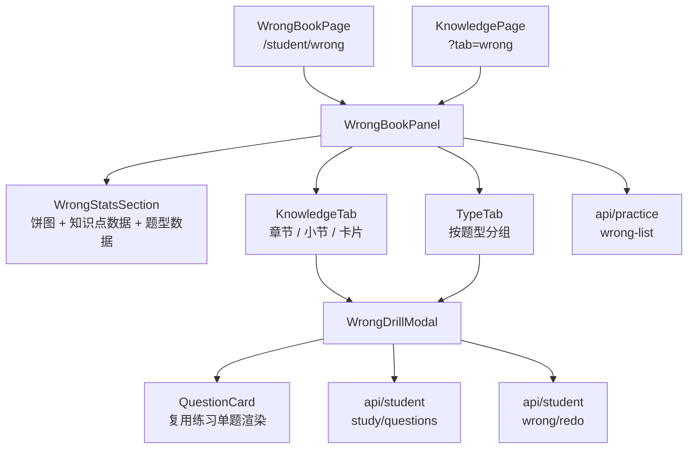

# 学员端错题本改造

Feature Name: 2026-09-28-wrong-book-redesign
Updated: 2026-09-28

## Description

把学员端错题本从「单列错题列表 + 简单分组」升级为「统计区 + 页签 + 三栏」结构，并新增卡片字段（正确答案、章节、小节）与页内弹层的「消灭错题 / 消灭知识点」做题闭环。消灭判定口径为「错题组全部答对才消灭」；消灭过程不跳转学习页。错题本内容面板 `WrongBookPanel` 同时被独立路由页与知识点详情页复用，改造后两处保持一致。

## Architecture

说明：`WrongBookPanel` 负责取数、统计、三栏/分组渲染；`WrongDrillModal` 负责页内做题与消灭结算；`QuestionCard` 复用既有练习单题渲染（单选/多选/判断/填空/多项填空）。统计图使用内联 SVG 环形图，不引入第三方图表库。

## Components and Interfaces

### WrongBookPanel（改造）

- 归属：`wisestar-client/src/components/student/WrongBookPanel.jsx`
- 职责：拉取本人错题列表，计算统计口径，渲染统计区与两个页签；打开消灭弹层。
- 取数：`listWrongQuestions({ current: 1, pageSize: 200 })`。
- 状态：`list`、`loading`、`activeTab`（kp/type）、`selectedChapterId`、`selectedSectionId`、`drill`（当前错题组会话）。
- 交互：
  - 章节点击 → 更新 `selectedChapterId`、联动小节与卡片。
  - 「消灭错题」→ 以单道原题构造错题组。
  - 「消灭知识点」→ 以该知识点下全部原题构造错题组。

### WrongStatsSection（新增，可置于 WrongBookPanel 内或独立文件）

- 职责：渲染知识点错题饼图、按知识点错题数据、按错题类型错题数据。
- 输入：`list`。
- 计算（纯函数，便于单测）：按 `knowledgePointName` 计数排序、按 `questionType` 计数排序。

### WrongDrillModal（新增）

- 归属：`wisestar-client/src/pages/student/WrongDrillModal.jsx`
- Props：`open`、`mode`（single/kp）、`originals`（原题列表）、`onClose`、`onEliminated`。
- 职责：组题、逐题作答、判分、结算消灭。
- 行为：
  1. 组题：对每道原题调 `getStudyQuestions({ questionId, exposeAnswer: true })` 取原题（含答案）；再按题型生成新题。
  2. 逐题渲染 `QuestionCard`（`judgeMode=true`），维护 `answers`、`confirmed`。
  3. 全部作答后判定：错题组全部答对 → 对每道原题调 `wrong/redo({ questionId, answer })`；否则保留。
- 题目映射：`{ id, name, questionType, template: schema }`（`study/questions` 返回字段为 `schema`，`QuestionCard` 读取 `template`）。

### 复用组件

- `QuestionCard`：`wisestar-client/src/components/practice/QuestionCard.jsx`，单题渲染与判分展示。
- `practiceHelpers`：`extractCorrectAnswers` / `evaluateAnswer` / `formatCorrectAnswers`，与后端判分语义一致。

## Data Models

### WrongQuestionView（后端新增字段）

- `correctAnswer: String`：正确答案展示文本，多答案以「、」连接；由 `AnswerJudgeUtil.extractCorrectAnswers(template.template)` 计算。
- `sectionId / sectionName`：错题所属小节（优先取练习会话 `t_practice_record.section_id`，其次取知识点所属小节）。
- `chapterId / chapterName`：小节所属章节。

### PracticeDetailMapper.selectWrongQuestions（SQL 扩展）

- 内层 select 增加 `r.section_id AS sectionId`，`knowledge_point_id` 采用 `COALESCE(kpq.knowledge_point_id, r.knowledge_point_id)`。
- 章节/小节名称与正确答案在 `PracticeServiceImpl` 批量回填，避免 SQL 解析 JSON。

### 前端组题结构

- 错题组会话：`{ mode, originals: [...], questions: [...], answers: {}, confirmed: {} }`。
- `questions[i]`：`{ id, name, questionType, template, isOriginal }`。

## Correctness Properties

- 错题组内题目 id 互不重复。
- 「消灭错题」组题数不超过 3 且必含原题。
- 「消灭知识点」对每道原题追加 2 道同题型新题。
- 仅当错题组内全部原题与新题均答对时，才调用 `wrong/redo` 移除原题；任一题答错则全部保留。
- 错题列表仅包含当前登录学员本人的错题。
- 消灭过程不产生路由跳转。

## Error Handling

- `wrong-list` 请求失败：展示错误提示与空态，不阻塞页面。
- 单题详情获取失败：该原题仍可参与做题（仅展示题面信息），正确答案以占位符展示。
- 同题型新题候选不足：按实际数量出题，不报错。
- `wrong/redo` 失败：提示「消灭失败，请重试」，不移除卡片。

## Test Strategy

- 后端：`mvn clean package -pl api -am -DskipTests`；curl 断言 `wrong-list` 返回 `correctAnswer / sectionName / chapterName`，且学员仅见本人错题。
- 前端：`oxlint` 零告警、`npm run build` 成功。
- 纯函数单测（node）：统计计数排序、组题去重与题数上限。
- 手工冒烟：三栏联动；「消灭错题」全对移除、有错保留；「消灭知识点」全对成组移除；全程无页面跳转。

## References

- [WrongBookPanel.jsx](wisestar-client/src/components/student/WrongBookPanel.jsx)
- [WrongBookPage.jsx](wisestar-client/src/pages/student/WrongBookPage.jsx)
- [QuestionCard.jsx](wisestar-client/src/components/practice/QuestionCard.jsx)
- [practice.js](wisestar-client/src/api/practice.js)
- [student.js](wisestar-client/src/api/student.js)
- [PracticeApi.java](server/api/src/main/java/cn/wisestar/server/api/PracticeApi.java)
- [PracticeServiceImpl.java](server/rdbms/src/main/java/cn/wisestar/server/impl/PracticeServiceImpl.java)
- [PracticeDetailMapper.java](server/rdbms/src/main/java/cn/wisestar/server/mapper/PracticeDetailMapper.java)
- [WrongQuestionView.java](server/shared/src/main/java/cn/wisestar/server/domain/dto/WrongQuestionView.java)
- [StudentServiceImpl.java](server/rdbms/src/main/java/cn/wisestar/server/impl/StudentServiceImpl.java)
