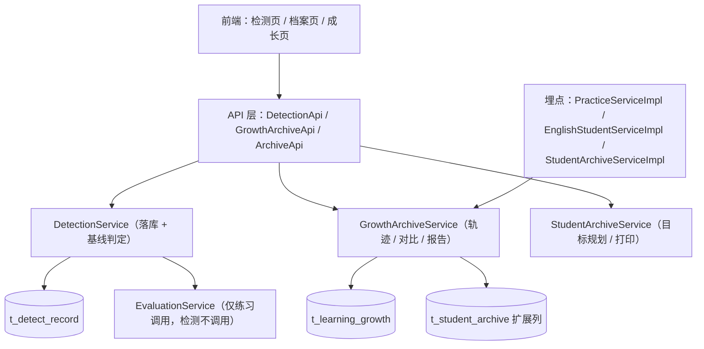
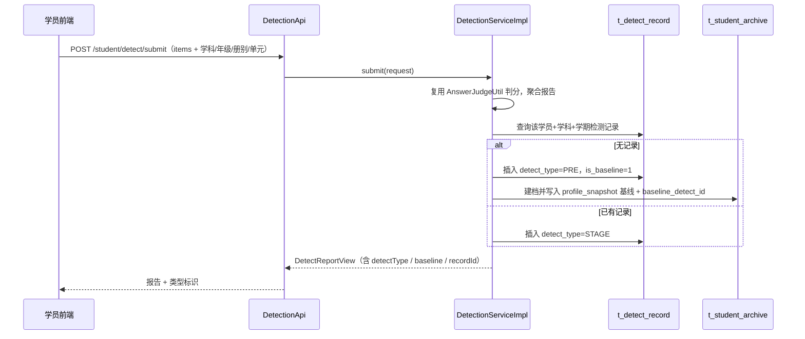
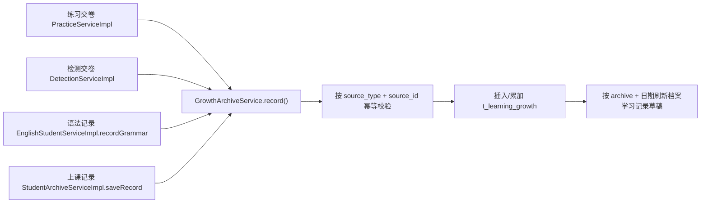

# 学员成长档案（学前检测 + 学习轨迹 + 成长报告）技术设计

Feature Name: student-growth-archive
Updated: 2026-10-04

## 1. Description

本设计在既有「知识点检测」（`DetectionServiceImpl`）与「学员学习档案」（`StudentArchiveServiceImpl`）之上，增加三类持久化能力与一组查询/报告接口：

1. **检测记录持久化**：每次全面检测落库为 `t_detect_record`；学员某学科本学期首次检测标记为学前检测（PRE），并定格为成长基线；其余为阶段检测（STAGE）。
2. **学习轨迹事件流水**：在线练习、单元检测、英语语法练习、上课记录四类已落库行为，各写入一条 `t_learning_growth` 事件，构成可查询、可幂等的成长时间轴。
3. **成长对比与人性化报告**：以基线为参照逐知识点算「基线 → 当前」变化，AI 生成面向家长的叙事报告，规则模板降级，浏览器打印交付。

检测保持诊断语义：不发放积分/学习币、不修改掌握度算法；成长基线独立于练习进度。例外（精准破弱模型 WPB，2026-10-05 决策）：首次全面检测（`is_baseline=1`）的薄弱知识点一次性写入当前薄弱系统（`t_user_weak_knowledge`）并留痕，此后检测不再重写；详见 `weak-point-breakthrough-model.md`。

## 2. Architecture

### 2.1 组件关系

### 2.2 检测交卷与基线判定流程

### 2.3 学习轨迹写入流程

## 3. Components and Interfaces

### 3.1 后端新增与修改

**Model / Mapper（`server/rdbms`）**

- 新增 `DetectRecord`（`@TableName("t_detect_record")`）+ `DetectRecordMapper extends BaseMapper<DetectRecord>`，继承 `BaseModel`。
- 新增 `LearningGrowth`（`@TableName("t_learning_growth")`）+ `LearningGrowthMapper extends BaseMapper<LearningGrowth>`，继承 `BaseModel`。

**DTO（`server/shared`，新增包 `domain.dto.growth`；`domain.dto.detect` 扩展）**

- `DetectRecordView`：检测历史条目（id / subjectId / subjectName / semester / detectType / total / correct / accuracy / chapterNames / weakPoints 摘要 / createTime）。
- `GrowthEventView`：轨迹事件视图（id / eventType / sourceType / subjectName / occurredAt / chapter / knowledgePoints / questionCount / correctCount / accuracy / durationMs / points / coins / title）。
- `GrowthTimelineQuery`：studentId（管理端）/ subjectId / from / to。
- `GrowthCompareView`：成长对比（baseline 信息 / current 概览 / 逐知识点 delta 列表 / 整体进步指标）。
- `GrowthReportRequest`：studentId（管理端）/ subjectId / semester。
- `GrowthReportView`：报告正文 + 状态 + 模型 + 生成时间 + 打印所需头部信息。
- `DetectSubmitRequest` 扩展：新增 `subjectId / grade / term / chapterIds / questionCount / durationMs / semester / clientToken`。
- `DetectReportView` 扩展：新增 `detectType / baseline / recordId`。

**Service 接口与实现**

- `DetectionService`（`server/shared`）扩展：
  - `DetectReportView submit(DetectSubmitRequest)`：保持签名，内部增加落库与基线判定（事务）。
  - `List<DetectRecordView> history(String studentId, String subjectId, String semester)`。
- `GrowthArchiveService`（新增，`server/shared`）+ `GrowthArchiveServiceImpl`（`server/rdbms`）：
  - `void record(GrowthEventContext context)`：幂等写入轨迹事件；语法类按 `grammarId + 日期` 累加。
  - `List<GrowthEventView> timeline(String studentId, String subjectId, String from, String to)`。
  - `GrowthCompareView compare(String studentId, String subjectId, String semester)`。
  - `GrowthReportView generate(GrowthReportRequest request)`：汇总基线 + 对比 + 轨迹 + 目标规划，AI 生成或规则降级，写入 `t_student_archive`。
  - `GrowthReportView report(String studentId, String subjectId, String semester)`。
  - `void rebuild(String studentId, String subjectId, String semester)`：由来源业务数据重建轨迹（运维/补偿用）。
- `StudentArchiveService` / `StudentArchiveServiceImpl` 调整：
  - 档案唯一性由「学员+学期」改为「学员+学期+学科」，`resolveArchive` / `getArchive` / `save` / `overview` 增加 `subjectId` 维度定位（`subjectId` 为空时定位全科条目，保持既有行为）。
  - `getArchive` 增加返回 `baselineDetect`、`growthCompare`、`timeline`（或由前端分别调用成长接口，避免详情接口过重——设计采用前端分别调用）。
  - `generateReport` 报告 prompt 改为引用 `GrowthCompareView`（基线对比）。
  - `saveRecord` 定稿后触发 `GrowthArchiveService.record` 记录 CLASS 事件。

**埋点位置**

| 来源 | 文件与方法 | 事件类型 | source_id |
|---|---|---|---|
| 在线练习/试炼 | `PracticeServiceImpl.submit`（`server/rdbms/.../PracticeServiceImpl.java:242` 落库后、奖励结算后） | PRACTICE | `practice:{recordId}` |
| 单元检测 | `DetectionServiceImpl.submit`（`server/rdbms/.../DetectionServiceImpl.java:185`） | DETECT | `detect:{detectRecordId}` |
| 英语语法练习 | `EnglishStudentServiceImpl.recordGrammar`（`server/rdbms/.../EnglishStudentServiceImpl.java:177`） | GRAMMAR | `grammar:{grammarId}:{yyyy-MM-dd}` 累加 |
| 上课记录定稿 | `StudentArchiveServiceImpl.saveRecord`（`server/rdbms/.../StudentArchiveServiceImpl.java:268`） | CLASS | `archive:record:{recordId}` |

**API**

- `DetectionApi`（`server/api`）新增 `GET ${api.prefix}/student/detect/history?subjectId=&semester=`，`@PreAuthorize("isAuthenticated()")`。
- 新增 `GrowthArchiveApi`（`server/api`）：
  - `GET ${api.prefix}/student/growth/timeline?subjectId=&from=&to=`，学员本人，`isAuthenticated()`。
  - `GET ${api.prefix}/student/growth/compare?subjectId=&semester=`，学员本人，`isAuthenticated()`。
  - `GET ${api.prefix}/student/growth/report?subjectId=&semester=`，学员本人，`isAuthenticated()`。
  - `POST ${api.prefix}/student/growth/report/generate`，学员本人，`isAuthenticated()`。
- `ArchiveApi`（`server/api`）新增管理端查询（`student:archive`）：
  - `GET ${api.prefix}/student/archive/detect-history?studentId=&subjectId=&semester=`。
  - `GET ${api.prefix}/student/archive/timeline?studentId=&subjectId=&from=&to=`。
  - `GET ${api.prefix}/student/archive/compare?studentId=&subjectId=&semester=`。
  - `POST ${api.prefix}/student/archive/report/generate`（复用既有，`student:archive:edit`）。

> 不新增权限点：学员端用 `isAuthenticated()`，管理端复用 `student:archive` / `student:archive:edit`。

### 3.2 前端

- `src/api/detect.js` 新增 `getDetectHistory`；新增 `src/api/growth.js`（`getGrowthTimeline` / `getGrowthCompare` / `getGrowthReport` / `generateGrowthReport` / 管理端同名方法）。
- `src/pages/student/KnowledgeDetectPage.jsx`：报告区新增「学前检测」/「阶段检测」标识与基线提示。
- `src/pages/student/StudentArchivePage.jsx`（管理端）：新增「成长对比」区块与「学习轨迹」时间轴；报告区沿用并可重新生成。
- `src/pages/student/StudentMyArchivePage.jsx`（学员端只读）：新增成长对比、轨迹时间轴与报告，复用浏览器打印。
- 复用 `RichContent`（结构化渲染）与现有打印样式；不引入服务端 PDF。

### 3.3 精准破弱模型（WPB）改动

**数据与埋点**

- 新增 `WeakPointEvent`（`@TableName("t_weak_point_event")`）+ `WeakPointEventMapper`，继承 `BaseModel`。
- `DetectionServiceImpl.submit`：首次基线落库后，将薄弱点一次性 `upsert` 到 `t_user_weak_knowledge` 并写 `discovered` 事件（口径 a）；后续检测不重写。
- `EvaluationServiceImpl`：发现薄弱写 `discovered`（或 `reopened`）、攻克写 `conquered`；作为既有薄弱/攻克判定的副作用，独立事务，失败 `log.warn` 不阻断主流程。

**加权**

- `StudentServiceImpl.fillChapterProgress`：章节达成率由算术平均改为加权平均（薄弱小节权重 2、普通 1，常量可配）。
- 组卷（`SectionPracticeService` / 知识点组卷）：对薄弱知识点所属小节提高抽取权重（默认 2）。
- 小节/章节视图 DTO 增加 `weak`（boolean）与 `weakCount`（int），由 `t_user_weak_knowledge` active + 知识点归属反查。

**奖励**

- `StudentRewardConstants` 新增 `ACTION_WEAK_SECTION_CONQUER`：40 学习币 + 0 积分。
- `RewardServiceImpl.settle`：薄弱攻克类行为（知识点、小节）幂等范围由学期一次改为终身一次（此类 `ref_id` 不加学期前缀）；其余行为保持学期一次。
- 小节攻克判定：该小节知识点曾薄弱数 > 0 且当前 active 薄弱数 = 0 时触发，按终身一次发放。

**接口**

- 新增 `GET ${api.prefix}/student/weak/timeline`（学员本人 `isAuthenticated()`）。
- 新增 `POST ${api.prefix}/student/practice/weak`（薄弱点专攻组卷，`isAuthenticated()`）。
- 不新增权限点，管理端复用 `student:archive` / `student:archive:edit`。

## 4. Data Models

### 4.1 `t_detect_record`（新增）

| 列 | 类型 | 说明 |
|---|---|---|
| id | varchar(32) PK | 主键 |
| student_id | varchar(32) | 学员ID |
| subject_id | varchar(32) | 学科ID |
| subject_name | varchar(32) | 学科名称快照 |
| grade | varchar(32) | 年级快照 |
| term | varchar(16) | 册别快照 |
| semester | varchar(16) | 学期键，如 2026-1 |
| detect_type | varchar(16) | PRE / STAGE |
| is_baseline | tinyint | 1 表示被用作成长基线 |
| chapter_ids | text | 勾选章节ID JSON 数组 |
| chapter_names | text | 勾选章节名称 JSON 数组 |
| question_count | int | 组卷题量 |
| total | int | 实际判分题数 |
| correct_count | int | 正确题数 |
| accuracy | int | 正确率 0-100 |
| duration_ms | bigint | 作答耗时 |
| weak_points | text | 薄弱点 JSON 数组 |
| details | text | 逐题结果 JSON 数组 |
| client_token | varchar(64) | 客户端幂等令牌，可空 |
| create_at / create_by / update_at / update_by / is_deleted | | 审计列（`BaseModel`） |

索引：`idx_detect_record(student_id, subject_id, semester, create_at)`；`uk_detect_client(student_id, client_token)`（client_token 非空时唯一）。

### 4.2 `t_learning_growth`（新增）

| 列 | 类型 | 说明 |
|---|---|---|
| id | varchar(32) PK | 主键 |
| student_id | varchar(32) | 学员ID |
| subject_id | varchar(32) | 学科ID |
| subject_name | varchar(32) | 学科名称快照 |
| event_type | varchar(16) | PRACTICE / DETECT / GRAMMAR / CLASS |
| source_type | varchar(16) | practice / detect / grammar / archive_record |
| source_id | varchar(64) | 业务对象ID（幂等键） |
| event_date | varchar(10) | yyyy-MM-dd |
| occurred_at | timestamp | 发生时间 |
| chapter_id | varchar(32) | 章节/单元ID |
| chapter | varchar(128) | 章节/单元名称 |
| knowledge_points | text | 知识点名称 JSON 数组 |
| question_count | int | 题量 |
| correct_count | int | 正确数 |
| accuracy | int | 正确率 0-100 |
| duration_ms | bigint | 时长 |
| points | int | 积分（检测恒为 0） |
| coins | int | 学习币（检测恒为 0） |
| title | varchar(256) | 事件标题 |
| remark | varchar(512) | 备注 |
| create_at / create_by / update_at / update_by / is_deleted | | 审计列 |

唯一键：`uk_growth_source(student_id, source_type, source_id)`；索引：`idx_growth_timeline(student_id, subject_id, occurred_at)`。

### 4.3 `t_student_archive` 扩展列（幂等 `ALTER TABLE ... ADD COLUMN IF NOT EXISTS`）

| 列 | 类型 | 说明 |
|---|---|---|
| baseline_detect_id | varchar(32) | 定格为基线的检测记录ID |
| baseline_at | timestamp | 基线定格时间 |
| report_model | varchar(64) | 报告生成模型（ai 模型名或 rule） |
| report_generated_at | timestamp | 报告生成时间 |

**唯一键调整（按学科独立）**：`t_student_archive` 唯一约束由「学员+学期」调整为「学员+学期+学科」（`uk_student_archive(student_id, semester, subject_id)`）。历史 `subject_id` 为空的行视为全科/通用条目，保留不改；新基线与成长报告写入带具体学科的行。迁移以新增唯一索引与幂等 DDL 完成，不删除历史数据。

`profile_snapshot` 语义升级为基线快照：`{"baseline":true,"detectId":"...","accuracy":73,"units":[...],"weakPoints":[{"kpId":"","name":"","subjectId":"","accuracy":0}]}`。解析保持向后兼容（旧快照仍按 `name` 数组读取）。

### 4.4 DDL 落地

新增表、`t_student_archive` 扩展列与唯一键调整（`uk_student_archive(student_id, semester, subject_id)`）同时写入 `server/rdbms/src/main/resources/scripts/init-h2.sql` 与 `init-mysql.sql`（幂等；H2 用 `CREATE TABLE IF NOT EXISTS` / `ALTER TABLE ... ADD COLUMN IF NOT EXISTS` / 幂等索引，MySQL 用对应方言）；并随 `server/db-snapshot/wisestar.sql` 提交。

### 4.5 `t_weak_point_event`（精准破弱模型 WPB 新增）

| 列 | 类型 | 说明 |
|---|---|---|
| id | varchar(32) PK | 主键 |
| student_id | varchar(32) | 学员ID |
| subject_id | varchar(32) | 学科ID |
| knowledge_point_id | varchar(32) | 知识点ID |
| section_id | varchar(32) | 小节ID |
| chapter_id | varchar(32) | 章节ID |
| event_type | varchar(16) | discovered / conquered / reopened |
| mastery | int | 事件发生时该知识点掌握度 |
| source | varchar(16) | detect / practice / correction |
| ref_id | varchar(64) | 业务来源ID（幂等键） |
| occurred_at | timestamp | 发生时间 |
| create_at / create_by / update_at / update_by / is_deleted | | 审计列 |

唯一键：`uk_weak_event(student_id, knowledge_point_id, event_type, ref_id)`；索引：`idx_weak_event(student_id, occurred_at)`。

## 5. Correctness Properties

1. **基线唯一**：同一 `student_id + subject_id + semester` 至多一条 `is_baseline=1` 的 PRE 检测；重复判定返回既有基线。
2. **首次自动定位**：某学科本学期第一次成功判分的检测记录必为 PRE，第二次起必为 STAGE。
3. **检测无副作用**：检测落库过程不调用 `EvaluationService`、不调用 `RewardService`；DETECT 事件的 `points` 与 `coins` 恒为 0。
4. **事件幂等**：`(student_id, source_type, source_id)` 唯一；重复触发不产生重复事件；GRAMMAR 事件按 `grammarId + 日期` 累加。
5. **可重建**：给定 `t_practice_record` / `t_detect_record` / `t_student_archive_record` / `t_english_grammar_book`，轨迹可由 `rebuild` 重建。
6. **对比可复现**：`compare` 的输出仅由基线与当前 `t_user_knowledge_progress` / `t_user_weak_knowledge` 决定，不依赖前端状态。
7. **结构稳定性**：章节/小节/知识点的增删改移动不修改既有基线、事件与报告。
8. **审计一致**：所有新增持久化对象遵循 `BaseModel` 审计列。

## 6. Error Handling

| 场景 | 策略 |
|---|---|
| 检测记录落库失败 | 回滚检测记录事务，仍返回诊断报告，并记录 `log.warn`，基线留待下次检测 |
| 轨迹事件写入失败 | 捕获异常并 `log.warn`，不阻断交卷/定稿主流程；后续请求或 `rebuild` 补偿 |
| AI 报告生成失败/超时 | 降级 `buildRuleReport` 规则模板，`report_model=rule` |
| 交卷中某题不存在 | 跳过该题，继续处理其余题 |
| 重复提交（clientToken 相同） | 返回既有检测记录与报告，不再新增 |
| 学员访问管理端接口 | 由 `student:archive` 权限拦截，返回业务 403 |

## 7. Test Strategy

- **单元测试**：
  - 基线判定：首次 → PRE + baseline；第二次 → STAGE。
  - 事件幂等：同一 source_id 重复 `record` 仅一条；GRAMMAR 累加。
  - 对比计算：基线薄弱点三种状态（已攻克 / 持续巩固 / 仍薄弱）判定与整体指标。
  - 规则模板降级：AI 不可用时输出含知识点名称的报告。
- **集成测试**（H2 副本）：
  - 检测 submit 两次 → 记录类型与基线正确；`profile_snapshot` 写入。
  - 练习交卷 → 生成 PRACTICE 事件；语法记录 → GRAMMAR 事件；上课记录定稿 → CLASS 事件。
  - 报告生成：启用/停用 AI 两种路径。
- **API 冒烟**：history / timeline / compare / report 的学员端与管理端返回与权限（管理端学员访问 403）。
- **迁移幂等**：新增表与列在 H2 副本连跑两遍退出码 0、数据不重复。
- **前端**：`npm run lint` 与 `npm run build` 通过；Playwright 校验检测页类型标识、档案页成长对比与轨迹、打印样式隐藏按钮。

## 8. References

[^1]: (`server/rdbms/src/main/java/cn/wisestar/server/impl/DetectionServiceImpl.java`) - 检测组卷与判分实现，`submit` 位于第 185 行。
[^2]: (`server/rdbms/src/main/java/cn/wisestar/server/impl/StudentArchiveServiceImpl.java`) - 档案服务实现，`saveRecord` 位于第 268 行，`generateReport` 位于第 363 行。
[^3]: (`server/rdbms/src/main/java/cn/wisestar/server/impl/PracticeServiceImpl.java`) - 练习交卷落库，`PracticeRecord` 构建位于第 242 行。
[^4]: (`server/rdbms/src/main/java/cn/wisestar/server/impl/EnglishStudentServiceImpl.java`) - 语法记录，`recordGrammar` 位于第 177 行。
[^5]: (`server/rdbms/src/main/java/cn/wisestar/server/impl/StudySummaryServiceImpl.java`) - 当日聚合与 `aiText`，AI 降级逻辑位于第 117 行。
[^6]: (`server/shared/src/main/java/cn/wisestar/server/core/constant/PermissionConsts.java`) - 权限点清单，`student:archive` / `student:archive:edit` 位于第 65-66 行。
[^7]: (`server/rdbms/src/main/resources/scripts/init-h2.sql` 与 `init-mysql.sql`) - 幂等种子脚本（新增表与列需同步）。
[^8]: (`.monkeycode/specs/2026-10-04-student-growth-archive/requirements.md`) - 本特性需求文档。
[^9]: (`.monkeycode/specs/2026-10-04-student-growth-archive/weak-point-breakthrough-model.md`) - 精准破弱模型（WPB）设计，含整体逻辑、功能清单与影响分析。
