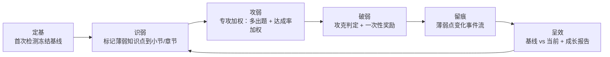
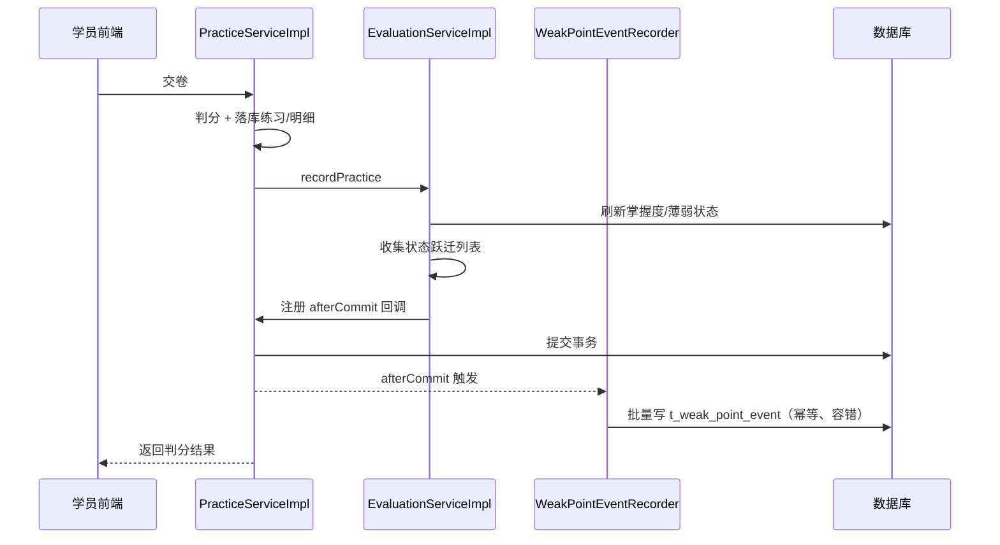

# 「精准破弱」模型（Weak-Point Breakthrough）设计

Feature Name: student-growth-archive（本模型并入该规格）
Model Name: 精准破弱
Model Code: WPB
Updated: 2026-10-05

## 1. 模型定义

「精准破弱」是以**薄弱知识点**为核心、贯穿「检测定基 → 识别标记 → 专攻加权 → 攻克奖励 → 变化留痕 → 成长呈现」的学情闭环模型。它不引入系统评分与"提分数值"，只回答一个问题：学员的薄弱点是否在一点点减少，并把这个过程对学员、家长、老师同时可见。

一句话定位：**用首次检测定格起点，用加权把注意力引向薄弱，用一次性奖励激励攻克，用事件流记录减少，用对比呈现效果。**

## 2. 整体逻辑：六环闭环

| 环 | 目标 | 关键动作 |
|---|---|---|
| 定基 | 建立可对比的起点 | 首次全面检测落库并冻结为基线 |
| 识弱 | 找出该攻哪里 | 检测薄弱点写入当前薄弱系统；薄弱标记到小节/章节 |
| 攻弱 | 引导注意力到薄弱 | 组卷薄弱加权、章节达成率薄弱小节加权 |
| 破弱 | 激励攻克 | 攻克判定；知识点/小节一次性奖励 |
| 留痕 | 记录变化过程 | 发现/攻克/复现写入薄弱事件流 |
| 呈效 | 让效果可见 | 基线 vs 当前对比、薄弱点减少、成长报告 |

## 3. 与现有能力的关系

| 现有能力 | 关系 |
|---|---|
| 知识点检测 `DetectionServiceImpl` | 改造：由无状态诊断变为首次落基线并 seed 薄弱点 |
| 学习评价 `EvaluationServiceImpl` | 改造：攻克/发现薄弱时追加事件；奖励幂等改为终身一次 |
| 奖励体系 `StudentRewardConstants` / `RewardServiceImpl` | 改造：新增小节攻克行为；部分行为幂等由学期改终身 |
| 章节/小节进度 `StudentServiceImpl` | 改造：章节达成率由算术平均改加权平均；组卷加薄弱权重 |
| 学员档案 `StudentArchiveServiceImpl` | 改造：初始快照来源改为基线检测记录 |
| 成长档案规格（检测记录/轨迹/对比/报告） | 复用：本模型的上层呈现直接复用其设计 |
| 薄弱点专攻（跨单元组卷） | 新增 |
| 薄弱点变化事件流 | 新增 |

## 4. 功能清单

### 4.1 定基（首次检测基线）

| 功能 | 类型 | 涉及 |
|---|---|---|
| 首次全面检测落库 `t_detect_record`（`is_baseline=1`） | 新增 | `DetectionServiceImpl.submit` |
| 检测记录幂等与历史查询 | 新增 | `t_detect_record` + `DetectionApi` |
| 基线薄弱点一次性写入当前薄弱系统 | 改造 | `t_user_weak_knowledge` |
| 档案初始快照来源改为基线记录 | 改造 | `StudentArchiveServiceImpl` |

### 4.2 识弱（薄弱标记）

| 功能 | 类型 | 涉及 |
|---|---|---|
| 薄弱知识点聚合到所属小节/章节 | 改造 | `KnowledgePoint.sectionId` 反查 |
| 小节/章节视图返回 `weak` 标记与薄弱数 | 改造 | `SectionView` / `ChapterView` DTO |
| 学员端在小节/章节上展示"薄弱"标识 | 新增 | 学习页/知识页前端 |

### 4.3 攻弱（专攻加权）

| 功能 | 类型 | 涉及 |
|---|---|---|
| 组卷时对薄弱知识点/小节题目提高抽取权重 | 改造 | 组卷方法 + `SectionPracticeService` |
| 跨单元薄弱点聚合"专攻卷" | 新增 | 组卷服务 + 学员端入口 |
| 章节达成率按薄弱小节加权计算 | 改造 | `StudentServiceImpl.fillChapterProgress` |
| 首页/每日任务优先薄弱点 | 可选改造 | `StudentHomePage` / 任务模块 |

### 4.4 破弱（攻克与奖励）

| 功能 | 类型 | 涉及 |
|---|---|---|
| 知识点攻克判定 | 复用 | `EvaluationServiceImpl.conquer` |
| 知识点攻克奖励 25 学币 + 12 积分，终身一次 | 改造 | 幂等键由学期改终身 |
| 小节攻克判定（该小节曾薄弱知识点全部攻克且无 active 薄弱） | 新增 | `EvaluationServiceImpl` |
| 小节攻克奖励 40 学币 + 0 积分，终身一次 | 新增 | `StudentRewardConstants` |

### 4.5 留痕（事件流）

| 功能 | 类型 | 涉及 |
|---|---|---|
| 新增 `t_weak_point_event`（discovered/conquered/reopened） | 新增 | 模型 + Mapper |
| 发现薄弱写事件 | 改造 | `EvaluationServiceImpl.updateProgress` |
| 攻克写事件 | 改造 | `EvaluationServiceImpl.markConquered` |
| 复现写事件 | 改造 | 薄弱状态 active → conquered 的逆向 |

### 4.6 呈效（对比与报告）

| 功能 | 类型 | 涉及 |
|---|---|---|
| 基线 vs 当前薄弱点对比接口 | 复用成长档案规格 | `GrowthArchiveService.compare` |
| 薄弱点变化时间线（减少过程） | 新增 | `t_weak_point_event` 查询 |
| 学员端/档案页成长对比与事件时间线 | 新增 | 前端 |
| 成长报告 | 复用成长档案规格 | `GrowthArchiveService.generate` |

## 5. 数据模型变更

### 5.1 新增 `t_detect_record`（复用成长档案规格定义）

沿用成长档案规格的检测记录表，`is_baseline` 标记首次基线，`weak_points` 存基线薄弱点 JSON。

### 5.2 新增 `t_weak_point_event`（本模型新增）

| 列 | 类型 | 说明 |
|---|---|---|
| id | varchar(32) PK | 主键 |
| student_id | varchar(32) | 学员ID |
| subject_id | varchar(32) | 学科ID |
| knowledge_point_id | varchar(32) | 知识点ID |
| section_id | varchar(32) | 小节ID（加权与标记用） |
| chapter_id | varchar(32) | 章节ID |
| event_type | varchar(16) | discovered / conquered / reopened |
| mastery | int | 事件发生时该知识点掌握度 |
| source | varchar(16) | detect / practice / correction |
| ref_id | varchar(64) | 幂等键（如 practice:{id}） |
| occurred_at | timestamp | 发生时间 |
| create_at / create_by / update_at / update_by / is_deleted | | 审计列 |

唯一键：`uk_weak_event(student_id, knowledge_point_id, event_type, ref_id)`；
索引：`idx_weak_event(student_id, occurred_at)`。

### 5.3 `t_user_weak_knowledge` 复用

保持现有"当前态"（active/conquered）。本模型不新增列；如需按小节快速加权，可由 `t_knowledge_point.section_id` 反查。

### 5.4 奖励幂等语义调整

`RewardServiceImpl.settle` 目前对所有 `ref_id` 统一加学期前缀。本模型要求薄弱攻克类奖励为**终身一次**，需对该类行为不加学期前缀（或单独判定 lifetime 行为集合）。

## 6. 接口变更

| 接口 | 方法 | 说明 | 权限 |
|---|---|---|---|
| `/student/detect/submit` | POST | 首次落基线 + seed 薄弱点 | isAuthenticated |
| `/student/detect/history` | GET | 检测历史 | isAuthenticated / student:archive |
| `/student/weak/timeline` | GET | 薄弱点变化时间线 | isAuthenticated / student:archive |
| `/student/growth/compare` | GET | 基线 vs 当前对比（成长档案） | isAuthenticated / student:archive |
| `/student/practice/weak` | POST | 薄弱点专攻组卷 | isAuthenticated |

不新增权限点：学员端用 `isAuthenticated()`，管理端复用 `student:archive` / `student:archive:edit`。

## 7. 奖励规则（已确认）

| 行为 | 学习币 | 学海积分 | 幂等 |
|---|---|---|---|
| 攻克薄弱知识点 | 25 | 12 | 终身一次 |
| 攻克薄弱小节 | 40 | 0 | 终身一次 |
| 攻克薄弱章节 | 不做 | — | — |

## 8. 对现有功能与逻辑的影响

| 现有功能 | 变更性质 | 影响与回归点 |
|---|---|---|
| 知识点检测交卷 | 改现有 | 由无状态变有状态；首次检测会写薄弱点、影响薄弱列表与档案初值 |
| 学习评价 | 改现有 | 判定阈值不变，新增事件副作用；改奖励幂等会改变跨学期重发行为 |
| 奖励结算 | 改现有 | 幂等键前缀逻辑调整，影响跨学期/重复攻克发放 |
| 章节达成率 | 改现有 | 算术平均改加权平均，学员端章节进度/星级会变化 |
| 练习组卷 | 改现有 | 抽题结果变化，薄弱处题目占比提升 |
| 学员档案初始快照 | 改现有 | 来源由练习薄弱点改为基线检测记录，老学员建案时点行为变化 |
| 成长对比/报告 | 复用规格 | 依赖基线记录与当前薄弱，实现时一并落地 |
| 种子脚本与快照 | 固定连带 | 新表/新列同步 `init-h2.sql`、`init-mysql.sql`，重导 `wisestar.sql` |
| 权限 | 无新增 | 复用现有权限点 |

风险等级：检测落库与奖励幂等调整影响面最大；章节达成率与组卷为中等；事件流与对比为新增，风险低。

## 9. 题目配置 / 答题方式 / 错题本 影响

### 9.1 题目配置（组卷侧）

| 项 | 是否改变 | 说明 |
|---|---|---|
| 题目数据结构 `t_template` + `SurveySchema` | 不变 | 题干、选项、子题结构不改 |
| 分值配置 `attribute.examScore` / `examBlankScores` | 不变 | 逐题分值与逐空给分口径不变 |
| 标准答案 `attribute.examCorrectAnswer` | 不变 | 提取与归一化规则不变 |
| 题型过滤 `types` / 难度 `difficulty` / 题库绑定 `repoId` | 不变 | 出题范围过滤逻辑不变 |
| 小节练习配置 `SectionPracticeConfig`（`mode` / `questionCount` / `passRate` / `unlockNext` / `preview`） | 不变 | `t_section.practice` JSON 字段不新增 |
| 组卷抽取策略 `StudentServiceImpl.pickByCoverage` | **改变** | 现为"知识点保底覆盖 + 余量轮询"，无权重；新增薄弱知识点/小节权重（默认 2），改变抽题组合 |
| 章节测评出题范围 | 不变 | 仍按整章知识点覆盖，不受薄弱加权影响 |

要点：WPB 只改"抽多少、抽谁"的**选择策略**，不改题目本身如何被配置与存储。

### 9.2 答题方式（作答与判分侧）

| 项 | 是否改变 | 说明 |
|---|---|---|
| 判分规则 `AnswerJudgeUtil.evaluate` | 不变 | 单选/判断按选项文本、多选按集合相等、填空按 `|` 逐空 |
| 逐空判分 `evaluateBlanks` | 不变 | 多项填空部分给分逻辑不变 |
| 循环小数数学等价 `CycleDecimalJudge` | 不变 | `0.6̇`/`0.666…`/`0.(6)` 等价口径不变 |
| 填空归一化（全角/空白/零宽） | 不变 | `normalizeBlank` 不变 |
| 前端答案格式 `{type: option/options/text}` | 不变 | 提交结构不变 |
| 练习交卷 / 错题重做判分入口 | 不变 | `PracticeServiceImpl.submitPractice`、`StudentServiceImpl.wrongRedo` 复用同一工具 |
| 判分后副作用 | **新增** | 判分完成后追加薄弱事件（discovered / conquered / reopened），不改变判分结果与作答体验 |

要点：答题与判分"零改动"，WPB 只在既有掌控度/薄弱刷新链路上加事件与奖励副作用。

### 9.3 错题本（使用逻辑）

| 项 | 是否改变 | 说明 |
|---|---|---|
| 数据来源 `t_practice_detail.is_correct=0` 聚合 | 不变 | `selectWrongQuestions` 聚合口径不变 |
| 订正移出 `corrected=true` | 不变 | 错题重做答对即移出 |
| 错题归因 `wrongReason` | 不变 | 学员标注归因不变 |
| 管理端错题库 `wrong-list` | 不变 | 权限与字段不变 |
| 订正后薄弱刷新 `refreshWeakAfterCorrection` | 联动增强 | 已存在；WPB 在此路径补写 `conquered`/`reopened` 事件 |
| 订正奖励 `ACTION_WRONG_CORRECT`（5 币 + 4 积分） | 不变 | 学期幂等（`wrong:{questionId}`）不变 |
| 订正触发薄弱攻克/小节攻克奖励 | **新增联动** | 订正若压垮最后一个薄弱点，会追加薄弱攻克与小节攻克奖励（与订正奖励合法叠加） |
| 错题作为薄弱专攻入口 | **可选新增** | 错题本可加"薄弱"筛选/标识，辅助专攻 |

要点：错题本核心判定与展示不变；变化在于它现在是薄弱事件与攻克奖励的**主要触发来源之一**，`hasUncorrectedWrong`（是否仍有未订正错题）会直接影响薄弱点能否判定为攻克，回归时需重点覆盖。

## 10. 不做项（本期）

1. 系统"提分"数值与自动评测。
2. 薄弱章节级攻克奖励。
3. 独立家长登录门户与自动推送（本期复用现有档案查看/打印）。
4. 题型通关（如后续需要，另立规格）。

## 11. 落地顺序建议

1. 检测落库 + 基线冻结（`t_detect_record`）。
2. 薄弱点 seed + 薄弱事件流（`t_weak_point_event`）。
3. 专攻加权（章节达成率加权、组卷加权）。
4. 攻克奖励（小节新增、知识点改终身一次）。
5. 对比呈现与成长报告（复用成长档案规格）。

## 12. 低负荷与高容错实现设计

### 12.1 五条总原则

1. **旁路化**：事件、奖励、加权计算都不进入学习主流程的关键路径；主流程（交卷、订正、检测）成功优先，WPB 增量失败即降级。
2. **幂等化**：所有写入以业务唯一键幂等，允许重复执行，并发靠数据库唯一约束兜底。
3. **可重建**：事件流与薄弱状态可由源数据（练习明细、检测记录、错题订正）重算，丢失可补偿。
4. **只在跃迁时写**：事件只在 `discovered` / `conquered` / `reopened` 状态跃迁时产生，事件量与"学员 × 知识点"同量级，远低于练习次数。
5. **就低查询**：读取走索引 + 单次批量，聚合在内存完成，杜绝 N+1 与逐条查询。

### 12.2 事件写入（低负荷 + 高容错）

- **收集而非即时写**：在既有薄弱刷新链（`EvaluationServiceImpl.updateProgress` / `markConquered` / `refreshWeakAfterCorrection`）判定出跃迁后，只把跃迁项收集到列表，方法末尾一次性 `saveBatch` 批量入库，避免逐条 insert。
- **提交后写入**：`submitPractice` 为 `@Transactional(rollbackFor = Exception.class)`，`EvaluationServiceImpl` 类级 `@Transactional`。事件写入通过 `TransactionSynchronizationManager.registerSynchronization(...afterCommit)` 放到**主事务提交之后**：主事务回滚则事件不写（与源数据一致）；提交后写失败也不影响已完成的交卷。全程 try/catch + `log.warn`，不向上抛出。
- **线程策略**：默认在提交后同线程批量写（批量小、开销低）；**不占用**全局 `MyExecutor-` 池（core 4 / max 8 / queue 200），避免与 `UserBookServiceImpl` 等导入任务争用。若日后事件量激增，再切到专用有界线程池并配 `CallerRunsPolicy` 背压。
- **幂等键**：`uk_weak_event(student_id, knowledge_point_id, event_type, ref_id)`；`ref_id` 形如 `detect:{recordId}` / `practice:{practiceId}:{kpId}` / `correct:{detailId}`；重复插入捕获 `DuplicateKeyException` 并忽略。
- **名称快照**：事件冗余存储 `kp_name` / `section_name` / `chapter_name` 快照，教学内容删除后仍可展示。

### 12.3 奖励结算（高容错）

- 复用 `RewardService.settle`；入口已有 `existsRef` 幂等判断，且 `t_user_learning_record` 已存在唯一索引 `uk_ulr_user_action_ref(user_id, action_type, ref_id)`，并发重复结算由数据库拒绝。
- **终身一次改造**：在 `RewardServiceImpl.settle` 引入 `LIFETIME_ACTIONS = {weak_conquer, weak_section_conquer}`；此类行为 `effectiveRef` 不加学期前缀，其余行为保持现状。改动集中在 `settle` 一处，风险可控。
- 结算异常（异常/单科 10000 上限）不抛出到主流程，沿用现有 try/catch 包裹，避免因奖励失败影响学习。

### 12.4 组卷加权（低负荷）

- 组卷开始时**一次查询**取该学员当前 active 薄弱 kp 集合（走既有 `idx_weak_status(user_id, status)`），并由 `kp.sectionId` 映射出薄弱小节集合；得到 `Set<kpId>` / `Set<sectionId>`。
- 在 `pickByCoverage` **内存中**按权重分配配额：薄弱 kp 的保底与余量权重为 2、普通为 1，不新增任何逐题查询。
- 薄弱集合为空时直接走原逻辑，零额外开销。
- 权重值可配，高负载时可关闭加权退回原逻辑（见 12.8）。

### 12.5 读取与呈效（低负荷）

- **薄弱标记**：章节/小节视图一次性载入该学员该学科 active 薄弱 kp → 内存聚合 `weak` / `weakCount`，避免逐章节查询。
- **章节加权达成率**：由 `t_user_knowledge_progress` 一次查询按 `section_id` 分组，内存加权，避免逐小节查询。
- **薄弱对比**：基线取自 `t_detect_record.weak_points`（冻结 JSON，单行），当前取自 `t_user_weak_knowledge` active（一次索引查询），内存 diff，无重算。
- **时间线**：`t_weak_point_event` 走 `idx_weak_event(student_id, subject_id, occurred_at)` 分页，不扫全表。

### 12.6 索引清单

| 表 | 索引 | 用途 |
|---|---|---|
| `t_weak_point_event` | `uk_weak_event(student_id, knowledge_point_id, event_type, ref_id)` | 事件幂等 |
| `t_weak_point_event` | `idx_weak_event(student_id, subject_id, occurred_at)` | 时间线查询 |
| `t_user_weak_knowledge` | `idx_weak_status(user_id, status)`（已存在） | active 薄弱集合 |
| `t_user_weak_knowledge` | `uk_weak(user_id, subject_id, knowledge_point_id)`（已存在） | 状态 upsert |
| `t_user_learning_record` | `uk_ulr_user_action_ref(user_id, action_type, ref_id)`（已存在） | 奖励并发幂等 |
| `t_detect_record` | `uk_detect_baseline(student_id, subject_id, semester, baseline_key)` | 基线唯一 |

### 12.7 基线与检测容错

- **基线唯一**：`t_detect_record` 增加 `baseline_key`（仅 PRE 时 = `studentId:subjectId:semester`，其余 NULL），唯一索引保证并发下至多一条基线；重复提交捕获冲突并返回既有基线。
- **检测落库不阻断诊断**：落库/建档失败时 try/catch，诊断报告照常返回，基线留待下次检测。
- **seed 幂等**：检测薄弱点按 `(user_id, subject_id, knowledge_point_id)` upsert 到 `t_user_weak_knowledge`，重复 seed 不重复建 active、不重复发奖励。

### 12.8 容错矩阵

| 失败场景 | 影响 | 兜底 |
|---|---|---|
| 事件批量写失败 | 时间线缺记录 | `log.warn` 不阻断；可由源数据 `rebuild` 补偿 |
| 奖励结算失败 | 少发一次奖励 | 幂等键仍在，下次同键可补发；不阻断学习 |
| 达标判定与奖励半成功 | 状态已变、奖励未发 | 状态与奖励分离，重进刷新链可再触发（幂等） |
| 检测落库失败 | 无基线/无检测记录 | 返回诊断报告，下次检测重建基线 |
| 并发重复交卷/订正 | 重复事件/奖励 | ref 幂等 + DB 唯一约束拒绝 |
| 知识点/章节被删除 | 展示断链 | 事件冗余名称快照，展示降级不报错 |
| 高负载 | 组卷/加权开销上升 | 加权权重可配，关闭后退回原逻辑 |
| AI 报告失败 | 报告缺失 | 规则模板降级（沿用成长档案规格） |

### 12.9 数据流时序（提交后写入）

### 12.10 与现有基础设施的一致性

- 复用既有 `@EnableAsync` 全局线程池的策略（有界队列 + `CallerRunsPolicy` 背压），但事件写入默认**不占用**该池，保留给导入类任务。
- 复用既有 `saveBatch`（MyBatis-Plus `IService`）批量能力。
- 复用既有 `uk_ulr_user_action_ref` 奖励并发约束，不新增奖励锁。
- 不引入定时调度（项目暂无 `@Scheduled` 基础设施）；`rebuild` 为管理端手动补偿入口。

