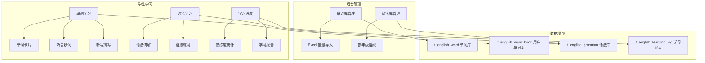

# 英语学习模块 技术设计文档

Feature Name: english-learning
Updated: 2026-08-30

## Description

英语学习模块包含**单词记忆**与**语法学习**两大核心功能，支持图片记忆/听音辨词/听写拼写/例句记忆/艾宾浩斯复习等多种单词记忆方式，提供语法讲解 + 例句 + 练习完整学习闭环。

## Architecture



## Components and Interfaces

### 前端组件

| 组件 | 路径 | 功能 |
|------|------|------|
| WordStudyPage | `/english/word` | 单词学习（卡片/听音/拼写） |
| GrammarStudyPage | `/english/grammar` | 语法学习（讲解 + 练习） |
| LearningProgressPage | `/english/progress` | 学习进度统计 |
| WordManagePage | `/english/words` | 后台单词库管理 |
| GrammarManagePage | `/english/grammars` | 后台语法库管理 |

### 后端接口

| 接口 | 方法 | 说明 |
|------|------|------|
| `/api/english/word/list` | GET | 单词列表（按版本/年级/单元筛选） |
| `/api/english/word/study` | GET | 获取待学习/复习单词 |
| `/api/english/word/record` | POST | 记录学习结果（熟练度 + 下次复习时间） |
| `/api/english/grammar/list` | GET | 语法列表（按年级筛选） |
| `/api/english/grammar/detail` | GET | 语法详情（讲解 + 例句 + 练习） |
| `/api/english/grammar/record` | POST | 记录练习结果 |
| `/api/english/progress` | GET | 学习进度统计 |

## Data Models

### t_english_word（单词库）

```sql
CREATE TABLE t_english_word (
  id varchar(64) PRIMARY KEY,
  spell varchar(128) NOT NULL COMMENT '单词拼写',
  phonetic varchar(64) COMMENT '音标',
  meaning text COMMENT '释义',
  image_url varchar(512) COMMENT '图片 URL',
  audio_url varchar(512) COMMENT '音频 URL',
  example_sentence text COMMENT '例句',
  version varchar(32) COMMENT '教材版本',
  grade varchar(16) COMMENT '年级',
  unit varchar(32) COMMENT '单元',
  created_at timestamp DEFAULT CURRENT_TIMESTAMP
);
```

### t_english_word_book（用户单词本）

```sql
CREATE TABLE t_english_word_book (
  id varchar(64) PRIMARY KEY,
  user_id varchar(64) NOT NULL,
  word_id varchar(64) NOT NULL,
  familiarity tinyint DEFAULT 0 COMMENT '熟练度 0-未学习 1-生疏 2-熟悉 3-熟练 4-精通',
  next_review_time timestamp COMMENT '下次复习时间',
  created_at timestamp DEFAULT CURRENT_TIMESTAMP,
  UNIQUE KEY uk_user_word (user_id, word_id)
);
```

### t_english_grammar（语法库）

```sql
CREATE TABLE t_english_grammar (
  id varchar(64) PRIMARY KEY,
  title varchar(256) NOT NULL COMMENT '标题',
  content text COMMENT '讲解内容',
  examples text COMMENT '例句',
  exercises json COMMENT '练习题',
  grade varchar(16) COMMENT '年级',
  created_at timestamp DEFAULT CURRENT_TIMESTAMP
);
```

### t_english_learning_log（学习记录）

```sql
CREATE TABLE t_english_learning_log (
  id varchar(64) PRIMARY KEY,
  user_id varchar(64) NOT NULL,
  type varchar(16) NOT NULL COMMENT '类型 word/grammar',
  content_id varchar(64) NOT NULL,
  duration int COMMENT '学习时长 (秒)',
  correct_count int COMMENT '正确数',
  created_at timestamp DEFAULT CURRENT_TIMESTAMP,
  INDEX idx_user (user_id, created_at)
);
```

## Correctness Properties

### 艾宾浩斯复习时间安排

| 复习次数 | 间隔时间 |
|----------|----------|
| 第 1 次 | 5 分钟 |
| 第 2 次 | 30 分钟 |
| 第 3 次 | 12 小时 |
| 第 4 次 | 1 天 |
| 第 5 次 | 2 天 |
| 第 6 次 | 4 天 |
| 第 7 次 | 7 天 |
| 第 8 次+ | 15 天 |

### 熟练度计算

- **正确复习**：熟练度 +1（上限 4）
- **错误复习**：熟练度 -1（下限 0）
- **熟练度 4**：标记为"已精通"，不再安排复习

## Error Handling

1. **单词音频加载失败**：显示文字提示"音频加载失败，请重试"
2. **图片加载失败**：显示默认占位图
3. **提交失败**：保留用户答案，提示"网络异常，请重试"
4. **并发冲突**：乐观锁控制（version 字段）

## Test Strategy

### 单元测试
- 艾宾浩斯时间计算逻辑
- 熟练度计算逻辑
- 单词/语法筛选逻辑

### 集成测试
- 单词学习完整流程
- 语法学习完整流程
- 学习进度统计准确性

### 前端测试
- 单词卡片渲染
- 听音辨词交互
- 听写拼写交互

## Implementation Plan

### Phase 1: 单词记忆（2 周）
1. 数据库设计与迁移
2. 后台单词库管理（CRUD + Excel 导入）
3. 前端单词学习页（卡片/听音/拼写）
4. 艾宾浩斯复习逻辑

### Phase 2: 语法学习（1 周）
1. 后台语法库管理
2. 前端语法学习页（讲解 + 练习）

### Phase 3: 学习进度（1 周）
1. 学习记录统计
2. 进度展示页
3. 与学海积分打通

## References

[^1]: 艾宾浩斯遗忘曲线 - https://zh.wikipedia.org/wiki/艾宾浩斯遗忘曲线
[^2]: 小学英语单词表 - 人教版教材参考
