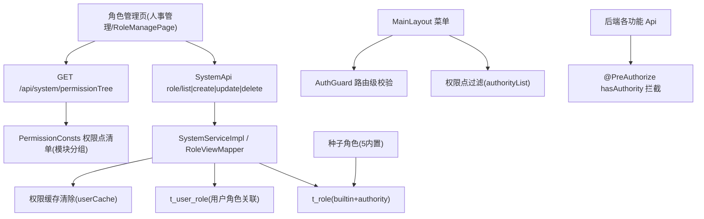

# 人事管理 · 角色权限管理 技术设计

Feature Name: hr-role-permission
Updated: 2026-08-13

## Description

实现后台系统角色权限管理：角色 CRUD（新增/删除/编辑权限） + 权限树（按功能模块分组、操作点勾选） + 权限生效（前端菜单级过滤 + 后端接口级拦截）。系统预置 5 个内置角色（管理员/校长/教师/学管师/教务）且不可删除。

系统已具备的底座（直接复用）：
- 后端角色接口：`POST /api/system/role/list|create|update|delete`，`RoleRequest.authorities`（权限编码列表）已有，`t_role.authority` 逗号分隔存储。
- 权限加载：`UserServiceImpl` 将角色 authority 拆分为 `GrantedAuthority`（含 `ROLE_{code}`），接口 `@PreAuthorize("hasAuthority('xxx')")` 拦截。
- 缓存：角色/权限变化时 `evictCache(roleId)` 清除用户缓存（cacheName `userCache`）。
- 删除保护：`SystemApi.deleteRole` 已有"至少保留一个角色"校验。

## Architecture

## Components and Interfaces

### 1. 权限点清单（新增）

- 新建常量类 `cn.wisestar.server.core.constant.PermissionConsts`（shared 模块），集中定义权限树数据源：

| 模块 | 菜单 | 权限点（module:action） |
|---|---|---|
| 仪表盘 | / | `home` |
| 在线练习 | /practice | `exercise:list` |
| 问卷管理 | /projects | `project:list/detail/create/update/delete/report` |
| 答案管理 | /answers | `answer:list/detail/create/update/delete/export/upload` |
| 题库管理 | /repos 等 | `repo:list/detail/create/update/delete/export/book` |
| 题目管理 | /questions | `question:list/create/update/delete`（新增权限点） |
| 知识管理 | /knowledge/* | `knowledge:list/create/update/delete`（新增，章节/小节/知识点共用） |
| 学员管理 | /students | `student:list/create/update/delete`（新增，/me 为 isAuthenticated 学员端专用） |
| 订单管理 | /orders | `order:list/create/update/delete`（新增） |
| 系统管理 | /system | `system:user:*`、`system:role:*`、`system:dept:*`、`system:position:*`、`system:dict:*`、`system:dictItem:*`（沿用现有） |

- 权限树结构：模块为父节点，操作点为叶节点。操作点命名规范：
  - 查看（含列表/详情）：`{module}:list`（兼容现有 `repo:detail` 等，归入"查看"）
  - 新增：`{module}:create`
  - 修改：`{module}:update`
  - 删除：`{module}:delete`
- 新增接口 `GET /api/system/permissionTree`（`SystemApi`，`@PreAuthorize("hasRole('admin')")`），返回模块分组树形 JSON：`[{ key, name, children: [{ key, name }] }]`。

### 2. 角色表扩展

- `t_role` 新增字段 `builtin`（tinyint，0 普通 / 1 内置不可删），`init-mysql.sql` + `init-h2.sql` 同步，`Role.java` 增加 `builtin` 属性，`RoleView` 增加 `builtin` 与 `authorities`（已有），`RoleRequest` 保持。
- 新增 `RoleCheckUtil` 或在 `SystemServiceImpl` 内校验：删除/编码修改时 `builtin=1` 拒绝（`ValidationException`）。

### 3. 内置角色种子

- `init-mysql.sql` / `init-h2.sql` 预置 5 角色（`builtin=1`），为既有初始化脚本追加（用固定 id + `INSERT ... WHERE NOT EXISTS` 或项目现有幂等模式）：

| 名称 | code | 默认权限（authority） |
|---|---|---|
| 管理员 | admin | 全量权限点（沿用现有 admin 种子并追加新权限点 `question:*`、`knowledge:*`、`student:*`、`order:*`） |
| 校长 | principal | 查看类 + 学员/订单管理全操作（决策层） |
| 教师 | teacher | 知识/题库/题目/练习查看+维护 |
| 学管师 | consultant | 学员/订单全操作 + 查看其余 |
| 教务 | academic | 知识/题库/题目维护 + 学员查看 |

- 具体 authority 字符串在实现时按 PermissionConsts 逐点拼接，保证与权限树勾选项一一对应。

### 4. 接口级权限补齐

对当前仅 `isAuthenticated()` 的后台管理接口补齐 `hasAuthority(...)` 注解：
- `ChapterApi` / `SectionApi` / `KnowledgePointApi`（管理端 CRUD）→ `knowledge:list/create/update/delete`
- `QuestionListPage` 依赖的题目接口（PracticeApi 中管理端题目查询部分）→ `question:list` 等（实现时按接口实际归属区分学员端 `isAuthenticated` 与管理端权限点）
- `StudentApi`（管理端 CRUD）→ `student:list/create/update/delete`；`/me` 保持 `isAuthenticated()`
- `OrderApi` → `order:list/create/update/delete`
- 历史模块已有权限点不动。

### 5. 前端菜单级过滤

- 登录响应 `/api/currentUser` 已返回 `authorityList`。
- `MainLayout.jsx`：为每个菜单项（含子菜单）配置 `required` 权限点列表；用户 `authorityList` 不含任一点时隐藏该菜单项。
- `AuthGuard.jsx`：路由级校验——目标路由对应权限点不在用户权限内则渲染无权限提示（保留现有 `adminOnly` 逻辑，管理员 `home` 兜底全可见）。
- 管理员特殊处理：`authorityList` 含全部权限点（种子全量），无需额外分支。

### 6. 角色管理页（人事管理）

- 新页面 `pages/hr/RoleManagePage.jsx`，路由 `/hr/roles`，侧边菜单新增「人事管理」分组（仅系统管理-角色权限可见者）。
- 功能：
  - 列表：角色名称/编码/备注/权限点数量/内置标识/创建时间；名称模糊搜索；分页。
  - 新增：Modal 表单（名称、编码、备注、权限树勾选）→ `role/create`。
  - 编辑：Modal 回填（名称、备注、权限树回显勾选；编码只读；内置角色不可删）→ `role/update`。
  - 删除：内置角色删除按钮禁用 + 后端双重校验；`Modal.confirm` 二次确认 → `role/delete`。
  - 权限树：`antd Tree` checkable，父子联动，保存仅提交叶节点。
- API 复用 `api/system.js`（或新增 `api/hr.js`）角色接口 + `GET /api/system/permissionTree`。

## Data Models

- `t_role` 变更：新增 `builtin` tinyint NOT NULL DEFAULT 0。
- 角色权限存储：沿用 `t_role.authority`（逗号分隔），新增/编辑时 `RoleViewMapper.fromRequest` 将 `authorities` List 转逗号串。
- 用户-角色关联：沿用 `t_user_role`（user_type/user_id/role_id），删除角色时同步删除关联。
- 权限树数据：`PermissionConsts` 常量（编译期清单），非数据库表。

## Correctness Properties

1. 内置角色（builtin=1）不可删除、编码不可修改；管理员角色权限始终全量（前端禁用编辑 + 后端拒绝非全量写入可选的强约束，本次以种子全量 + 前端禁用为度）。
2. 系统至少保留一个角色（沿用现有校验）。
3. 角色编码唯一：新增时校验 `code` 重复；`t_role` 无 code 唯一索引，以 service 查重兜底（与现有 `student` 学号做法一致，或补唯一索引——实现时若加唯一索引需确认种子幂等兼容，倾向 service 查重）。
4. 角色权限更新后 `evictCache(roleId)` 清除关联用户缓存，权限即时生效。
5. 菜单过滤与接口拦截双重生效：前端隐藏仅提升体验，后端 `@PreAuthorize` 为最终防线。

## Error Handling

| 场景 | 响应 |
|---|---|
| 内置角色删除 | 400 `ValidationException`：内置角色不可删除 |
| 角色编码重复 | 400：角色编码已存在 |
| 系统仅剩一个角色 | 400（沿用现有 `system.role.delete.retainOne`） |
| 无权限访问接口 | 403（Spring Security 默认） |
| 无权限访问路由 | 前端无权限提示页 |

## Test Strategy

1. 后端单测/自测脚本（沿用 `/tmp/opencode` 脚本模式）：角色 CRUD 全链路（admin 登录 → 建角色含权限树 → 列表回显 → 改权限 → 删角色）、内置角色删除被拒、编码重复被拒、权限更新后重新登录权限点生效。
2. 接口级：非授权角色调用 `student:create` 等接口返回 403。
3. 菜单级：以不同角色登录前端，验证菜单显隐与路由拦截。
4. `mvn clean package -DskipTests` 构建通过；前端 lint + build 通过。
5. 数据库：H2/MySQL 种子初始化后 5 内置角色存在且 builtin=1。

## References

- 现有角色接口：`server/api/.../SystemApi.java`（role/list|create|update|delete，L162-L273）
- 权限加载：`server/rdbms/.../impl/UserServiceImpl.java`（L133-L144）
- 缓存清除：`server/rdbms/.../impl/SystemServiceImpl.java`（evictCache，L120-L127）
- 角色模型：`server/rdbms/.../domain/model/Role.java`
- 前端菜单：`wisestar-client/src/components/layout/MainLayout.jsx`（menuItems L68+）
- 路由守卫：`wisestar-client/src/components/common/AuthGuard.jsx`
- 规格：`.monkeycode/specs/hr-role-permission/requirements.md`
