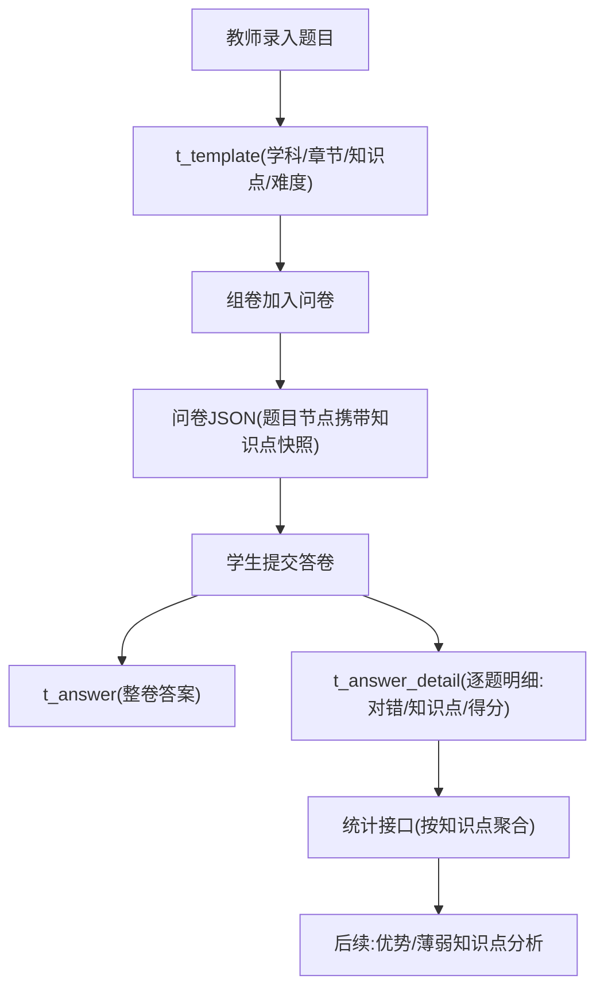

# 题目分析数据基础优化

Feature Name: question-analysis-data-foundation
Updated: 2026-08-01

## Description

为 AI 自习室系统的学生答题分析（优势/薄弱知识点）打数据基础：

1. 题目数据模型增加 学科→章节→知识点 三级结构与难度字段
2. 新增答题明细表，学生提交答卷时按题落库，记录每题对错、知识点、得分
3. 题目管理前端表格展示并支持按知识点筛选
4. 提供按知识点聚合的统计查询接口

## Architecture



知识点数据流：题目 → 问卷（快照）→ 答题明细（快照），历史答卷不受题目后续修改影响。

## Components and Interfaces

### 后端

| 组件 | 接口 | 说明 |
|------|------|------|
| Template 实体 | - | 增加 subject/chapter/knowledgePoint/difficulty 字段 |
| AnswerDetail 实体 | - | 新表 t_answer_detail 映射 |
| AnswerServiceImpl | 提交答卷时 | 解析答卷，逐题生成明细批量落库（先删后插保证幂等） |
| AnalysisApi | GET /api/analysis/knowledge-point/stats | 按知识点聚合统计（答题次数/正确次数/正确率） |
| AnalysisApi | GET /api/analysis/knowledge-point/student-profile | 单学生知识点正确率画像 |

### 前端

| 组件 | 说明 |
|------|------|
| QuestionEditModal | 增加学科/章节/知识点/难度录入 |
| QuestionListPage | 表格增加学科/章节/知识点/难度列，支持按学科、知识点筛选 |
| TemplatePickerModal | 同步展示知识点字段 |

## Data Models

### t_template 新增字段

| 字段 | 类型 | 说明 |
|------|------|------|
| subject | VARCHAR(64) | 学科，单值，如 数学 |
| chapter | VARCHAR(64) | 章节，单值，如 第二章 |
| knowledge_point | VARCHAR(255) | 知识点，多值，JSON 数组，如 ["函数","单调性"] |
| difficulty | VARCHAR(16) | 难度，easy/medium/hard |

### t_answer_detail 新表

| 字段 | 类型 | 说明 |
|------|------|------|
| id | VARCHAR(32) | 主键 |
| answer_id | VARCHAR(32) | 答卷 ID |
| project_id | VARCHAR(32) | 问卷 ID |
| question_id | VARCHAR(64) | 题目节点 ID（问卷内 q_xxx） |
| question_type | VARCHAR(32) | 题型 |
| subject | VARCHAR(64) | 学科快照 |
| chapter | VARCHAR(64) | 章节快照 |
| knowledge_point | VARCHAR(255) | 知识点快照，逗号分隔 |
| user_answer | TEXT | 学生答案 |
| is_correct | TINYINT | NULL=无标准答案，1=正确，0=错误 |
| score | DOUBLE | 得分 |
| duration_ms | BIGINT | 用时（可选，前端暂未上报时为空） |
| create_by | VARCHAR(32) | 学生 ID |
| create_at / update_at | DATETIME | 时间戳 |

### 问卷 JSON 题目节点扩展

题目加入问卷时（templateToQuestion），节点携带：

```json
{
  "id": "q_abc123",
  "type": "Radio",
  "title": "...",
  "templateId": "<题库题目ID>",
  "attribute": {
    "required": false,
    "examCorrectAnswer": "...",
    "subject": "数学",
    "chapter": "第二章",
    "knowledgePoint": ["函数", "单调性"],
    "difficulty": "medium"
  },
  "children": [...]
}
```

答题明细从问卷快照提取知识点，历史答卷不受题库题目后续修改影响。

## Correctness Properties

1. 对错判定规则：
   - 单选/下拉（Radio/Select）：学生答案等于正确答案（选项文本）
   - 多选（Checkbox）：学生答案集合与正确答案集合相等（与顺序无关）
   - 判断（Judge）：学生答案等于"正确"/"错误"
   - 填空（FillBlank）：学生答案去除首尾空白后与正确答案相等
   - 文本/备注/评分（Text/Remark/Score）：无标准答案，is_correct 为 NULL，不计入正确率
2. 同一答卷重复提交（暂存后完成），答题明细先删后插，不产生重复记录
3. 题目知识点后续修改不影响历史答题明细（快照隔离）
4. 未配置知识点的题目，答题明细 knowledge_point 为空字符串，统计时归入"未分类"

## Error Handling

| 场景 | 处理 |
|------|------|
| 答卷 JSON 解析失败 | 跳过明细生成并记录日志，不影响答卷保存主流程 |
| 答卷中题目节点缺少正确答案 | is_correct 置 NULL，不中断明细生成 |
| 统计接口无数据 | 返回空列表，正确率为 0 |

## Test Strategy

1. 单元测试：对错判定规则（单选/多选/判断/填空/文本各题型）
2. 单元测试：知识点快照提取（多知识点、无知识点、中文知识点）
3. 集成测试：提交答卷 → 明细落库 → 统计接口正确率
4. 前端：题目管理表格知识点列展示与筛选，题目编辑弹窗知识点录入回填
