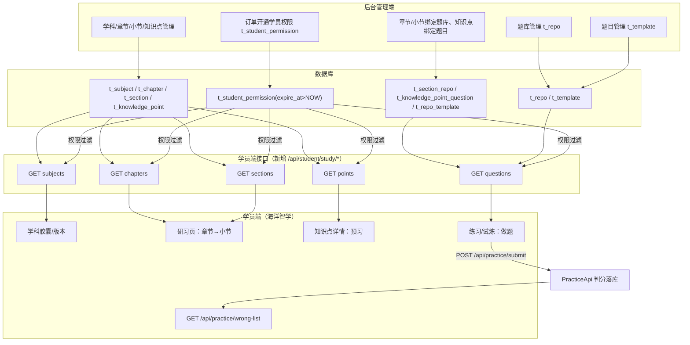

# 学员端内容对接 技术设计

Feature Name: student-content-bridge
Updated: 2026-08-20

## Description

打通后台管理端知识/题目配置与学员端呈现：后台维护的学科、章节、小节、知识点、题库、题目，经新增的学员端内容接口（按订单权限过滤）真实呈现到学员端，替代当前纯 mock 内容；练习/试炼题目来自后台绑定数据，交卷复用既有 `/api/practice/submit` 真实判分落库。学习积分/学习币/今日统计保持 mock（已确认决策 3）。

## Architecture

**数据流**：后台录入（学科/章节/小节/知识点/题库/题目/绑定/订单权限）→ 学员端 study 接口按当前学员订单权限过滤返回 → 学员端页面渲染；练习交卷 → PracticeApi 真实判分 → 错题本。

## Components and Interfaces

### 后端新增（StudentApi 扩展 + StudentService 扩展）

统一前缀 `/api/student/study/*`，全部 `isAuthenticated()`，服务层校验学员身份 + 订单权限：

| 接口 | 参数 | 返回 | 说明 |
|---|---|---|---|
| `GET /api/student/study/subjects` | - | `List<StudentSubjectView>` | 当前学员有效学科（含 icon、该学科有权限的版本列表） |
| `GET /api/student/study/chapters` | `subjectId` | `List<ChapterView>` | 学科下章节（含小节数）；校验学科在权限内 |
| `GET /api/student/study/sections` | `chapterId` | `List<SectionView>` | 章节下小节（含内容设置 content JSON、知识点数） |
| `GET /api/student/study/points` | `sectionId` | `List<KnowledgePointView>` | 小节下知识点（含讲解要点、配图） |
| `GET /api/student/study/questions` | `sectionId?` `knowledgePointId?` `count?` `difficulty?` `types?` | `List<StudentQuestionView>` | 练习/试炼题目（不含答案与解析，防作弊） |

### 复用既有接口

- `POST /api/practice/submit`：练习/试炼交卷（后端判分 + 落库 + 错题标记）。
- `GET /api/practice/wrong-list`：错题本。

### 前端新增/改造

- `api/student.js`：新增 5 个 study 接口封装。
- `useStudentStore`：新增 `fetchSubjects/fetchChapters/fetchSections/fetchPoints/fetchQuestions` 与内容状态；`getVisibleSubjects` 改用真实学科（按权限）；接口异常回退 mock 并置 `contentLoadFailed` 标记。
- `StudyPage`（研习）：章节/小节数据源由 mock 切真实接口；空态提示「该章节暂无内容」。
- `KnowledgePage`（知识点详情）：预习内容（讲解要点/配图）来自真实接口；练习/试炼题目来自真实接口，交卷调 `submitPractice` 判分；错题模式用 `wrong-list`。
- `StudentHomePage`：学习统计保持 mock（决策 3），研习入口正常。

## Data Models

无新增表，复用既有表：

- `t_subject`（学科）、`t_chapter`（章节）、`t_section`（小节，content=目标/概述/要点 JSON、practice=题量/难度/题型 JSON）、`t_knowledge_point`（知识点，content.points + image_url）。
- `t_section_repo`（小节绑定题库）→ `t_repo_template`（题库-题目）→ `t_template`（题目，attribute JSON 含选项/答案/解析）。
- `t_knowledge_point_question`（知识点绑定题目）→ `t_template`。
- `t_student_permission`（订单权限：student_id + subject_id + grade + version + expire_at，`expire_at > NOW()` 生效）。

新增 DTO：

- `StudentSubjectView`：`id / name / icon / versions[]`（versions 取该学科有效权限版本去重；学科 icon 取 t_subject）。
- `StudentQuestionView`：`id / name(题干) / questionType / tag / attribute(仅题目展示字段，剥离 answer/analysis)`。
- 章节/小节/知识点复用 `ChapterView / SectionView / KnowledgePointView`（管理端视图字段对学员端无敏感信息）。

## Correctness Properties

1. **权限收敛**：study 接口请求的 subjectId/chapterId/sectionId 必须落在当前学员有效权限（`t_student_permission`，expire_at > NOW()）的学科链上，否则返回空/校验错误。
2. **答案不暴露**：`questions` 接口返回的题目剥离 `answer/analysis`，判分仅由后端 `submitPractice` 完成。
3. **空数据语义**：后台无内容时接口返回空数组，前端显示空态；接口异常时前端回退 mock 并提示（不静默）。
4. **出题范围**：小节练习取该小节绑定题库的题目（按 practice 设置筛选）；知识点试炼取该知识点绑定题目；两者互不混用。
5. **幂等/性能**：study 接口为只读查询，无写操作；题目接口按 count 限制返回数量（默认 10，上限 50）。

## Error Handling

| 场景 | 处理 |
|---|---|
| 未登录访问 study 接口 | Spring Security 拦截，返回 code 401 |
| 后台账号调用 study 接口 | 服务层校验非学员，返回 400「当前用户不是学员」 |
| 请求学科不在订单权限内 | 返回空列表（学员端空态）或 400 校验错误 |
| 绑定题库/题目不足 | 返回实际可用题目，前端提示「题量不足」 |
| 练习交卷失败 | 沿用 PracticeApi 错误处理（message 提示） |

## Test Strategy

1. **后端接口自测**（脚本）：创建学员 + 订单（学科 A）→ study/subjects 仅返回学科 A；study/chapters 返回学科 A 章节；sections/points/questions 按层级返回；无权限学科返回空；questions 返回题目不含 answer 字段；非学员调用 400。
2. **练习闭环**：学员端题目 → submitPractice 交卷 → wrong-list 出现错题。
3. **前端验证**：真实数据渲染、空态提示、接口异常 mock 回退提示；lint/build 通过。

## References

[^1]: 需求文档 - [requirements.md](requirements.md)
[^2]: 学员管理需求（权限/订单） - [student-management/requirements.md](../student-management/requirements.md)
[^3]: PracticeApi - server/api/src/main/java/cn/wisestar/server/api/PracticeApi.java
