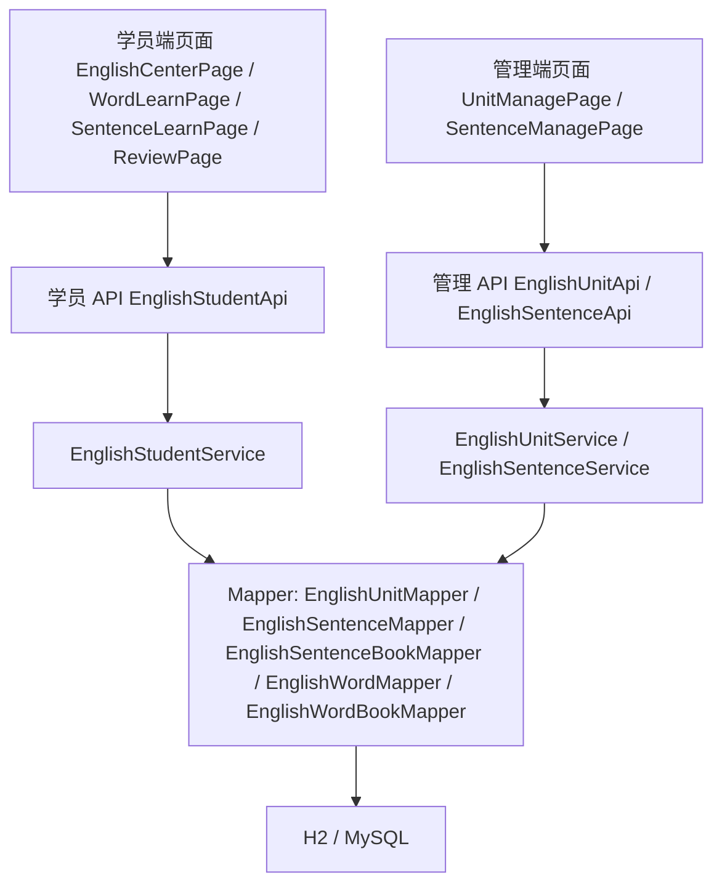
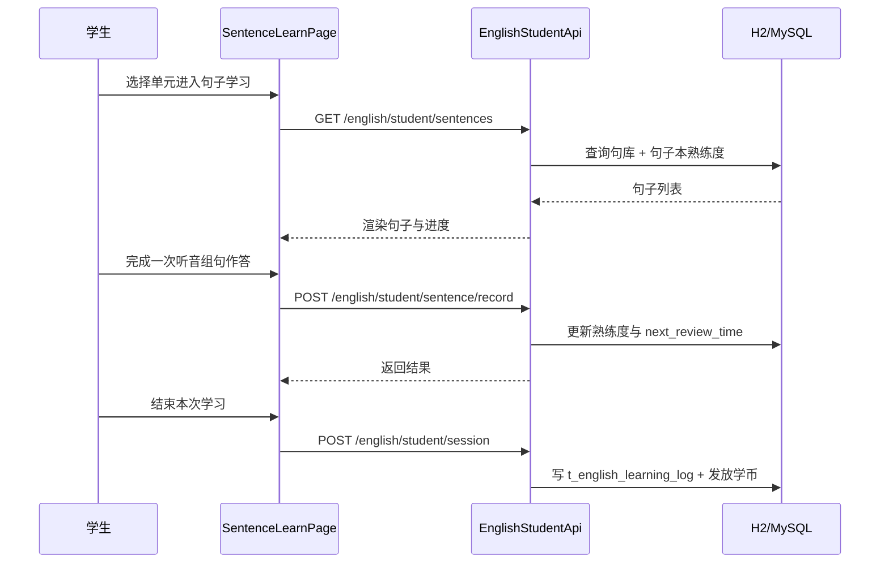

# 学生端英语学习中心 技术设计文档

Feature Name: student-english-hub
Created: 2026-09-15
Status: 初稿待确认
Related: `requirements.md`

## 1. 概述

### 1.1 目标

在现有 wisestar 系统中落地英语学习中心，覆盖两条链路：

- **学员端**：英语学习中心主界面 → 单词学习 → 句子学习 → 智能复习，学习结果写入熟练度与复习队列。
- **管理端**：单元管理、句库管理（含批量导入），并复用现有单词/语法/AI 内容包管理。

### 1.2 范围

**包含**

- 新增 `t_english_unit`、`t_english_sentence`、`t_english_sentence_book` 三张表。
- 新增单元服务、句子服务、学员英语学习服务及其 API。
- 新增/替换管理端 `UnitManagePage`、`SentenceManagePage`。
- 新增学员端英语学习中心、单词学习、句子学习、智能复习页面。
- 复用现有 `t_english_word`、`t_english_word_book`、`t_english_learning_log` 与复习算法。

**不包含**

- 不改动现有 AI 内容生成逻辑（`EnglishAiPackService`）。
- 不改动学币/积分/宝箱的底层账本实现，仅接入现有发放与统计入口。
- 不接入第三方教材音频版权内容，音频缺失时回退浏览器语音合成。

### 1.3 设计原则

- 复用现有分层与命名（MyBatis-Plus + `BaseModel` + `PaginationResponse` + 统一响应包装）。
- 学生端界面自研，视觉延续海洋童趣风格（`student.css`）。
- 句子内容独立成库，与单词解耦，可单独维护与导入。

## 2. 架构总览



分层落位（与现有一致）：

- 接口层：`server/api/src/main/java/cn/wisestar/server/api/`
- 服务接口：`server/shared/src/main/java/cn/wisestar/server/service/`
- DTO/View：`server/shared/src/main/java/cn/wisestar/server/domain/dto/english/`
- 实体：`server/rdbms/src/main/java/cn/wisestar/server/domain/model/`
- Mapper：`server/rdbms/src/main/java/cn/wisestar/server/mapper/`
- 服务实现：`server/rdbms/src/main/java/cn/wisestar/server/impl/`
- 初始化脚本：`server/rdbms/src/main/resources/scripts/init-h2.sql`、`init-mysql.sql`
- 权限常量：`server/shared/src/main/java/cn/wisestar/server/core/constant/PermissionConsts.java`

## 3. 数据模型设计

### 3.1 新增表 DDL（H2 / MySQL 同构）

```sql
-- 单元目录（单词与句子共用，用于单元列表与排序）
CREATE TABLE IF NOT EXISTS t_english_unit (
  id varchar(64) NOT NULL,
  version varchar(32) COMMENT '教材版本',
  grade varchar(16) COMMENT '年级',
  term varchar(16) COMMENT '学期（上册/下册）',
  unit varchar(32) COMMENT '单元，如 Unit 1 Helping at home',
  sort int DEFAULT 0 COMMENT '排序',
  create_at timestamp DEFAULT CURRENT_TIMESTAMP,
  create_by varchar(256),
  update_at timestamp,
  update_by varchar(256),
  is_deleted tinyint DEFAULT 0,
  PRIMARY KEY (id),
  UNIQUE KEY uk_unit (version, grade, term, unit)
);

-- 句库
CREATE TABLE IF NOT EXISTS t_english_sentence (
  id varchar(64) NOT NULL,
  en text NOT NULL COMMENT '英文句子',
  zh varchar(512) COMMENT '中文释义',
  audio_url varchar(512) COMMENT '音频 URL',
  version varchar(32) COMMENT '教材版本',
  grade varchar(16) COMMENT '年级',
  term varchar(16) COMMENT '学期（上册/下册）',
  unit varchar(32) COMMENT '单元',
  sort int DEFAULT 0 COMMENT '单元内排序',
  create_at timestamp DEFAULT CURRENT_TIMESTAMP,
  create_by varchar(256),
  update_at timestamp,
  update_by varchar(256),
  is_deleted tinyint DEFAULT 0,
  PRIMARY KEY (id)
);
CREATE INDEX IF NOT EXISTS idx_english_sentence_unit
  ON t_english_sentence (version, grade, term, unit, sort);

-- 学生句子本（熟练度 + 复习调度）
CREATE TABLE IF NOT EXISTS t_english_sentence_book (
  id varchar(64) NOT NULL,
  user_id varchar(64) NOT NULL,
  sentence_id varchar(64) NOT NULL,
  familiarity tinyint DEFAULT 0 COMMENT '熟练度 0-未学习 1-生疏 2-熟悉 3-熟练 4-精通',
  correct_count int DEFAULT 0 COMMENT '累计答对次数',
  wrong_count int DEFAULT 0 COMMENT '累计答错次数',
  last_review_time timestamp COMMENT '最近复习时间',
  next_review_time timestamp COMMENT '下次复习时间',
  create_at timestamp DEFAULT CURRENT_TIMESTAMP,
  create_by varchar(256),
  update_at timestamp,
  update_by varchar(256),
  is_deleted tinyint DEFAULT 0,
  PRIMARY KEY (id),
  UNIQUE KEY uk_user_sentence (user_id, sentence_id)
);
```

> MySQL 脚本中用 `CREATE TABLE ... ENGINE=InnoDB DEFAULT CHARSET=utf8mb4`、`UNIQUE KEY`、`KEY` 语法；H2 脚本保持现有 `IF NOT EXISTS` 风格。两张初始化脚本必须同步新增。

### 3.2 复用表

- `t_english_word` / `t_english_word_book`：单词与单词本（已有）。
- `t_english_learning_log`：学习记录，句子学习的 `type` 取 `sentence`，单词取 `word`。

### 3.3 数据初始化

- `t_english_unit`：由现有 `t_english_word` 按 `version + grade + term + unit` 聚合生成种子（36 单元），`sort` 按单元名中的数字排序。
- `t_english_sentence`：默认无种子数据，由管理端录入或导入。
- 主键统一雪花 ID（字符串），与现有表一致。

## 4. 后端设计

### 4.1 实体

- `EnglishUnit`：`@TableName("t_english_unit")`，字段 version/grade/term/unit/sort。
- `EnglishSentence`：`@TableName("t_english_sentence")`，字段 en/zh/audioUrl/version/grade/term/unit/sort。
- `EnglishSentenceBook`：`@TableName("t_english_sentence_book")`，字段 userId/sentenceId/familiarity/correctCount/wrongCount/lastReviewTime/nextReviewTime。

均继承 `BaseModel`（提供 id、createAt、createBy、updateAt、updateBy、isDeleted）。

### 4.2 Mapper

- `EnglishUnitMapper`、`EnglishSentenceMapper`、`EnglishSentenceBookMapper`，继承 `BaseMapper<T>`。
- Mapper 扫描包 `cn.wisestar.server.mapper` 已覆盖，无需额外配置。

### 4.3 DTO / View

- `EnglishUnitView` / `EnglishUnitQuery`：单元列表视图与查询（version/grade/term）。
- `EnglishSentenceView` / `EnglishSentenceQuery`：句子视图与查询（含 familiarity、correctCount、wrongCount）。
- `EnglishUnitProgressView`：单元进度（unit、wordCount、sentenceCount、wordFinished、sentenceFinished、reviewDue）。
- 沿用 `PaginationResponse<T>` 与 `ImportResult`。

### 4.4 Service

**EnglishUnitService（管理端）**

- `PaginationResponse<EnglishUnitView> list(EnglishUnitQuery query)`
- `void saveOrUpdate(EnglishUnitView view)`
- `void delete(String id)`
- `List<EnglishUnitView> listByBook(String version, String grade, String term)`

**EnglishSentenceService（管理与学员共用）**

- `PaginationResponse<EnglishSentenceView> list(EnglishSentenceQuery query)`
- `void saveOrUpdate(EnglishSentenceView view)`
- `void delete(String id)`
- `ImportResult importSentences(MultipartFile file)`：列 = 版本/年级/册别/单元/英文/中文/音频，按「版本+年级+册别+单元+英文」去重更新。

**EnglishStudentService（学员端）**

- `List<EnglishUnitProgressView> unitProgress(String userId, String version, String grade, String term)`：单元列表 + 进度。
- `List<EnglishSentenceView> sentences(String userId, String unit, String version, String grade, String term)`：单元句子 + 熟练度。
- `List<EnglishSentenceView> studySentences(String userId, int limit)`：待学习/复习句子。
- `void recordSentence(String userId, String sentenceId, boolean correct)`：更新熟练度与复习时间，并写 `t_english_learning_log`。
- `ReviewSessionView reviewSession(String userId, int limit)`：合并单词与句子复习队列。
- `void recordSession(String userId, String type, int durationSeconds, int correctCount)`：写学习记录，接入学币与时长统计。

### 4.5 API

**管理端**

| 方法 | 路径 | 权限 | 说明 |
|------|------|------|------|
| GET | `/api/english/unit/list` | `english:unit:list` | 单元分页列表 |
| POST | `/api/english/unit/save` | `english:unit:create` `english:unit:update` | 新增/更新单元 |
| POST | `/api/english/unit/delete` | `english:unit:delete` | 删除单元 |
| GET | `/api/english/sentence/list` | `english:sentence:list` | 句子分页列表 |
| POST | `/api/english/sentence/save` | `english:sentence:create` `english:sentence:update` | 新增/更新句子 |
| POST | `/api/english/sentence/delete` | `english:sentence:delete` | 删除句子 |
| POST | `/api/english/sentence/import` | `english:sentence:import` | 批量导入句子 |

**学员端**（`EnglishStudentApi`，`@PreAuthorize("isAuthenticated()")`）

| 方法 | 路径 | 说明 |
|------|------|------|
| GET | `/api/english/student/units` | 单元列表 + 进度（版本/年级/册别） |
| GET | `/api/english/student/sentences` | 单元句子列表（含熟练度） |
| GET | `/api/english/student/sentence/study` | 待学习/复习句子 |
| POST | `/api/english/student/sentence/record` | 记录句子作答 `{sentenceId, correct}` |
| GET | `/api/english/student/review` | 智能复习会话（单词 + 句子） |
| POST | `/api/english/student/session` | 记录学习会话 `{type, durationSeconds, correctCount}` |

现有 `/api/english/word/study|record|word-book` 保持不变，作为单词学习链路。

### 4.6 核心逻辑

**复习算法**：句子复用 `EnglishWordServiceImpl.calculateNextReviewTime` 的艾宾浩斯间隔（熟练度 0→5 分钟，1→30 分钟，2→12 小时，3→1 天，4→2 天，5+→4 天），答对熟练度 +1（上限 4），答错 −1（下限 0），同时维护 `lastReviewTime` 与累计正误次数。建议将该方法抽到共用工具类 `EnglishReviewScheduler`，单词与句子共用，避免重复实现。

**智能复习队列**：`reviewSession` 合并单词本与句子本中 `next_review_time <= now` 的记录，按 `next_review_time` 升序，`limit` 截断，返回类型标记（word/sentence）。

**组句分词**：英文句子按空白切分生成词块；标点（`. , ? !`）就近附加到词块尾部，作为排序提示。分词在前端 `tokenizeSentence(en)` 完成，后端只下发原文，避免额外接口与存储。

**音频回退**：优先播放 `audioUrl`；为空时使用浏览器 `SpeechSynthesisUtterance`（`lang='en-US'`）朗读。统一封装前端 `speakEnglish(text, audioUrl)`，单词与句子共用。

**进度计算**：单元单词完成数 = 该单元有单词本记录且 `familiarity >= 1` 的单词数；句子完成数同理。待复习数 = 单词本 + 句子本中到期的记录数。

**学币与时长接入**：`recordSession` 复用现有在线时长心跳与学币发放入口（与 `StudentServiceImpl` 现有奖励口径一致），不新建账本。

### 4.7 权限与初始化脚本

- `PermissionConsts` 新增：`english:unit:list/create/update/delete`、`english:sentence:list/create/update/delete/import`。
- `init-h2.sql` / `init-mysql.sql`：新增三张表 DDL、`t_english_unit` 种子、管理员角色 `authority` 串追加新权限点。
- 管理员角色 authority 为逗号串，追加时保持现有顺序风格。

## 5. 前端设计

### 5.1 管理端

**`/english/unit` UnitManagePage（替换占位）**

- 顶部筛选：学科固定英语、版本、年级、册别。
- 列表列：单元、排序、单词数、句子数、操作。
- 操作：新增、编辑、删除；表单字段 version/grade/term/unit/sort。
- 风格：裸 div + `Title level={4}` + antd `Table`/`Modal`，不用 Card 包裹。

**`/english/sentence` SentenceManagePage（替换占位）**

- 筛选：版本、年级、册别、单元、关键字。
- 列表列：英文、中文、单元、音频、排序、操作。
- 操作：新增、编辑、删除、批量导入（模板下载含表头说明）。
- 音频：支持填写 URL，并显示试听按钮。

**路由与权限**：`App.jsx` 中 `/english/unit`、`/english/sentence` 加 `AuthGuard required`；`MainLayout.jsx`「英语板块」菜单保持分组，补齐管理页菜单项。

### 5.2 学员端

**入口（与语文/数学一致）**

- 不新增底部 tabbar 项，英语复用现有「首页学海研习卡片 + 顶部学科下拉」入口机制。
- `StudentHomePage.jsx`：当 `activeSubject` 为英语时，学海研习卡片点击跳转 `/student/english`；其他学科跳转 `/student/study`。判断依据用学科名称「英语」（真实学科 `key` 为学科 ID，如 `1003`），同时兼容 mock `key='english'`。
- 学海研习卡片在英语学科下展示英语主题（沿用 `SUBJECTS[english].icon/theme`），文案仍是「开启英语研习」。
- 顶部学科下拉切到英语后，卡片即指向英语学习中心，与语文/数学切换逻辑完全一致。
- `StudentHomePage.jsx` 可选在英语卡片内展示待复习角标（数据来自 `/api/english/student/review`）。

**页面**

| 路由 | 页面 | 说明 |
|------|------|------|
| `/student/english` | `EnglishCenterPage` | 单元列表 + 单元进度 + 智能复习区 |
| `/student/english/word` | `EnglishWordLearnPage` | 单元单词学习（卡片/听音辨词/听写拼写） |
| `/student/english/sentence` | `EnglishSentenceLearnPage` | 单元句子学习（听音组句/连词成句/句子默写/听力理解） |
| `/student/english/review` | `EnglishReviewPage` | 一键复习（单词 + 句子混合队列） |

**交互要点**

- 主界面顶部为版本/年级/册别切换（复用 StudentLayout 现有下拉），主体为单元网格卡片（单元名 + 单词/句子进度环 + 待复习角标）。
- 单元卡片点击展开学习入口：单词学习、句子学习、测评。
- 句子学习四类练习共用句子数据，切换题型只改变渲染与判分逻辑。
- 判分：标准化英文（去首尾空白、忽略大小写、合并连续空格），组句按词块顺序比较。
- 答题反馈：即时正误 + 正确答案 + 重试；连续 3 次错误自动进入下一题。

### 5.3 视觉规范（原创）

- 延续海洋童趣：浅蓝渐变背景、波浪分隔、3D 圆角卡片、海螺/贝壳/珊瑚等原创图形元素。
- 英语学习中心在统一风格上使用独立主题色（如珊瑚橙 + 海蓝），与语文/数学区分。
- 进度展示用环形进度或贝壳进度条等原创图形，不使用第三方产品图标与插画。
- 公共样式新增 `src/pages/student/EnglishCenterPage.css` 等页面级样式，复用 `student.css` 变量。

### 5.4 侵权规避设计

- 功能名称使用通用教育术语：听音辨词、听写拼写、听音组句、连词成句、句子默写、听力理解、智能复习。
- 不复制参考产品的 Logo、图标、插画、配色方案与文案表述。
- 仅参考「单元列表 + 题型卡片 + 复习区」的信息架构，具体布局与视觉重新设计。
- 音频与图片仅使用自有或已授权素材；第三方素材在管理端记录来源，页面不展示第三方品牌。
- 在文档与代码注释中记录参考来源与原创声明。

## 6. 关键流程



## 7. 测试策略

- **单元测试**：复习算法（熟练度增减与间隔）、句子导入去重、进度计算。
- **接口测试**：curl cookie jar 登录学员 `a000001`，验证单元进度、句子列表、记录与复习队列；管理端用 admin 验证 CRUD 与导入。
- **回环冒烟**：管理端导入句子 → 学员端按单元加载 → 作答 → 句子本与复习队列更新。
- **前端验证**：`npm run build` + `npm run lint`，并在浏览器实测渲染（JSX 变量引用 build 不报错）。
- **审计列一致性**：新增表必须含 `create_at/create_by/update_at/update_by/is_deleted`，与 `BaseModel` 对齐；H2 INSERT 列数必须与列名个数一致。

## 8. 实施任务拆解

1. 新增三张表 DDL 到 `init-h2.sql` 与 `init-mysql.sql`，补充 `t_english_unit` 种子与管理员权限点。
2. 新增实体、Mapper、DTO。
3. 新增 `EnglishUnitService` / `EnglishSentenceService` / `EnglishStudentService` 接口与实现，抽出 `EnglishReviewScheduler`。
4. 新增管理端 API `EnglishUnitApi` / `EnglishSentenceApi`，学员端 API `EnglishStudentApi`。
5. 新增权限常量并在角色初始化脚本追加。
6. 替换管理端 `UnitManagePage` / `SentenceManagePage`，补路由与菜单。
7. 新增学员端四页面与路由；改造 `StudentHomePage` 英语学科的学海研习卡片跳转，落地原创视觉。
8. 后端 `clean package`、前端 `build`，接口与页面联调。
9. 端到端冒烟（导入句子 → 学习 → 复习），导出 H2 快照并提交。

## 9. 风险与待定项

- **内容工作量**：句库需人工录入或导入，上线前需保证至少覆盖种子单元的核心句型。
- **音频版权**：优先使用自有录音或授权音频，缺失时回退 TTS。
- **复习调度一致性**：单词与句子共用算法时需统一时间基准，避免时区偏差。
- **学币发放口径**：句子学习奖励标准需与现有单词学习口径对齐后再实现。

---

**文档状态**：初稿待确认
**下一步**：用户确认后进入实施规划（tasklist）
