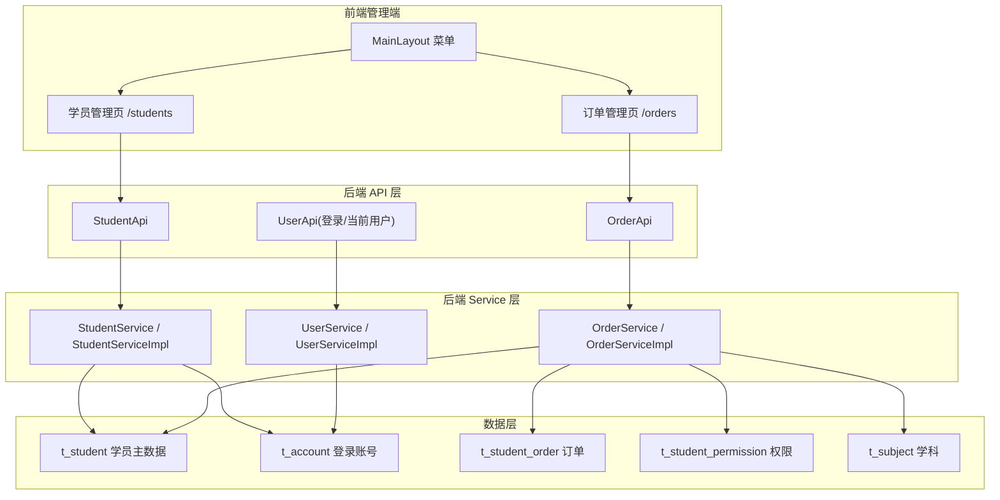

# 学员管理模块 技术设计

Feature Name: student-management
Updated: 2026-08-12

## Description

学员管理模块为管理端新增两个子功能：**学员注册**（录入学员基础信息，自动生成 8 位学号作为登录账号，默认密码 123456）与**订单管理**（为已注册学员配置学科 / 年级 / 教材版本 / 账号时长，写入订单主表与学员权限关联表）。

本次迭代范围仅管理端：学员端（/student）为纯前端 mock，按订单权限的内容鉴权留待后续迭代；但权限关联表结构按鉴权可查询（student_id + 范围 + expire_at）设计，为后续做准备。

三个已确认决策：
1. 仅管理端，学员端鉴权后续迭代。
2. 学科取知识管理 `t_subject`；年级/教材版本用固定枚举（前端常量）。
3. 学员账号 `user_type = Student`，登录复用现有 `/api/public/login`，前端按 userType 跳转。

## Architecture



数据流（新增学员）：前端表单 → `POST /api/student/create` → StudentServiceImpl（校验 → 生成学号 → 事务内写 t_student + t_account）→ 返回含学号的 StudentView。

数据流（创建订单）：前端表单 → `POST /api/order/create` → OrderServiceImpl（事务内写 t_student_order + 按学科×年级笛卡尔积展开写 t_student_permission）→ 返回 OrderView。

## Components and Interfaces

### 后端新增

| 组件 | 位置 | 职责 |
|---|---|---|
| `StudentApi` | api 模块 | 学员 CRUD 接口 |
| `StudentService` / `StudentServiceImpl` | shared / rdbms | 学号生成、学员入库、账号创建 |
| `OrderApi` | api 模块 | 订单 CRUD 接口 |
| `OrderService` / `OrderServiceImpl` | shared / rdbms | 订单写入 + 权限展开 |
| `Student` / `StudentOrder` / `StudentPermission` | rdbms model | 实体 |
| `StudentMapper` / `StudentOrderMapper` / `StudentPermissionMapper` | rdbms mapper | MyBatis-Plus Mapper |
| `StudentRequest/StudentQuery/StudentView` | shared dto | 学员请求/查询/视图 |
| `OrderRequest/OrderQuery/OrderView` | shared dto | 订单请求/查询/视图 |

### 后端修改

| 组件 | 变更 |
|---|---|
| `AppConsts.USER_TYPE` | 枚举加 `Student` |
| `UserInfo` | 加 `userType` 字段（登录后前端据此跳转） |
| `UserViewMapper.toUserView(Account)` | 设置 userType；Student 类型回填 t_student 基础信息 |
| `UserServiceImpl.loadUserById` | 按 userType 区分：Student 查 t_student，SysUser 查 t_user（getCurrentUser 兼容学员） |

### API 接口

**StudentApi（@PreAuthorize isAuthenticated，前缀 /api）**

| 方法 | 路径 | 请求 | 响应 data |
|---|---|---|---|
| POST | /student/create | `{name, age?, phone, school?, campus?}` | StudentView |
| GET | /student/list | `{current, pageSize, name?, studentNo?, phone?}` | `{list:[StudentView], total}` |
| POST | /student/update | `{id, name?, age?, phone?, school?, campus?}` | - |
| POST | /student/delete | `{id}` | - |

StudentView: `{id, studentNo, name, age, phone, school, campus, createAt}`

**OrderApi（@PreAuthorize isAuthenticated，前缀 /api）**

| 方法 | 路径 | 请求 | 响应 data |
|---|---|---|---|
| POST | /order/create | `{studentId, subjectIds[], grades[], version, duration, durationUnit}` | OrderView |
| GET | /order/list | `{current, pageSize, studentId?, studentName?, status?}` | `{list:[OrderView], total}` |
| POST | /order/cancel | `{id}` | -（作废：status=0 + 权限逻辑删） |
| POST | /order/delete | `{id}` | -（逻辑删 + 权限清理） |

OrderView: `{id, studentId, studentNo, studentName, subjects:[{id,name}], grades:[], version, duration, durationUnit, expireAt, status, createAt}`

字典：学科复用 `GET /api/subject/list`；年级/教材版本/时长单位为前端常量。

### 前端

| 组件 | 路由 | 说明 |
|---|---|---|
| `StudentManagePage.jsx` | /students | 学员列表 + 新增/编辑弹窗 + 删除 |
| `OrderManagePage.jsx` | /orders | 订单列表 + 新增弹窗 + 作废/删除 |
| `MainLayout.jsx` | 菜单 | 新增「学员管理」分组（学员列表 / 订单管理） |
| `App.jsx` | 路由 | 注册 /students、/orders |
| `LoginPage.jsx` / `AuthGuard.jsx` | 登录 | 登录后按 userType 跳转（Student → /student）；管理端路由校验 SysUser |

### 学号生成规则

- 8 位数字，首位非 0：随机区间 [10000000, 99999999]。
- 生成后查 `t_student.student_no` 校验唯一，冲突重试（最多 10 次）。
- 数据库唯一索引兜底；并发极端情况下插入冲突由唯一索引报错返回系统错误。

## Data Models

```sql
-- 学员主数据表（新建）
CREATE TABLE `t_student` (
  `id` varchar(64) NOT NULL COMMENT 'ID',
  `student_no` varchar(8) NOT NULL COMMENT '学号(8位数字,唯一)',
  `name` varchar(50) NOT NULL COMMENT '姓名',
  `age` int DEFAULT NULL COMMENT '年龄',
  `phone` varchar(20) NOT NULL COMMENT '联系号码',
  `school` varchar(100) DEFAULT NULL COMMENT '学校',
  `campus` varchar(50) DEFAULT NULL COMMENT '校区(本迭代仅占位)',
  `extra` text COMMENT '扩展预留字段(JSON,前端不展示)',
  `status` tinyint(1) NOT NULL DEFAULT '1' COMMENT '状态',
  `is_deleted` tinyint(1) NOT NULL DEFAULT '0',
  `create_at` timestamp NOT NULL DEFAULT CURRENT_TIMESTAMP,
  `create_by` varchar(256) DEFAULT NULL,
  `update_at` timestamp NULL DEFAULT NULL ON UPDATE CURRENT_TIMESTAMP,
  `update_by` varchar(256) DEFAULT NULL,
  PRIMARY KEY (`id`),
  UNIQUE KEY `uk_student_no` (`student_no`)
) ENGINE=InnoDB DEFAULT CHARSET=utf8mb3 COMMENT='学员主数据';

-- 订单主表（新建）
CREATE TABLE `t_student_order` (
  `id` varchar(64) NOT NULL COMMENT 'ID',
  `student_id` varchar(64) NOT NULL COMMENT '学员ID(t_student.id)',
  `subject_ids` varchar(255) NOT NULL COMMENT '学科ID多选(逗号分隔)',
  `grades` varchar(255) NOT NULL COMMENT '年级多选(逗号分隔)',
  `version` varchar(50) DEFAULT NULL COMMENT '教材版本',
  `duration` int NOT NULL COMMENT '账号时长数值',
  `duration_unit` varchar(10) NOT NULL COMMENT '时长单位 DAY/MONTH/YEAR',
  `expire_at` datetime NOT NULL COMMENT '有效期至(服务端计算)',
  `status` tinyint(1) NOT NULL DEFAULT '1' COMMENT '1生效 0作废',
  `is_deleted` tinyint(1) NOT NULL DEFAULT '0',
  `create_at` timestamp NOT NULL DEFAULT CURRENT_TIMESTAMP,
  `create_by` varchar(256) DEFAULT NULL,
  `update_at` timestamp NULL DEFAULT NULL ON UPDATE CURRENT_TIMESTAMP,
  `update_by` varchar(256) DEFAULT NULL,
  PRIMARY KEY (`id`),
  KEY `idx_order_student` (`student_id`)
) ENGINE=InnoDB DEFAULT CHARSET=utf8mb3 COMMENT='学员订单';

-- 学员权限关联表（新建，多选学科×年级笛卡尔积展开为行，供后续鉴权）
CREATE TABLE `t_student_permission` (
  `id` varchar(64) NOT NULL COMMENT 'ID',
  `student_id` varchar(64) NOT NULL COMMENT '学员ID',
  `order_id` varchar(64) NOT NULL COMMENT '来源订单ID',
  `subject_id` varchar(64) NOT NULL COMMENT '学科ID',
  `grade` varchar(20) NOT NULL COMMENT '年级',
  `version` varchar(50) DEFAULT NULL COMMENT '教材版本',
  `expire_at` datetime NOT NULL COMMENT '有效期至',
  `is_deleted` tinyint(1) NOT NULL DEFAULT '0',
  `create_at` timestamp NOT NULL DEFAULT CURRENT_TIMESTAMP,
  `create_by` varchar(256) DEFAULT NULL,
  `update_at` timestamp NULL DEFAULT NULL ON UPDATE CURRENT_TIMESTAMP,
  `update_by` varchar(256) DEFAULT NULL,
  PRIMARY KEY (`id`),
  KEY `idx_perm_student` (`student_id`)
) ENGINE=InnoDB DEFAULT CHARSET=utf8mb3 COMMENT='学员权限';
```

登录账号复用 `t_account`：`user_type='Student'`、`user_id=t_student.id`、`auth_account=学号`、`auth_secret=passwordEncoder.encode("123456")`。

年级/教材版本枚举（前端常量）：
- 年级：一年级、二年级、三年级、四年级、五年级、六年级
- 教材版本：人教版、苏教版、北师大版、外研版
- 时长单位：DAY（天）、MONTH（月）、YEAR（年）

## Correctness Properties

1. 学号全局唯一：数据库唯一索引 `uk_student_no` 兜底 + 业务层生成重试。
2. 姓名 + 联系号码组合唯一：新增前按 `(name, phone)` 查询 t_student 已存在（含未删除）则拒绝。
3. 新增学员原子性：t_student + t_account 同一事务，任一失败整体回滚。
4. 创建订单原子性：t_student_order + 全部 t_student_permission 展开行同一事务。
5. 学号不可修改：update 接口不接收 studentNo。
6. 权限展开正确性：subjectIds × grades 笛卡尔积行数 = 两集合元素数之积；每行继承订单 version 与 expireAt。
7. 到期自动失效：鉴权查询条件 `expire_at > NOW()`（本次不实现鉴权，表结构保证可查）。
8. 账号默认密码：固定 "123456"，bcrypt 加密存储，不落明文。

## Error Handling

| 场景 | 处理 |
|---|---|
| 姓名/联系号码为空 | 参数校验（@NotBlank）返回 400 错误提示 |
| 姓名+电话组合重复 | 返回业务错误「该学员已存在」 |
| 学号生成 10 次冲突 | 返回系统错误「学号生成失败，请重试」 |
| 订单关联学员不存在/已删除 | 返回「学员不存在」 |
| 学科 ID 无效 | 校验 t_subject 存在，否则返回「学科无效」 |
| 时长数值非法（<=0） | 参数校验拒绝 |
| 插入唯一索引冲突（并发） | 捕获 DuplicateKeyException 返回「学号已存在，请重试」 |

## Test Strategy

1. **后端编译**：`mvn clean package -DskipTests` 全模块通过。
2. **API 自测脚本**（/tmp/opencode/test-student-api.mjs）：
   - 新增学员 → 返回 8 位学号；重复姓名+电话 → 拒绝；
   - 学员列表按学号/姓名筛选；
   - 创建订单（多学科 × 多年级）→ 权限表行数 = 学科数 × 年级数；
   - 订单列表回查（含学员名/学科名）、作废订单 → 权限逻辑删；
   - 学员删除 → 账号/订单/权限级联逻辑删。
3. **前端**：`npm run build` + `npm run lint` 通过；经 3000 vite 代理端到端链路验证。
4. **数据库幂等**：init-h2.sql / init-mysql.sql 新表 `CREATE TABLE IF NOT EXISTS`（h2 侧同其他表处理），重复启动不报错。

## References

[^1]: (需求文档) - `.monkeycode/specs/student-management/requirements.md`
[^2]: (开发维护日志) - `docs/开发维护日志.md`（第 17 节为最近一次题库绑定改造，第 18 节将记录本次学员管理）
[^3]: (数据库脚本) - `server/rdbms/src/main/resources/scripts/init-mysql.sql` / `init-h2.sql`
[^4]: (用户类型常量) - `server/shared/src/main/java/cn/wisestar/server/core/constant/AppConsts.java#L144`
[^5]: (认证加载) - `server/rdbms/src/main/java/cn/wisestar/server/impl/UserServiceImpl.java#L100`
[^6]: (管理端菜单) - `wisestar-client/src/components/layout/MainLayout.jsx`
