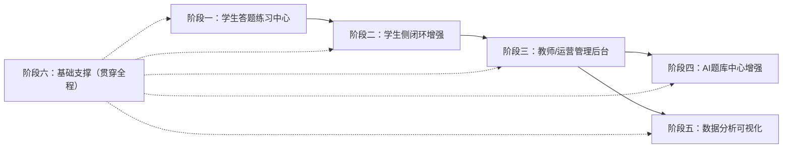

# AI 自习室系统开发路线图

> 本文档根据「AI 自习室学习系统」功能蓝图，结合当前代码库（由「卷王 SurveyKing」改造而来）的实际情况，
> 规划后续开发的阶段、任务分解、依赖关系与验收标准，作为后续开发工作的执行依据。
>
> 最后更新：2026-08-05（v2：答题练习模式提升为最高优先级，新增答题交互设计专章）

---

## 1. 目标蓝图（功能总览）

系统由五大板块组成：

| 板块 | 内容 | 使用方 |
|------|------|--------|
| 一、学生前台端 | 账号中心、自主学习中心（刷题/错题本/收藏/计时器）、拓展兴趣板块、消息通知 | 线下门店学生 |
| 二、教师/运营管理后台 | 用户管理、任务管理、巡检监控、报表导出、系统应急开关 | 管理员/教师 |
| 三、私有AI题库中心 | 题目资源管理、多维标签体系、试卷管理、AI能力接口 | 管理员/教师 |
| 四、智能数据分析模块 | 学习行为统计、学情诊断、数据看板 | 管理员 |
| 五、基础支撑模块 | 权限管理、日志记录、数据备份、局域网部署 | 运维 |

---

## 2. 现状盘点（代码库已有能力）

以下能力已在当前代码库实现，后续开发应优先复用，避免重复建设。

### 2.1 学生侧（已有部分）

| 蓝图条目 | 现状 | 代码位置 |
|---------|------|---------|
| 学生注册/登录 | 已实现（注册页 + RSA 加密登录） | `wisestar-client/src/pages/login/RegisterPage.jsx`、`LoginPage.jsx`；后端 `UserApi` `/public/register`、`/public/login` |
| 个人信息 | 后端有 currentUser/checkUsernameExist，前端缺个人中心页 | `UserApi` |
| 历史记录 | 答卷列表 + 详情 | `AnswerListPage.jsx`、`AnswerDetailPage.jsx`；`AnswerApi` |
| 收藏习题 | 后端有 UserBook 表与 book 系列接口，前端未接 | `UserBook.java`、`TemplateApi /book/*` |
| 答题提交链路 | 后端判分/排名/明细完整（saveAnswer 自动判分写 t_answer_detail）；前端只有**问卷填表式**的 SurveyViewPage，无刷题式交互 | `SurveyViewPage.jsx`（一屏到底平铺题）、`AnswerServiceImpl` |

### 2.2 教师/管理后台（已有部分）

| 蓝图条目 | 现状 | 代码位置 |
|---------|------|---------|
| 学生账号新增/启用禁用 | 用户 CRUD、导入、部门/岗位分组已实现 | `SystemApi`（user/dept/position 系列）、`UserApi /importUser` |
| 权限管控 | 角色/权限/菜单体系完整 | `SystemApi`（role/permission 系列）、`Permission.java`、`RolePermission.java` |
| 任务管理 | 后端有任务相关接口，前端未接 | `SurveyApi /listHistoryTask`、`/listUserTask` |
| 报表导出 | 问卷/题目导出 Excel 已实现 | `RepoApi /export`、`TemplateApi /export`、`AnswerApi /export` |
| 系统管理页 | 占位页（待实现具体功能） | `SystemPage.jsx` |

### 2.3 题库中心（已有部分）

| 蓝图条目 | 现状 | 代码位置 |
|---------|------|---------|
| 批量导入/单题新增 | Excel 导入模板下载 + 批量导入已实现 | `TemplateApi /import`、`/downloadTemplate`、`/batchCreate` |
| 编辑题目/答案/解析/配图 | 题目 CRUD + 附件上传已实现 | `TemplateApi`、`FileApi`；`template.js`（前端 API） |
| 题目上下架/回收站 | 逻辑删除 + 回收站恢复已实现 | `TemplateApi /trash`、`/restore`、`/destroy` |
| 多维标签 | 三级知识点（科目→章节→知识点）已建，t_tag 表已建 | `Tag.java`、`TemplateApi /listTag`；题目 JSON 存知识点 |
| 试卷管理 | 问卷（project）CRUD 已实现；AI 智能组卷未实现 | `ProjectApi`、`RepoApi` |
| AI 能力接口 | SiliconFlow 流式对话后端已实现（未启用 token） | `server/ai` 模块、`ChatController`、`SiliconflowChatServiceImpl` |

### 2.4 数据分析（已有部分）

| 蓝图条目 | 现状 | 代码位置 |
|---------|------|---------|
| 学习行为统计 | 概览统计（问卷数/考试数/人数/今日答卷）已实现 | `DashboardApi /userOverview`、`DashboardPage.jsx` |
| 学情诊断 | 知识点统计 + 学生画像接口已实现，前端可视化未做 | `AnalysisApi /knowledge-point/stats`、`/knowledge-point/student-profile` |
| 答题明细 | t_answer_detail 表与明细生成逻辑已建（duration_ms 前端未上报） | `AnswerDetail.java`、`AnswerServiceImpl` |

### 2.5 基础支撑（已有部分）

| 蓝图条目 | 现状 | 代码位置 |
|---------|------|---------|
| 权限管理 | 完整（角色/权限/部门/岗位/字典） | `SystemApi` |
| 字典管理 | 已实现 | `SystemApi /dict/*` |

---

## 3. 差距分析（蓝图 - 现状）

标 ★ 的为**需要新建**的功能，标 ▲ 的为**已有基础、需增强/前端接入**的功能。

### 3.1 学生前台端

| 蓝图条目 | 差距 | 类型 |
|---------|------|------|
| **答题练习（三种模式 + 交互）** | **系统有题库/问卷库但无学生刷题入口；现有答题页是问卷填表式，非刷题式交互。这是全系统最核心的缺口** | ★★ |
| 学习档案（历史记录、错题本） | 历史记录已有；**错题本整块缺失** | ★ |
| 权限切换（检查模式→隐藏文化课板块） | 缺失，需做全局栏目显隐开关 | ★ |
| 按标签选题（年级/科目/知识点/难度/题型） | 后端有标签数据，**前端缺选题筛选界面** | ▲ |
| 专项刷题/套卷模拟/随机练习 | 无专项入口，需基于题库+答题链扩展 | ★ |
| AI 解析、思路讲解 | 后端流式对话已有，**前端答题页未接入** | ▲ |
| 错题本（自动收集/重做/筛选导出/知识点标记） | 整块缺失 | ★ |
| 收藏习题 | 后端有接口，**前端未接收藏按钮/收藏夹页** | ▲ |
| 学习计时器（自习计时、专注时长统计） | 整块缺失 | ★ |
| 拓展兴趣板块（科学探究/思维益智/兴趣习题） | 需按题目拓展标签分区展示 | ★ |
| 消息通知（老师布置任务、学习提醒） | 后端有任务接口，**前端无通知中心** | ▲ |

### 3.2 教师/运营管理后台

| 蓝图条目 | 差距 | 类型 |
|---------|------|------|
| 学生分组（班级分组） | 已有部门/岗位，**班级维度待确认/扩展** | ▲ |
| 权限管控（设置学生可见栏目） | 权限体系有，**需结合检查模式做栏目级控制** | ▲ |
| 布置习题任务、限定完成时间 | 后端有任务接口，**前端任务管理页缺失** | ▲ |
| 查看全班任务完成情况 | 缺失 | ★ |
| 实时在线学生列表 | 缺失（需登录会话/心跳统计） | ★ |
| 学生学习时长、活跃记录 | 学习时长统计缺失（依赖计时器数据） | ★ |
| 答题进度实时查看 | 缺失（可基于 t_answer_detail 做进度聚合） | ★ |
| 单人学情报告 | 后端画像接口已有，**前端报告页缺失** | ▲ |
| 班级知识点薄弱项统计 | 后端 stats 接口已有，**前端可视化缺失** | ▲ |
| 周期学习数据 Excel 导出 | 已有通用导出，**学情周期报表需扩展** | ▲ |
| 系统应急开关（一键合规模式） | 缺失（与检查模式联动） | ★ |

### 3.3 私有 AI 题库中心

| 蓝图条目 | 差距 | 类型 |
|---------|------|------|
| 题目上下架管理 | 回收站已有，**上架/下架独立状态位缺失** | ▲ |
| 拓展标签（学科类/兴趣益智类） | 已有 tag 体系，**需增加分区类型字段** | ▲ |
| 手动组卷 | 问卷编辑已有，**组卷 UI 需按蓝图梳理** | ▲ |
| AI 智能组卷（根据薄弱点出题） | 缺失（依赖薄弱点分析 + 题库检索） | ★ |
| 试卷发布、归档 | 问卷发布链路已有，**归档状态缺失** | ▲ |
| AI 自动答疑、思路引导 | 流式对话已有，**需接入答题场景** | ▲ |
| 主观题辅助评分 | 缺失 | ★ |

### 3.4 智能数据分析

| 蓝图条目 | 差距 | 类型 |
|---------|------|------|
| 每日/每周学习时长、答题数量、正确率 | 概览有今日答卷数，**周期统计 + 正确率缺失** | ▲ |
| 做题耗时、反复做错题目统计 | **duration_ms 前端未上报**，统计缺失 | ★ |
| 知识点掌握图谱 | 后端接口已有，**前端图谱可视化缺失** | ▲ |
| 自动识别薄弱知识点 | 后端 stats 已有，**前端呈现缺失** | ▲ |
| 数据看板（可视化图表） | Dashboard 仅 4 卡片，**缺图表库与图表页** | ▲ |

### 3.5 基础支撑

| 蓝图条目 | 差距 | 类型 |
|---------|------|------|
| 登录日志、答题操作日志 | 缺失（需建表 + AOP 或埋点） | ★ |
| 数据备份 | 缺失（需备份脚本/定时任务） | ★ |
| 局域网部署支持 | 缺失（需部署文档与配置说明） | ★ |

---

## 4. 分阶段开发计划

核心判断：**答题练习模式是整个系统的价值中枢**。系统已有题库、问卷库和判分数据链，但学生每天真正面对的是"刷题界面"——这个界面缺失，前面的资产全部闲置；且答题交互本身直接决定学生专注力，必须作为最高优先级、投入最大精力设计的部分。

阶段顺序：先做学生刷题闭环 → 再做错题/收藏/计时等学生侧闭环 → 再教师管理 → 再 AI 与数据分析。基础支撑贯穿全程。

### 阶段一：学生答题练习中心（最高优先级，系统核心）

**目标**：学生能登录 → 按标签选题 → 三种模式刷题（沉浸式交互）→ 即时判题反馈 → 结果页（得分/AI 解析/错题标记）→ 再来一组。此阶段产出学生每天使用的主界面。

**先决条件**：复用现有判分链路（`AnswerServiceImpl` 自动判分/排名/写明细），新增「练习会话」概念（由组卷请求临时生成题目序列，答题后按现有 saveAnswer 链路落库）。建议后端先做练习组卷接口，前端再开发交互。

| # | 任务 | 涉及文件/模块 | 验收标准 |
|---|------|--------------|---------|
| 1.1 | **答题交互设计规范（先行）**：一题一屏/即时判题/进度反馈/计时/激励/交卷策略，形成可复用交互组件 | 设计文档 + 前端交互组件库 | 见第 5 节交互设计专章，组件可复用 |
| 1.2 | 练习入口 + 选题页（年级/科目/知识点/难度/题型 5 条件筛选） | 前端 `PracticeHomePage.jsx`（入口卡片：专项刷题/套卷模拟/随机练习）；`QuestionPickPage.jsx`；复用 `TemplateApi /list`、`/listTag` | 三种模式入口清晰；5 个筛选项组合过滤出题目，展示题量与题面预览 |
| 1.3 | 后端练习组卷接口：按筛选条件抽题生成练习会话 | 新建 `PracticeApi`/`PracticeService`；`RepoService` 复用题库查询 | 三种模式各返回有序题目序列 + 会话 id + 模式元数据（题量/限时） |
| 1.4 | 专项刷题模式：一题一屏、作答即切下一题、全部完成后交卷 | 前端 `PracticeSessionPage.jsx`（模式=专项） | 单题聚焦展示；选择后即时进入下一题；答题卡可回看/跳题；提交后出分 |
| 1.5 | 套卷模拟模式：整卷顺序作答、全局倒计时、到点自动交卷 | `PracticeSessionPage.jsx`（模式=套卷） | 倒计时显示且到点自动交卷；整卷题目可浏览；超时未答计错 |
| 1.6 | 随机练习模式：随机抽题、即时判对错、答对继续 | `PracticeSessionPage.jsx`（模式=随机） | 随机出题；答完立即显示对错与解析；可"再来一组" |
| 1.7 | 结果页：得分/正确率/每题正误/错题列表/AI 解析入口/再来一组 | `PracticeResultPage.jsx` | 统计完整；错题列表可点入单题回顾；AI 解析按钮可用 |
| 1.8 | 答题页接入 AI 解析、思路讲解（按题流式讲解） | 前端调 `ChatController /stream`；系统配置启用 SiliconFlow token | 结果页/错题回顾点「AI 讲解」展示流式思路 |
| 1.9 | 交卷后自动标记错题（为阶段二错题本铺路） | 复用判分结果，错题写入新表或标记 | ✅ 已完成：交卷落库 t_practice_record/t_practice_detail（is_correct=0 即错题）；管理端「题库管理→错题库管理」页面（`/wrong-questions`，题目×学员聚合，按题库/题型/关键词/时间筛选）已上线 |

### 阶段二：学生侧闭环增强

**目标**：在刷题闭环基础上补全错题本、收藏、计时器、合规开关、兴趣板块，让学生侧体验完整。

| # | 任务 | 涉及文件/模块 | 验收标准 |
|---|------|--------------|---------|
| 2.1 | 错题本：自动收集 + 错题列表 + 重做 + 筛选导出 + 知识点标记 | 新建 `WrongBook` 表/实体、`WrongBookApi`/`WrongBookService`；前端 `WrongBookPage.jsx` | 答错的题自动进入错题本；可筛选（科目/知识点/题型）导出；重做后正确可移出 |
| 2.2 | 错题重做接入练习交互（复用阶段一组件） | 前端复用 `PracticeSessionPage` | 错题重做走同一套刷题交互 |
| 2.3 | 收藏习题：答题页/题目列表加收藏按钮 + 收藏夹页 | 前端接入 `TemplateApi /book/create` 等；新建 `BookmarksPage.jsx` | 收藏/取消即时生效，收藏夹页可查看并跳转答题 |
| 2.4 | 学习计时器：自习计时 + 专注时长统计上报 | 前端 `TimerPanel.jsx`；后端 `Dashboard` 表扩展或新建时长表；答题明细补 `duration_ms` | 计时可启停；结束时上报时长；时长在统计页可见 |
| 2.5 | 检查模式/合规开关：全局栏目显隐（隐藏文化课板块） | 后端 `SysInfo` 扩展开关字段 + 接口；前端全局 store + 布局过滤 | 开关开启后学生端隐藏文化课入口，仅留拓展兴趣板块 |
| 2.6 | 拓展兴趣板块：按拓展标签分区（科学探究/思维益智/兴趣习题） | 题目标签加分区类型；前端 `InterestPage.jsx` 按分区展示 | 三类分区各展示对应题目 |

### 阶段三：教师/运营管理后台

**目标**：管理员能管学生、布置任务、看在线与进度、出学情报表、一键合规。

| # | 任务 | 涉及文件/模块 | 验收标准 |
|---|------|--------------|---------|
| 3.1 | 任务管理：布置习题任务（选题 + 限定完成时间）+ 任务列表 | 新建 `Task` 表/实体/接口；前端 `TaskManagePage.jsx` | 可创建任务、指定学生/班级与截止时间；任务在学生端可见 |
| 3.2 | 全班任务完成情况统计 | 后端按任务聚合 t_answer；前端 `TaskDetailPage.jsx` | 展示每名学生完成状态、正确率 |
| 3.3 | 实时在线学生列表 | 后端登录会话/心跳表 + 接口；前端 `MonitorPage.jsx` | 在线学生实时刷新（30s 轮询） |
| 3.4 | 学习时长、活跃记录查看 | 复用阶段二 2.4 数据 + 聚合接口 | 按学生/日期展示时长与活跃记录 |
| 3.5 | 答题进度实时查看 | 后端按 t_answer_detail 聚合进度；前端进度视图 | 实时展示某任务/问卷的答题进度 |
| 3.6 | 单人学情报告页 | 复用 `AnalysisApi /knowledge-point/student-profile`；前端 `StudentReportPage.jsx` | 查看指定学生的画像、薄弱知识点、答题统计 |
| 3.7 | 班级知识点薄弱项统计页 | 复用 `AnalysisApi /knowledge-point/stats`；前端可视化 | 按班级展示知识点掌握率，标出薄弱项 |
| 3.8 | 周期学习数据 Excel 导出 | 扩展导出接口支持周期参数与学情字段 | 选定周期导出学生答题/时长/正确率 Excel |
| 3.9 | 系统应急开关（一键合规模式） | 与 2.5 共用开关，后台加「一键切换」按钮 + 确认 | 后台一键切换，学生端即时生效 |

### 阶段四：私有 AI 题库中心增强

**目标**：题库管理完善 + AI 组卷 + 主观题评分。

| # | 任务 | 涉及文件/模块 | 验收标准 |
|---|------|--------------|---------|
| 4.1 | 题目上架/下架独立状态位 | `Template` 实体加状态字段；列表接口支持状态过滤；前端上下架操作 | 下架题学生端不可见，管理端可见 |
| 4.2 | 拓展标签分区（学科类/兴趣益智类） | `Tag` 实体加 category 字段；导入模板支持 | 题目可按学科/兴趣分区，供 2.6 使用 |
| 4.3 | 手动组卷 UI 梳理 | 基于现有问卷编辑，按蓝图调整组卷流程 | 从题库勾题组卷、保存、发布 |
| 4.4 | AI 智能组卷（根据薄弱点出题） | 后端：薄弱点 → 知识点 → 题库检索 → 组卷；前端入口按钮 | 输入学生/班级后自动生成推荐套卷 |
| 4.5 | 试卷发布、归档 | `Project` 加发布/归档状态 | 发布后学生可见；归档后不可再答 |
| 4.6 | AI 答疑接入答题场景 | 复用 1.8 的对话链路，覆盖错题重做讲解 | 错题重做页可直接提问 |
| 4.7 | 主观题辅助评分 | 新建主观题题型 + AI 评分接口 + 人工复核 | 主观题提交后 AI 给参考评分，教师可复核 |

### 阶段五：智能数据分析模块

**目标**：数据看板 + 学情诊断可视化。

| # | 任务 | 涉及文件/模块 | 验收标准 |
|---|------|--------------|---------|
| 5.1 | 引入图表库（ECharts）并搭建看板页 | 前端 `AnalysisDashboardPage.jsx` | 看板页有图表骨架 |
| 5.2 | 学习行为统计：每日/每周时长、答题数量、正确率 | 后端聚合接口（依赖 2.4 时长数据）；前端图表 | 按日/周维度展示时长、答题数、正确率曲线 |
| 5.3 | 做题耗时、反复做错题目统计 | 依赖 2.4 的 duration_ms 上报；后端聚合 | 展示平均耗时、反复错题 Top 列表 |
| 5.4 | 知识点掌握图谱 | 后端接口已有；前端用图/矩阵可视化 | 知识点掌握率可视化，薄弱项高亮 |
| 5.5 | 自动识别薄弱知识点 + 推荐练习 | 后端算法（正确率低于阈值）；前端呈现 | 标出薄弱知识点，可一键跳转专项练习 |

### 阶段六：基础支撑模块（贯穿全程）

**目标**：日志、备份、部署文档，保障系统可运维。

| # | 任务 | 涉及文件/模块 | 验收标准 |
|---|------|--------------|---------|
| 6.1 | 登录日志、答题操作日志 | 新建日志表 + AOP 切面或拦截器；后台日志查询页 | 登录/答题操作有记录，可按用户/时间查询 |
| 6.2 | 数据备份 | 备份脚本（MySQL dump / H2 文件复制）+ 定时任务 | 手动/定时备份可执行，备份文件可恢复 |
| 6.3 | 局域网部署支持 | 部署文档（JDK17 + jar + 配置文件说明）；Windows/Linux 启动脚本 | 门店本地服务器按文档可部署，店内电脑可访问 |
| 6.4 | 系统管理页填充 | `SystemPage.jsx` 落地：角色/用户/字典/日志管理入口 | 系统管理菜单各功能可操作 |

---

## 5. 答题交互设计专章（专注力核心）

> 本章为阶段一 1.1 的设计依据。答题交互直接决定学生专注力，全部交互组件按本章规范实现，并沉淀为可复用组件。

### 5.1 设计原则

1. **单题聚焦**：刷题模式一屏一题，题干与选项居中，弱化导航与无关元素，减少注意力分散。
2. **即时反馈**：作答后立即反馈对错，缩短等待，保持心流（套卷模拟除外，交卷后统一出分）。
3. **进度可见**：进度条 + 答题卡（已答/未答/当前题），让学生始终知道"进行到哪"。
4. **正向激励**：连续答对、得分提升、完成奖励等轻激励，维持持续作答动力。
5. **低摩擦**：交卷前未答题提示 + 二次确认；断网/刷新保留会话进度。

### 5.2 交互组件清单

| 组件 | 适用模式 | 交互要点 |
|------|---------|---------|
| 题干展示 | 全部 | 题干 + 配图 + 题型/难度标签；长题干可折叠 |
| 选项交互 | 全部 | 单选/多选大按钮式选项；选择即反馈（专项/随机） |
| 答题卡 | 专项/套卷 | 题号网格，已答高亮/未答标记，点击跳题；可显对错状态（交卷后） |
| 进度条 | 全部 | 顶部进度条（第 n/N 题）+ 百分比 |
| 计时器 | 套卷（必）/专项（选） | 全局倒计时，剩余时间提醒，到点自动交卷；专项显示单题耗时 |
| 即时判题 | 专项/随机 | 选中后立即标对错 + 显示正确答案与解析（可切换显隐） |
| 交卷确认 | 全部 | 未答题数量提示 + 确认弹窗；套卷提示剩余时间 |
| 结果页 | 全部 | 得分/正确率/用时 + 每题正误列表 + 错题回顾 + AI 解析入口 + 再来一组 |
| 激励反馈 | 专项/随机 | 连击提示（连续答对 n 题）、完成动画、鼓励文案 |

### 5.3 三种模式的差异化交互

| 维度 | 专项刷题 | 套卷模拟 | 随机练习 |
|------|---------|---------|---------|
| 选题方式 | 按标签筛选后成卷 | 整卷固定题目 | 系统随机抽题 |
| 作答节奏 | 一题一屏，逐题推进 | 整卷顺序浏览作答 | 一题一屏，即时进入下一题 |
| 判题时机 | 即时判题（或交卷后，可配置） | 交卷后统一判分 | 即时判题 |
| 计时 | 可选单题限时 | 全局倒计时，到点自动交卷 | 无计时或轻计时 |
| 反馈 | 立即显示对错与解析 | 交卷后统一结果 | 立即显示对错与解析 |
| 定位 | 日常巩固练习 | 模拟考试（真实感、压力训练） | 碎片化热身/复习 |

### 5.4 专注力细节清单

- 刷题页全屏沉浸，底部固定操作区（上一题/答题卡/下一题/交卷），避免页面滚动干扰
- 选择后选项状态动画（选中高亮、正确绿色、错误红色）即时可见
- 连续答对 3/5/10 题出现进度激励提示，避免打断思路
- 套卷模拟隐藏即时答案，模拟真实考试；时间不足 1 分钟高亮警告
- 交卷后一键查看错题解析，提供「AI 讲解」流式入口
- 会话防丢失：练习会话 id 持久化，刷新后回到未完成位置

---

## 6. 开发流程规范（沿用现有约定）

1. **本地三件套**：VS Code（前端）、IDEA（后端）、DBeaver（MySQL 8，库 `wisestar`，root/root，dev profile）。
2. **环境版本**：JDK 17（必须）；npm 用官方源 `https://registry.npmjs.org`；Vite 5.x（Windows）/云端 8.x（不一致为遗留注意项）。
3. **构建验证**：
   - 后端：`cd server && mvn clean package -pl api -am -DskipTests`
   - 前端：`cd wisestar-client && npm run build`
   - 每次提交前必须两者通过。
4. **云端联调**：后端 preview profile（H2，端口 1991），前端 vite（端口 3000，代理 /api→1991）；云端 `.env.local` 不进 git。
5. **权限约定**：新接口按需加 `@PreAuthorize("hasAuthority('模块:操作')")`，并在初始化角色权限中补齐权限点。
6. **日志约定**：统一 SLF4J；流式/高频日志用 debug 级别，禁止 System.out。
7. **接口规范**：批量操作统一传 `{ ids: [] }`；导出统一走 Excel 模板；学生侧查询类接口须做归属校验（参考 `AnalysisApi.studentProfile` 越权修复）。
8. **注释约定**：核心类与方法补全 javadoc（含调用链、数据流），保持全量注释风格。

---

## 7. 优先级建议

| 优先级 | 任务 | 理由 |
|--------|------|------|
| **P0** | **1.1~1.7 答题练习中心（交互设计 + 选题 + 三种模式 + 结果页）** | **系统核心，学生每日使用的主界面，直接决定产品价值与专注力** |
| P0 | 1.8 AI 解析接入 | 差异化卖点，答题闭环增值 |
| P0 | 1.9 + 2.5/3.9 合规开关 | 合规底线，运营必需 |
| P1 | 2.1/2.2 错题本 | 高频学习功能，依赖阶段一错题标记 |
| P1 | 3.1/3.2 任务管理 | 教师日常高频 |
| P1 | 3.6/3.7 学情报告与薄弱项 | 教学价值核心 |
| P2 | 2.3/2.4 收藏与计时 | 增强体验，非核心路径 |
| P2 | 5.x 学习统计 | 依赖时长数据积累 |
| P2 | 4.4 AI 组卷、4.7 主观题评分 | 依赖数据积累 |
| P2 | 6.1~6.4 基础支撑 | 上线前完成即可 |

---

## 8. 风险与注意项

1. **AI token 未配置**：阶段一 1.8 依赖系统配置启用 SiliconFlow token，测试前需先在 `/api/system/aiSetting` 配置。
2. **练习会话与现有答卷链路的关系**：练习模式需在 t_answer/t_answer_detail 上区分来源（练习/考试/任务），避免与问卷答卷数据混淆，建议加 practiceType 字段。
3. **duration_ms 上报缺失**：阶段五学习耗时统计依赖前端在答题提交时上报用时，需在 1.4~1.6 一并实现。
4. **Vite 版本不一致**：Windows 本地 5.x 与云端 8.x 行为差异，涉及构建配置改动时两端都要验证。
5. **H2 与 MySQL 差异**：云端 preview 用 H2 文件库，本地用 MySQL 8，涉及新表建表语句需两套兼容（H2 与 MySQL 方言）。
6. **权限点补齐**：新增接口若加 `@PreAuthorize`，需同步在初始化角色权限数据中补齐，否则 Admin 角色外无法访问。
7. **计时准确性**：套卷倒计时以客户端为准可能导致作弊，若需严格限时，需后端记录答题开始/结束时间戳并校验。
