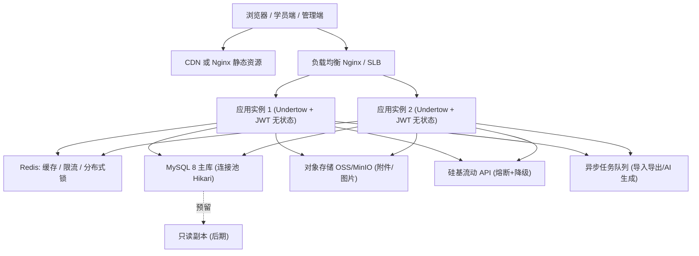

# 架构稳定性评估与改造方案（wisestar AI 自习室）

> 文档性质：**待评审的改造说明**，不是最终实施记录。评审通过后再按第 8 节的阶段推进。
> 目标场景：**同时在线 1000 ~ 5000 人**，具备容错能力，并为后续功能持续扩展保持模块化。
> 本文所有结论均基于当前仓库代码与配置（Spring Boot 2.7.7 + Undertow、MyBatis-Plus、H2/MySQL、React 19 + Vite）。

---

## 0. 先看这个：大白话版

### 0.1 一句话结论
你的情况是「阿里云服务器 + MySQL」，要的是稳，当前开发规模不复杂。那就按**「先一台服务器稳住 1000 人在线，再按人数加第二台扩到 2000~5000」**的路线走。第一批只需要做 4 件小事，不用马上买 Redis、对象存储、消息队列这些额外组件，避免过度设计。

### 0.2 名词对照表（每个词用一句大白话解释）

| 名词 | 大白话 | 现在要不要上 |
|---|---|---|
| 负载均衡（SLB / Nginx） | 餐厅门口的领位员，客人多了把人分到不同桌子（服务器） | 1000 人以内不用；上第二台服务器时再加 |
| 应用实例 | 真正干活的服务器/程序 | 先用 1 台；不够再加 |
| MySQL | 正式仓库，存所有重要数据 | 必须。阿里云 **RDS MySQL**（托管、自动备份）最省心 |
| H2 | 现在预览用的"临时小仓库"（一个文件），人一多就卡 | 生产必须换掉，换成 MySQL |
| Redis | 所有服务器共用的一块"小黑板"，谁改了大家都看得见 | 1 台服务器时不用；上到 2 台以上必须 |
| 对象存储 OSS | 存图片/附件的"网盘"，不占服务器硬盘 | 建议用，便宜省事，备份也简单 |
| 线程数 / 连接池 | 服务器同一时刻能接待多少个人 | 必须调大，默认值太小 |
| 超时 | "最多等多久"，超了就走开，别死等 | 必须设，防止一个卡死的请求占住服务员 |
| 熔断 / 降级 | 保险丝：外部服务（AI）坏了就暂时不连它，页面提示稍后再试，不影响做题 | 建议做，只针对 AI |
| 限流 | 限制每秒的请求数，防刷、防暴力试密码 | 建议做，重点在登录与写操作 |
| 幂等 | 同一个操作重复提交只算一次 | 必须做：下单、核销、发币 |
| 索引 | 数据库的目录，没有它查数据只能一页页翻 | 必须补 |
| 监控（Actuator） | 服务器的仪表盘，看现在累不累、哪里慢 | 建议做 |
| 前端打包 / 轮询 | 页面太大加载慢；定时重复问服务器"有没有新消息" | 后期优化 |

### 0.3 你这个情况怎么做（预算约 1000 元/年，目标 2000 人在线）

**核心思路：先只买一台云服务器，把主程序和 MySQL 都装在这一台上，图片放 OSS。** 先不要买负载均衡（SLB）、Redis 这些；用不到，还费钱。

**第一档：你现在要做的（一台服务器，目标 2000 人在线）**
- 买 1 台**阿里云 ECS 4 核 8G**（包年）。这台机器同时跑主程序和 MySQL。
- 图片和附件放到**对象存储 OSS**（省钱，还能省服务器带宽）。
- 需要：一个**域名**（要做 ICP 备案），一个免费的 **HTTPS 证书**。
- 要做的事：生产库从 H2 换成 MySQL；调大线程数和数据库连接数；给所有操作加超时；加健康检查和日志。

**如果想让服务器省一点钱、又想要省心：** 主程序用 2 核 4G ECS（约 199 元/年），数据库单独买**阿里云 RDS MySQL 2 核 4G**（约 228 元/年，阿里云帮你自动备份）。这套更省心，先用它撑 1000~1500 人，之后再把 ECS 升到 4 核 8G。两套加起来都在 1000 元以内。

**第二档：以后到 3000~5000 人在线**
- 再加 1 台 ECS，前面挂一台 SLB（领位员），再买一个 Redis（公共小黑板）。
- 把本地缓存、本地图片彻底改成 Redis + OSS。

> 建议：先按第一档买一台 4 核 8G 跑起来，用真实数据压测一下，看单台到底能扛多少。到了极限再加第二台，钱花在刀刃上。

### 0.4 买什么、大概多少钱（参考活动价，最终以阿里云控制台实时价格为准）

| 要买的东西 | 推荐规格 | 参考价 | 说明 |
|---|---|---|---|
| 云服务器 ECS | 4 核 8G，包年 | 约 700~955 元/年 | 主程序 + MySQL 都装它上面 |
| 云服务器 ECS（省钱款） | 2 核 4G，包年 | 约 199 元/年 | 起步够用，需压测 |
| 云数据库 RDS MySQL（可选） | 2 核 4G / 100GB | 约 228 元/年 | 托管，自动备份；买了它就不用自己维护 MySQL |
| 域名 | .com / .cn | 约 30~80 元/年 | 国内服务器需要**ICP 备案**，约 1~3 周 |
| 对象存储 OSS | 按量付费 | 几元~几十元/年 | 放图片附件，省服务器空间和带宽 |
| HTTPS 证书 | 免费证书 | 0 元 | 阿里云可申请免费证书 |
| 负载均衡 SLB | —— | 第一档**不买** | 只有一台服务器时不需要 |
| Redis | —— | 第一档**不买** | 只有一台服务器时不需要 |

**两个容易忽略但很关键的点：**
1. **带宽**：特价 ECS 通常自带 5M 左右固定带宽。2000 人同时看图片会不够，所以图片一定要放 OSS（或加 CDN），否则会卡。
2. **备案**：大陆地域的服务器 + 域名对外提供网站，必须先做 ICP 备案，大约 1~3 周。想跳过备案可以用香港地域，但速度略慢、带宽更贵。

### 0.5 关于「2000 人同时在线」的实话

2000 人在线，不代表每秒钟有 2000 个请求。大部分人是在看内容，平均每秒大概 250~500 个请求，上课前后峰值会到 800~1500。单台 4 核 8G 想要稳住这个量，**必须先做完上面那 4 件事（换 MySQL、调线程、加超时、加日志）**，再用压测验证，不能凭空保证。第一档做完后我会给你一个真实能扛多少人的结论，再决定要不要加第二台。

---

## 1. 目标、口径与待确认问题

### 1.1 目标口径
"同时在线 5000 人"在自习室场景下不等于 5000 QPS。按 K12 学员端"看内容为主、点击为次"的交互特征，给出本方案采用的容量口径：

| 指标 | 取值 | 说明 |
|---|---|---|
| 同时在线（会话） | 5000 | 已登录、页面打开 |
| 单用户平均请求间隔 | 10 ~ 20 秒 | 翻页、作答、进度上报、轮询 |
| 平均 QPS | 250 ~ 500 | 5000 / 10~20 |
| 峰值 QPS（3 倍） | 800 ~ 1500 | 上课前后、每日签到/宝箱时段集中 |
| 峰值并发阻塞请求 | 60 ~ 150 | 峰值 QPS × p95 延迟 80~100ms |
| WebSocket/SSE 长连接 | ≤ 500 | AI 流式讲解、后续实时动态 |

### 1.2 已确认输入与仍需确认的问题
**已确认（2026-09-17 用户拍板）：**
- 生产部署在**阿里云**；正式数据库使用 **MySQL**。
- 首要目标是**运行稳定**；当前开发规模不复杂，避免过度设计。
- 预算约 **1000 元/年**；目标**单台服务器稳住 2000 人同时在线**，先不引入 SLB/Redis 等额外组件。
- 开发全部在云端进行，本机无文件；用户此前未使用过 ECS / RDS。

**仍需确认：**
1. 数据库用**阿里云 RDS MySQL**（托管、自动备份，约 228 元/年），还是在 ECS 上**自建 MySQL**（免费但需自己维护/备份）？
2. 是否已有**域名**并愿意做 **ICP 备案**（约 1~3 周）；用大陆地域还是香港地域（免备案）？
3. 是否已有**阿里云账号**（新用户首购价更低）？
4. 生产上线的数据库迁移窗口（是否有夜间可重启时段）。

> 本方案默认按"**一台 ECS（4 核 8G）+ OSS + 域名**"作为落地起点；如选 RDS 则数据库独立托管。第二档（多实例 + SLB + Redis）按在线人数再加。

---

## 2. 现状评估（基线）

### 2.1 分层与模块
- Maven 多模块：`api`（启动 + Controller）→ `rdbms`（实体/Mapper/ServiceImpl）→ `shared`（常量、工具、缓存、安全、DTO、Service 接口）；另有 `ai`（AI 流式对话）与 `flow`（Flowable，当前未纳入构建）。
- **已具备的优点（先保住）**：
  - 认证为 **JWT + `SessionCreationPolicy.STATELESS`**（`WebSecurityConfig`），不依赖 HttpSession，天然利于水平扩展。
  - 统一响应 `{code,data,message}` + 统一分页 `PaginationResponse{total,list}` + 全局异常处理。
  - 权限模型清晰：`t_role.authority` 权限点 + `@PreAuthorize`，权限点集中定义在 `PermissionConsts`。
  - 业务层接口（`shared`）与实现（`rdbms`）分离，具备模块化基础。

### 2.2 并发与线程模型（关键短板）
| 项 | 现状 | 风险 |
|---|---|---|
| Web 容器 | Undertow，**未配置 io/worker 线程数** | 默认 worker ≈ CPU 核数 × 8。当前 `nproc=2` → 约 16 个 worker 线程，阻塞式接口下并发上限约 16，峰值 QPS 远低于目标 |
| 数据库连接池 | HikariCP，**未配置**，默认 `maximum-pool-size=10` | 池过小会成为吞吐瓶颈；多实例时若各自放大需核算 MySQL 总连接 |
| 异步/线程隔离 | 无专用线程池 | Excel 导入导出、AI 生成、批量组卷都在请求线程内执行，长任务会占满 worker |
| 请求超时 | `spring.mvc.async.request-timeout: -1`（不超时）；无客户端/DB 超时 | 慢请求可无限占用线程，线程池被拖垮 |
| 定时/后台任务 | 未发现 `@Scheduled`/`@Async` | 无后台批量通道 |
| 限流 | 验证码接口频率限制默认关闭，全局无限流 | 登录爆破、接口刷量无防护 |

### 2.3 存储与数据层（关键短板）
| 项 | 现状 | 风险 |
|---|---|---|
| 生产库 | preview 用 **H2 文件库**（`jdbc:h2:file:./wisestar`）；dev 用 MySQL 8 | H2 单文件写入并发能力弱，**不能承载 1000+ 并发**；生产必须切 MySQL |
| 索引 | `init-h2.sql` 中共 **16 个索引 / 59 张表** | 大量高频查询字段（`user_id`/`student_id`/`repo_id`/`template_id`/`created_at` 等）缺索引，高并发下全表扫描 |
| 大表聚合 | 错题库用窗口函数在 `t_practice_detail` 全量聚合 | 数据量上来后单次查询成本高 |
| 分页 | 未见 pageSize 上限约束 | 大 pageSize 可被用来拖垮 DB |
| 连接与事务 | 未见事务超时、慢 SQL 日志 | 长事务/慢 SQL 难定位 |

### 2.4 缓存与状态（水平扩展阻塞点）
- 缓存为 **进程内 Caffeine**（`CacheConfig`，`custom-cache.entries`，单缓存 `maximumSize=100`），用于 `userCache/deptCache/projectCache/commonCache` 等。
  → 多实例部署时各实例缓存不一致，"更新后清缓存"只在单机生效，会出现**改权限/改部门后部分实例读到旧数据**。
  → **好消息**：业务代码统一走 Spring Cache 注解（`@Cacheable` / `@CacheEvict` / `CacheManager`），切 Redis 只需替换 `CacheManager` 实现，业务代码零改动。
- AI 会话缓存在 `ConversationCacheService` 内（进程内，`ConcurrentHashMap`），是唯一必须外部化的状态。
- 文件存储 `file-storage.local.root-path: ./files`，本地磁盘。
  → 多实例 + 负载均衡后，用户在 A 实例上传、请求落到 B 实例会 404。
  → **好消息**：上传下载统一经过 `StorageService` 抽象（`shared/.../storage/`，`@ConditionalOnMissingBean` 允许替换实现），数据库只存文件 id 与相对路径，接 OSS 只需新增一个实现类 + 配置，业务代码零改动。
- 无分布式锁/分布式幂等支撑。

### 2.5 外部依赖与容错
- AI 走 SiliconFlow（`server/ai`，WebFlux 流式）；**无超时、无重试、无熔断、无降级**。外部 AI 抖动会拖住请求线程，甚至级联影响正常学习功能。
- 上传限制 `max-file-size: 2048MB`，本地落盘，既占磁盘又放大 DoS 面。

### 2.6 可观测性
- **无 `spring-boot-starter-actuator`**：没有健康检查、指标、线程池/连接池监控，无法做探针与容量观测。
- 基础配置 `logging.level.undertow: DEBUG`（`application.yml`），高并发下日志量与 I/O 开销显著。
- 无 traceId、无慢 SQL 记录。

### 2.7 前端
- Vite 构建产物单 chunk 约 **2.1MB**（构建告警），首屏加载慢；高峰时对带宽与 TTFB 不利。
- 学员动态采用 **10 秒轮询**，5000 在线会放大 QPS（5000/10 = 500 QPS 的纯轮询开销）。
- 前端静态资源未声明强缓存策略（依赖部署层）。

### 2.8 风险分级汇总
| 级别 | 问题 | 不解决的后果 |
|---|---|---|
| P0 | H2 作为生产库；worker 线程 16；Hikari 10；无超时 | 目标并发下直接不可用 |
| P0 | 本地文件存储 | 多实例上传/下载错乱 |
| P1 | 进程内缓存与 AI 会话 | 多实例数据不一致 |
| P1 | 无熔断/限流/异步隔离 | 单点外部依赖抖动导致雪崩 |
| P1 | 缺索引、无 pageSize 上限、错题全表聚合 | DB 成为瓶颈，慢查询堆积 |
| P2 | 无 actuator/指标/trace、DEBUG 日志、前端大包、轮询 | 故障不可观测、容量不可测、成本高 |

---

## 3. 目标架构

### 3.1 组件职责与关键参数（建议起点值，压测后调优）
| 组件 | 职责 | 建议 |
|---|---|---|
| Nginx/SLB | TLS 卸载、静态资源、限流、健康检查路由 | 静态资源强缓存；`limit_req` 兜底 |
| 应用实例 | 无状态业务 | 每实例：Undertow `io-threads=4`、`worker-threads=200`；Hikari `maximum-pool-size=20`、`connection-timeout=3s`；堆 `-Xmx2g` |
| MySQL 8 | 唯一可信存储 | `max_connections ≥ 实例数×20 + 余量`；关键查询补齐索引；慢查询阈值 200ms |
| Redis | 共享缓存、限流计数、分布式锁、幂等键 | 缓存 TTL 复用现有 `custom-cache.entries` 语义；本地 Caffeine 作为 L1 可选 |
| 对象存储 | 附件/图片 | 替换本地 `./files`，上传走服务端签发或直传 |
| 异步队列 | 导入导出、AI 生成、批量组卷 | 先用 DB 任务表 + 专用线程池，规模上来再引入 MQ |

---

## 4. 改造清单（按优先级）

> 每项格式：问题 → 方案 → 影响范围 → 验证方式。**本阶段只出方案，不改代码。**

### P0-1 生产库切换到 MySQL 8
- 问题：H2 文件库无法支撑并发写入，且 preview 快照机制不适合生产。
- 方案：生产固定 MySQL；补齐 `init-mysql.sql`（已知缺 `t_campus`/`t_user_campus`）；用 Flyway 或版本化 SQL 管理结构变更，替代"启动即跑种子"。
- 影响：`server/rdbms/src/main/resources/scripts/init-mysql.sql`、`config/application-pro.yml`、部署流程。
- 验证：MySQL 上跑通全部接口冒烟；`SHOW INDEX` 核对索引。

### P0-2 Web 容器与连接池参数化
- 问题：worker 16、Hikari 10、无超时。
- 方案：按 3.1 设置 Undertow/Hikari；显式设置 `server.undertow.no-request-timeout`、`spring.mvc.async.request-timeout`（如 30s）、Hikari `connection-timeout/validation-timeout`。
- 影响：`application*.yml`。
- 验证：压测下单实例 QPS、p95、连接池等待时间。

### P0-3 消除本地状态，支持多实例
- 问题：缓存、AI 会话、文件都在本机。
- 方案：① 缓存切 Redis（Spring Cache 抽象已就位，替换 `CacheManager` 即可）；② AI 会话外置；③ 文件切对象存储。
- 影响：`shared/.../config/CacheConfig.java`、`ai/.../ConversationCacheService.java`、`FileService` 实现、配置。
- 验证：双实例下"改权限/传文件"在两实例一致。

### P0-4 全链路超时与异步隔离
- 问题：无超时、长任务占用请求线程。
- 方案：定义统一超时策略；为 AI/导入导出/组卷建立**独立有界线程池**（bulkhead），请求线程只做提交与查询。
- 影响：新增线程池配置类；导入导出/组卷/AI 调用改造。
- 验证：模拟慢 AI 时，学习类接口 p95 不劣化。

### P1-1 容错：熔断 / 重试 / 降级 / 限流
- 方案：AI 调用加**超时 + 有限重试 + 熔断 + 降级**（不可用时提示"讲解暂不可用"，不影响做题）；网关/应用层对登录与写接口限流；登录失败锁定。
- 影响：`server/ai`、新增拦截器/过滤器、验证码频率配置开启。
- 验证：注入 AI 超时/故障，主流程不雪崩，恢复后自动回暖。

### P1-2 幂等与一致性
- 方案：商城下单/核销、练习交卷、签到/宝箱发放建立幂等键 + 唯一约束；核销用乐观更新（`status=0` 条件更新）。
- 影响：`MallOrderServiceImpl`、`PracticeServiceImpl`、签到/宝箱 Service、DDL 唯一索引。
- 验证：并发重复提交只成功一次。

### P1-3 数据层优化
- 方案：补齐高频查询索引；分页 `pageSize` 上限（如 200）；错题聚合改为可增量/受限时间窗；大表归档策略。
- 影响：`init-h2.sql`/`init-mysql.sql`、`PaginationQuery`、`PracticeDetailMapper`。
- 验证：`EXPLAIN` 关键查询走索引；压测慢 SQL 归零。

### P1-4 可观测性与探针
- 方案：引入 Actuator + Micrometer，暴露 `/actuator/health`、`/metrics`；接入 Prometheus/Grafana；日志降级为 INFO/WARN，输出 traceId；记录慢 SQL 与连接池指标。
- 影响：`server/api/pom.xml`、配置、日志配置。
- 验证：探针可用于滚动发布；面板能看到 QPS/线程/连接池/JVM。

### P2-1 前端性能
- 方案：路由级懒加载 + 代码分割（消除 2.1MB 单包）；静态资源内容哈希 + 强缓存；轮询改 SSE/WebSocket 或延长间隔 + 可见性暂停。
- 影响：`App.jsx`、`vite.config`、学员动态页面。
- 验证：Lighthouse / 首屏体积、轮询 QPS 下降。

### P2-2 安全与配置
- 方案：密钥/令牌走环境变量（不用 yml 明文）；上传大小与类型白名单；关闭 DEBUG 日志；启用 CSRF 策略评估（STATELESS + Cookie 需评估 SameSite）。
- 影响：配置文件、`FileApi`、日志配置。
- 验证：安全基线检查。

---

## 5. 容错机制设计要点

1. **超时**：外部调用（AI、对象存储）必须显式超时；DB 语句/事务超时；异步请求超时。
2. **隔离（Bulkhead）**：按能力分池，避免 AI/导入拖垮学习主链路。
3. **熔断与重试**：仅对**幂等**读操作重试；写操作不自动重试，用幂等键去重。
4. **降级**：AI 讲解、统计报表可降级；核心学习（看题、作答、交卷）不可降级。
5. **限流**：按 IP + 用户双维度；写接口与登录更严。
6. **幂等**：客户端请求号 + 服务端唯一约束；核销/发币用条件更新。
7. **优雅发布**：应用支持 graceful shutdown；LB 摘除后再停，避免发布丢请求。
8. **数据兜底**：MySQL 定时备份 + binlog；对象存储跨可用区；H2 快照仅限预览。

---

## 6. 模块化与扩展性设计

### 6.1 保持并强化的边界
- 依赖方向固定：`api → rdbms/shared/ai`，`rdbms → shared`，`ai → shared`；**shared 不反向依赖 rdbms**。
- 每个业务域使用独立包：`domain/dto/<domain>`、`mapper/<Domain>Mapper`、`impl/<Domain>ServiceImpl`、`api/<Domain>Api`。
- 权限点继续集中 `PermissionConsts`，新增功能只需"加常量 + 加注解"。

### 6.2 建议抽象的可替换点（SPI）
| 能力 | 现状 | 目标接口 | 可替换实现 | 是否已具备抽象 |
|---|---|---|---|---|
| 缓存 | Caffeine 本地 | Spring `CacheManager` | 本地 / Redis | 已具备（Spring Cache 注解） |
| 文件存储 | 本地 `./files` | `StorageService`（`shared/.../storage/`） | 本地 / OSS / MinIO | 已具备（`StorageAutoConfiguration`） |
| AI 提供方 | SiliconFlow | `AiChatService`（已有接口） | SiliconFlow / 其它 | 已具备 |
| 异步任务 | `AppConfig` 全局线程池（无界队列） | `AsyncTaskService` | 线程池 / MQ | 部分具备（需改有界） |

### 6.3 新功能接入约定（减少后期改动成本）
1. 新表同时改 `init-h2.sql` + `init-mysql.sql`（或迁移脚本）。
2. 新权限点同时改 `PermissionConsts` 并挂到内置角色。
3. 前端 `api/<domain>.js` + `pages/<domain>/`，菜单项声明 `required`。
4. 学员端数据接口统一按订单权限（`t_student_permission`）与校区范围（`CampusScopeService`）过滤。

### 6.4 现有代码已具备的可迁移基础（重要结论）
这份代码在改造前已经具备多处关键抽象，**生产化改造大部分是"换实现/换配置"，而不是重写**：

| 能力 | 现有抽象 | 生产切换方式 | 业务代码改动 |
|---|---|---|---|
| 文件存储 | `StorageService` / `LocalStorageService` / `StorageAutoConfiguration` | 新增 `OssStorageService implements StorageService` + 配置；DB 只存文件 id 与相对路径 | 无 |
| 缓存 | Spring Cache 注解 + 自定义 `CacheManager`（`CacheConfig`） | 引入 `spring-boot-starter-data-redis`，把 `CacheManager` 换成 `RedisCacheManager` | 无 |
| 认证 | JWT + `SessionCreationPolicy.STATELESS` | 多实例直接共享 | 无 |
| 异步 | `@EnableAsync` + 全局线程池（`AppConfig`） | 调参并把无界队列改为有界 | 无 |
| SQL | MyBatis-Plus + 注解 SQL；仅 `PracticeDetailMapper` 用窗口函数 `ROW_NUMBER() OVER`；36 处 `.last("limit n")` | MySQL 8 与 H2 2.x 均支持上述语法，迁移风险低 | 无 |

> 结论：需要真正"外置"的只有 **AI 会话**（`ConversationCacheService` 的进程内 `ConcurrentHashMap`），其余都有现成抽象。这也是本方案主张"先把第一档做扎实、不提前上组件"的底气。

### 6.5 开发期必须遵守的约定（防止后期返工）
1. **文件一律走 `StorageService`**，业务代码禁止 `new File(...)` / `Files.write(...)` / `transferTo(...)` 直接落盘（现有 `FileServiceImpl` 已符合）。
2. **共享状态一律用 Spring Cache 注解**，禁止用 `static` / `ConcurrentHashMap` 存会话级或跨节点数据（纯静态常量映射除外）。
3. **每个 DDL 变更同时更新 `init-h2.sql` 与 `init-mysql.sql`**；现状 `init-mysql.sql` 尚缺 `t_campus` / `t_user_campus`，切 MySQL 前必须补齐（已于 2026-09-17 补齐）。
4. **只用两库都支持的 SQL**：`LIMIT`、`IFNULL`、`NOW()`、窗口函数可用；避免 `DATE_FORMAT` / `ON DUPLICATE KEY UPDATE` / `GROUP_CONCAT` 等单库方言，确需时在 Java 侧处理。
5. **保持无状态**：不引入 HttpSession，不把业务数据缓存到本机磁盘，不写本地定时任务（多实例会重复执行）。
6. **配置外置**：数据库、缓存、存储、AI 全部通过 yml / 环境变量；禁止硬编码路径与密钥。
7. **异步队列必须有界**：现线程池队列无界（`AppConfig`），生产前改为有界 + 明确的拒绝策略（已于 2026-09-17 落地：队列 200 + `CallerRunsPolicy` + 优雅停机）。
8. **新增列表接口必须分页并设 pageSize 上限**；新增高频查询同时补索引 DDL（已于 2026-09-17 落地：`PageQuery` 正数 `pageSize` 上限 1000，`-1` 仍表示全量）。
9. **提前引入 Actuator**，让生产部署时健康检查与监控开箱可用（已于 2026-09-17 落地：暴露 `health` / `info`）。
10. **新功能按域分包**（`dto/<domain>`、`mapper/<Domain>Mapper`、`impl/<Domain>ServiceImpl`、`api/<Domain>Api`），权限点集中 `PermissionConsts`。

### 6.6 本轮已落地的低风险预埋（2026-09-17）
以下 4 项属于"只加不删、可回滚"的轻量预埋，已编码并通过构建与冒烟验证，为后续阶段 0/1 省掉返工：

| 项 | 改动位置 | 行为 | 验证 |
|---|---|---|---|
| 健康检查 | `api/pom.xml` 加 `spring-boot-starter-actuator`；`application.yml` 暴露 `health,info`（`show-details: never`）；`WebSecurityConfig` 放行 `/actuator/health`、`/actuator/info` | `GET /actuator/health` 免登录返回 200 | 冒烟通过 |
| 有界异步池 | `AppConfig#getAsyncExecutor` 加 `setQueueCapacity(200)` + `CallerRunsPolicy` + 优雅停机（`waitForTasksToCompleteOnShutdown` / `awaitTerminationSeconds=30`） | 队列打满时由提交线程执行，避免无界堆积 | 应用正常启动 |
| 校区表补齐 | `init-mysql.sql` 补 `t_campus` / `t_user_campus` 建表（对齐 `init-h2.sql`） | MySQL 初始化脚本与 H2 结构一致 | 构建通过 |
| 分页上限 | `PageQuery#getPageSize`：正数 `min(pageSize, 1000)`；`<1` 归一为默认 20；`-1` 表示全量 | `pageSize=1000000` 实测只返回 1000 行；`-1` 仍返回全量 1176 行 | 实测通过 |

> 说明：Actuator 响应会被全局统一响应体包装为 `{code,data,message}`，其中 `data.status` 为健康状态；以 HTTP 200 作为存活判断即可。前端仅 `SelectTemplateModal` 原用 `pageSize: 10000` 拉知识点，已改为 `-1`（全量契约），其余调用点最大 1000，无需改动。

---

## 7. 成本与代价
- 引入 Redis / 对象存储 / MySQL 运维：组件增加，部署复杂度上升，但这是 1000+ 并发的必要投入。
- 无状态化改造涉及缓存与文件两处关键路径，需回归权限、附件、AI 三块功能。
- 前端改造与异步化属于体验/韧性提升，可与主改造并行。

---

## 8. 实施阶段建议（评审通过后执行）

| 阶段 | 内容 | 产出/验收 |
|---|---|---|
| 阶段 0 | 建立基线：Actuator（已落地）+ 压测脚本（登录/看题/交卷/错题） | 拿到当前单实例 QPS/p95/瓶颈点 |
| 阶段 1（P0） | MySQL 切换 + 连接池/线程参数 + 超时 | 单实例稳定支撑 1000 在线 |
| 阶段 2（P0/P1） | 缓存/文件/AI 会话外置 → 双实例；熔断限流幂等 | 双实例 2000~3000 在线，故障不雪崩 |
| 阶段 3（P1/P2） | 数据层优化 + 可观测 + 前端优化 + 异步任务 | 4000~5000 在线，具备监控与容量结论 |

> 每阶段独立可回滚；阶段 1 完成即可上线生产（1000 并发档位）。

---

## 9. 决策记录与待确认问题

**已拍板（2026-09-17）：**
1. 生产运行在**阿里云**，数据库使用 **MySQL**。
2. 以**运行稳定**为第一目标，当前规模不复杂，采用 §0.3 的"先一台服务器、按需再加"策略。
3. 预算约 **1000 元/年**，目标是**单台服务器稳住 2000 人同时在线**。
4. 开发全部在云端进行；用户此前未接触过 ECS / RDS，方案会给出具体的购买与部署步骤。

**还需你确认：**
1. 数据库用**阿里云 RDS MySQL**（约 228 元/年，托管、自动备份），还是在 ECS 上自建 MySQL？
2. 是否已有**域名**、能否做 **ICP 备案**（大陆地域必须，约 1~3 周）？
3. 是否已有阿里云账号（新用户首购更便宜）？
4. 上线（H2 → MySQL）能否安排一个夜间可重启的时间窗口？

确认后我按 §0.3 第一档落地：出一份**从零到上线的部署手册**（买机器 → 装环境 → 建 MySQL → 传 jar → 起服务 → 配域名/HTTPS → 备份），并在每一步给出可验证的结果。
