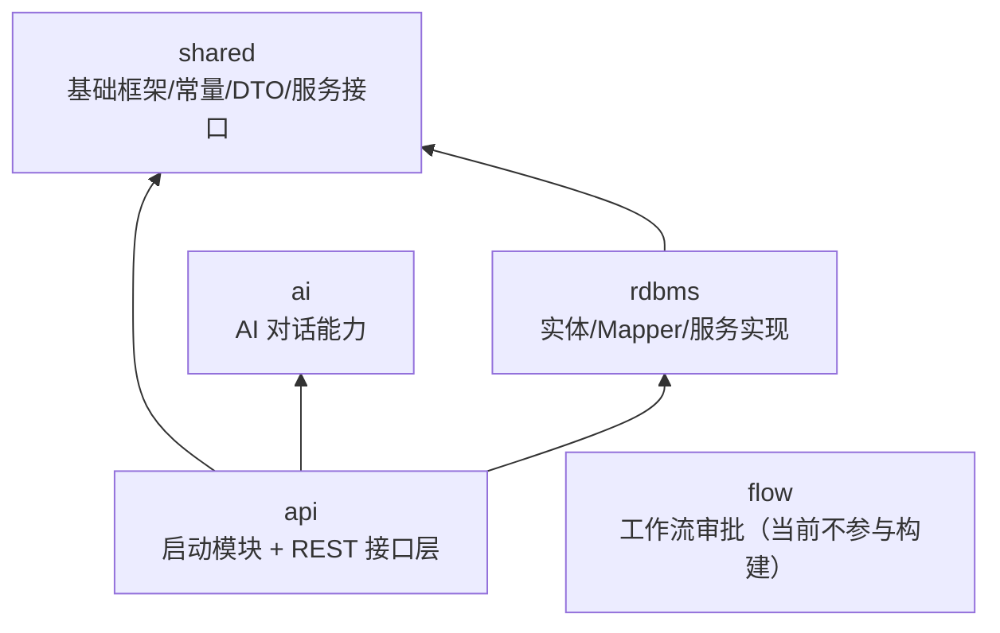
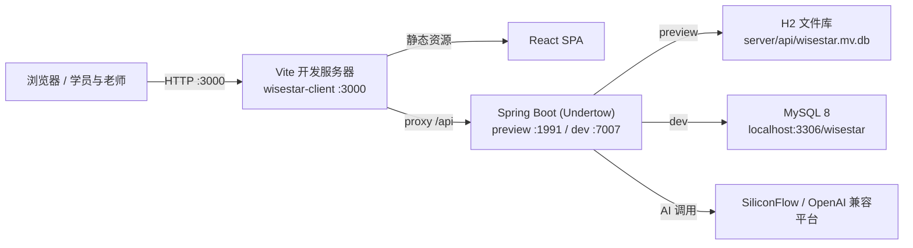
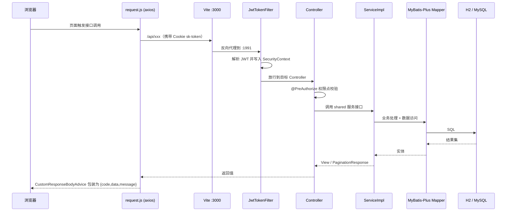

# 项目结构梳理（wisestar AI 自习室）

> 本文基于当前仓库源码实测整理，用于说明系统的定位、代码拓扑、运行时拓扑、业务主线、请求生命周期、数据主线、演进时间线与扩展点。
> 所有结论均可在仓库中找到对应文件；凡未能确认的内容已显式标注「未确认」。

## 一、系统定位

wisestar（智慧星 AI 自习室）是面向线下门店 K12 场景的自习室教学与管理系统，由开源项目「卷王 SurveyKing」改造而来（版本号 `v1.9.0` / 上游 v1.10.0）。系统同时覆盖两条使用面：

- 教学管理后台：管理员、校长、教师、学管师、教务等角色使用，负责题库与知识体系维护、练习与作业布置、学员与订单管理、督学监控、校区与权限管理、数据统计。
- 学生自主学习端：学员使用，提供研习（章节/小节/知识点）、试炼与专项练习、错题本、今日任务、学习币与积分成长激励、英语学习中心等。

从技术定位看，它是单体多模块的 Spring Boot 应用加一个前后端分离的 React 单页应用：后端唯一可运行入口是 `api` 模块的 `SurveyServerApplication`，前端由 Vite 开发服务器承载并通过 `/api` 反向代理访问后端。数据库在本地开发用 MySQL 8，云端预览用 H2 文件库，两套种子脚本保证结构一致。

从历史定位看，它由通用问卷/考试系统演化而来，因此代码中仍保留大量问卷时代的命名与能力（`t_project`、`t_answer`、`t_template`、`t_repo`、`flow` 工作流模块等）；当前业务已在其上叠加了「AI 自习室」的学生端与教学运营能力。问卷/答案相关的前端页面已移除，但后端接口与权限点保留（见 `.monkeycode/SESSION_CONTEXT.md` 第 6 节）。

## 二、代码拓扑

### 2.1 后端 Maven 模块与依赖方向

后端位于 `server/`，根 `pom.xml` 的 `groupId` 为 `cn.wisestar`、`artifactId` 为 `survey-server`、`revision` 为 `v1.9.0`，父工程为 `spring-boot-starter-parent 2.7.7`，Java 版本 17。根 POM 的 `<modules>` 声明为：

- `api`
- `shared`
- `rdbms`
- `ai`
- `flow`（被注释掉，`<!-- <module>flow</module> -->`，因此 **flow 模块不参与默认构建**，但其源码仍保留在仓库中）

依赖方向（依据各模块 `pom.xml` 实测）：`api` 依赖 `shared`、`rdbms`、`ai`；`rdbms` 依赖 `shared`；`shared` 为底层基础模块，被其它模块依赖。



各模块职责：

| 模块 | 职责 | 关键产物 |
|---|---|---|
| `shared` | 基础框架与公共契约：统一响应、分页、异常、鉴权、缓存、常量、DTO、服务接口 | `ApiResponse`、`PaginationResponse`、`WebSecurityConfig`、`GlobalExceptionHandler`、`PermissionConsts`、`domain/dto`、`service` 接口 |
| `rdbms` | 数据访问与业务实现：实体、MyBatis-Plus Mapper、服务实现、种子脚本 | `domain.model`、`mapper`、`impl`、`BaseModel`、`init-h2.sql` / `init-mysql.sql` |
| `api` | Web 层与唯一启动入口：36 个 Controller + `SurveyServerApplication` | `target/wisestar-v1.9.0.jar` |
| `ai` | AI 对话能力：通义/SiliconFlow 流式对话、会话缓存 | `ChatController`、`SiliconflowChatServiceImpl` |
| `flow` | 问卷审批工作流（Flowable）；源码保留但未纳入构建，也未接入当前自习室业务 | `FlowApi`、监听器、TaskHandler |

> 说明：`flow` 模块的 POM 与源码完整存在，但根 POM 中该模块被注释。本文将其归入「保留的问卷时代能力」，其是否重新启用未确认。

### 2.2 后端包结构

后端统一包根为 `cn.wisestar.server`。

`shared`（`shared/src/main/java/cn/wisestar/server/`，312 个 Java 文件）：

```text
core/
  annotation/      自定义注解（如 @EnableDataPerm）
  aop/             数据权限切面 DataPermAspect
  base/            基础转换器（converter）与 BaseModelMapper（mapper）
  cache/           缓存 Key 生成器（DeptKeyGenerator）
  common/          ApiResponse、PaginationResponse、Tuple2
  config/          AppConfig、CacheConfig、WebConfig、WebSecurityConfig
  constant/        PermissionConsts（权限点/内置角色）等常量
  exception/       业务异常
  mvc/advice/      CustomResponseBodyAdvice、GlobalExceptionHandler
  security/        JWT 过滤器、认证入口等
  uitls/           通用工具（25 个）
domain/dto/        117 个 DTO，含 english/knowledge/mall/student/task 子包
service/           48 个服务接口（供 rdbms 实现）
storage/           存储相关
```

`rdbms`（`rdbms/src/main/java/cn/wisestar/server/`，205 个 Java 文件）：

```text
core/model/        BaseModel（实体公共父类）
core/mybatis/      MybatisPlugConfig、MyMetaObjectHandler、ListTypeHandler
domain/model/      61 个实体（@TableName，绝大部分继承 BaseModel）
domain/mapper/     25 个 MapStruct 转换器（Request/Model/View 互转）
domain/dto/        rdbms 侧少量 DTO
mapper/            59 个 MyBatis-Plus Mapper（继承 BaseMapper）
impl/              54 个服务实现
service/           rdbms 侧服务（少量）
```

`api`（`api/src/main/java/cn/wisestar/server/`）：

```text
SurveyServerApplication.java   唯一启动类（@SpringBootApplication + @EnableConfigurationProperties）
api/                           36 个 Controller
```

`ai`（`ai/src/main/java/cn/wisestar/server/ai/`，14 个 Java 文件）：

```text
config/            AiConfiguration（WebClient，16MB 缓冲）
controller/        ChatController
domain/            ChatRequest、ConversationRequest/Response、ModelType、StreamResponseEvent 等
service/           ChatService、AiChatService、ConversationCacheService
service/impl/      ChatServiceImpl、SiliconflowChatServiceImpl
```

`flow`（`flow/src/main/java/cn/wisestar/server/flow/`，66 个 Java 文件，未参与构建）：

```text
api/               FlowApi
config/            WorkflowConfig（Flowable 引擎 + 监听器注册）
constant/          审批类型/任务类型/实例状态等常量
domain/dto|model|handler|mapper/  流程 DTO、实体、JSON TypeHandler、MapStruct
exception/         FlowableRuntimeException
helper/            TaskHelper（BPMN 审批人表达式）
listener/          ProcessStarted/Completed/Cancelled/Suspended、ActivityStarted 监听器
mapper/            Flowable 相关 Mapper
service/impl/taskHandler/  各审批动作处理器（同意/拒绝/驳回/撤回等）
```

`api` 模块 36 个 Controller 清单：`AnalysisApi`、`AnswerApi`、`CampusApi`、`ChapterApi`、`DashboardApi`、`EnglishAiPackApi`、`EnglishSentenceApi`、`EnglishStudentApi`、`EnglishUnitApi`、`EnglishWordAiApi`、`EnglishWordApi`、`EnglishWordManagerApi`、`EnglishWordStudentApi`、`ExerciseApi`、`FileApi`、`KnowledgePointApi`、`MallGoodsApi`、`MallOrderApi`、`OrderApi`、`PracticeApi`、`ProjectApi`、`RepoApi`、`ReportApi`、`SectionApi`、`StudentApi`、`StudentCheckinApi`、`StudentOnlineChestApi`、`StudentStudyApi`、`StudentSupervisionApi`、`StudentTaskApi`、`SubjectApi`、`SurveyApi`、`SystemApi`、`TaskApi`、`TemplateApi`、`UserApi`。

### 2.3 前端目录结构

前端位于 `wisestar-client/`，技术栈 React 19 + antd 6 + zustand + Vite，共 95 个源文件（含 `.jsx`/`.js`）。源码根为 `src/`：

```text
src/
  App.jsx            路由总表（426 行，集中注册管理端与学员端所有路由）
  main.jsx           入口
  api/               16 个接口封装模块，统一经 request.js（axios 封装）
  components/
    common/          AuthGuard、IconTile、RichContent、StarRating
    layout/          MainLayout（管理端菜单与权限过滤）
    practice/        AnswerSheet、ExamIntro、QuestionCard
    question/        ImportModal、QuestionEditModal、TemplatePickerModal
    repo/            SelectTemplateModal、RepoEditorWizard
    research/        AddQuestionModal、NodeEditModal（教研平台）
    student/         WrongBookPanel
  pages/
    admin/           CampusManagePage（校区管理）
    dashboard/       DashboardPage
    english/         WordStudy/WordManage/WordBook/WordAi/SentenceManage/UnitManage
    exercise/        ExerciseListPage、TeachingResearchPlatformPage（教研平台）
    hr/              RoleManagePage
    knowledge/       ChapterManagePage、SectionManagePage、KnowledgePointManagePage
    login/           LoginPage、RegisterPage
    mall/            VerifyPage（商品核销）
    practice/        PracticeHome/PracticeSession/WrongQuestion
    question/        QuestionListPage
    repo/            RepoListPage、RepoDetailPage、RepoAssignPage
    student/         学员端页面（见下）
    system/          User/Dept/Position/Dict/DictItem/MallGoods/AiSetting/Task 管理页
  stores/            useUserStore、useStudentStore、useKnowledgeStore（zustand）
  utils/             practiceHelpers、surveyHelpers、questionTypes、english、importance、usePermission
  pages/student/student.css   学员端海洋童趣风格公共样式
```

学员端页面（`src/pages/student/`）：`StudentLayout`（底部导航与统一心跳挂载）、`StudentLoginPage`、`StudentHomePage`（首页/今日任务/在线宝箱）、`StudyPage`（研习：章节-小节-知识点）、`KnowledgePage`（试炼/专项练习/错题本，1098 行，为学员端最大页面）、`ProfilePage`（档案与积分）、`MallPage`（商城兑换）、`WrongBookPage`、`OrderManagePage`、`StudentManagePage`、`StudentSupervisionPage`（督学）、`StudentActivityPage`（实时动态）、`TaskAssignmentPage`（任务发布）、`OnlineChestFloat`（在线时长宝箱悬浮窗），以及英语学习四页 `EnglishCenterPage`、`EnglishWordLearnPage`、`EnglishSentenceLearnPage`、`EnglishReviewPage`。

管理端菜单由 `components/layout/MainLayout.jsx` 定义，按业务分组：仪表盘 / 学生端主页 / 教研平台 / 学员管理（学员列表、订单管理、学员督学、任务发布）/ 习题管理（题目、练习列表、在线练习、错题管理）/ 知识管理（章节、小节、知识点）/ 英语板块（单元、单词、句库、单词学习、单词本、AI 内容生成）/ 积分管理（商品管理、商品核销）/ 行政管理（角色权限、校区管理）/ 系统管理（用户、部门、岗位、字典、字典条目、AI 服务设置）。菜单项通过 `required` 权限点数组做前端过滤，路由侧由 `AuthGuard` 校验，按钮级由 `usePermission` 控制。

## 三、运行时拓扑

运行时由前端 Vite 开发服务器与后端 Spring Boot 进程组成，只有一个对外暴露端口（前端 3000），后端只在本机被代理访问。



前端运行时配置（`wisestar-client/vite.config.js`）：

- 开发服务器端口固定为 3000，`strictPort: true`，`host: 0.0.0.0`。
- 代理规则：`/api` 转发到 `env.API_TARGET || http://localhost:1991`，不做路径重写，因此后端收到的仍是带 `/api` 前缀的路径。
- 需要在 `wisestar-client/.env.local` 中写 `API_TARGET=http://localhost:1991`（该文件被 gitignore）。

后端运行时配置（`server/api/src/main/resources/application.yml` 等）：

- 版本号 `1.10.0`（`application.yml`），端口默认 1991；`preview` profile 与 `dev` profile 端口分别为 1991 与 7007。
- `preview`：H2 文件库 `jdbc:h2:file:./wisestar;DB_CLOSE_DELAY=-1;MODE=MySQL;DATABASE_TO_LOWER=TRUE`，`spring.sql.init.mode=always` 并执行 `scripts/init-h2.sql` + `scripts/data-h2.sql`。
- `dev`：MySQL `jdbc:mysql://localhost:3306/wisestar`（root/root），`spring.sql.init.mode=never`。

数据库持久化（云端预览无持久化卷）：

- `server/db-export.sh`：在后端停止时把 H2 全量（DDL+DML）导出到 `server/db-snapshot/wisestar.sql`（需提交 Git）。
- `server/start-preview.sh`：库文件缺失且快照存在时，用 `org.h2.tools.RunScript` 导入快照，再以 `--spring.sql.init.mode=never` 启动。
- 约束：导出前必须停后端（H2 单进程）；不要启用 H2 `AUTO_SERVER`（容器主机名为 UUID，`InetAddress.getLocalHost()` 解析失败会导致启动报错）。
- 版本口径：构建产物的版本来自根 POM `<revision>v1.9.0</revision>`（`api` 模块 `finalName=wisestar-${revision}`），故 jar 名为 `wisestar-v1.9.0.jar`；`application.yml` 的 `version: 1.10.0` 是沿用上游 SurveyKing 的应用展示版本号，与产物版本无关。`start-preview.sh` 引用的 jar 名与构建产物一致。

其它运行时要点：

- 应用端口为内嵌 Undertow；`WebConfig` 把静态资源映射到 classpath `/static/` 并让根路径兜底返回 SPA `index.html`，`NoHandlerFoundException` 也返回 404 + `index.html`。
- 认证为无状态 JWT：登录后写入 Cookie `sk-token`（有效期 7 天），`JwtTokenFilter` 在 `UsernamePasswordAuthenticationFilter` 之前解析。
- AI 能力通过 `ai` 模块的 `WebClient` 调用 SiliconFlow 平台（OpenAI 兼容 `/v1/chat/completions`），配置来自系统设置而非配置文件。

## 四、业务主线

系统可归为以下若干条业务主线，均可在代码中找到对应入口。

1. 登录与权限：后台账号与学生账号登录（RSA 加密 + JWT Cookie），基于角色-权限点做功能级鉴权（`@PreAuthorize`），基于校区做数据级鉴权（`CampusScopeService` 的 `ALL/CAMPUS` 范围）。
2. 知识体系管理（管理端）：学科 → 章节 → 小节 → 知识点四级结构（`t_subject` / `t_chapter` / `t_section` / `t_knowledge_point`），支持批量导入、练习题绑定（练习仅可绑定到小节）、知识点与题目多对多绑定。
3. 题库与练习：题目（`t_template`）归属题库（`t_repo`），支持四维标签筛选与组卷；学员端在线练习交卷后写 `t_practice_record` / `t_practice_detail`，错题进入错题本。
4. 学员端研习与激励：学员端「研习」按订单权限展示可学内容，做题落库并结算学习币与积分；包含每日签到、每日任务、在线时长宝箱、章节/小节通关与星级、薄弱点攻克等激励闭环。
5. 学习评价与薄弱点：基于练习与答题明细按知识点聚合正确率，写入知识点掌握度（`t_user_knowledge_progress`）与薄弱知识点（`t_user_weak_knowledge`），支撑个性化推荐与学习总结。
6. 学习会话与总结：学员端心跳（`t_study_session`）累计在线时长，会话累计满 60 分钟触发当日学习总结（`t_study_summary`，可用 AI 或规则模板生成）。
7. 积分与学币：统一奖励结算（`RewardService`）维护学习币（分学科、单学期上限）与学海积分（终身、全学科）两套账本，行为经 `t_user_learning_record` 幂等发放。
8. 积分商城：老师维护商品，学员用学币兑换生成订单与核销码（`t_mall_order`），老师凭核销码核销。
9. 学员管理与订单：新增学员同事务创建学员与账号，订单按学科×年级展开权限（`t_student_order` + `t_student_permission`），学员端按有效权限鉴权。
10. 督学与动态：老师查看学员学习总结、实时位置与习题答案（`t_student_activity`），并发布学员任务（`t_student_task`，每人每日上限 3 条）。
11. 英语学习（独立内容域）：单词、语法、单元、句库自成体系（`t_english_*`），含 AI 单元内容生成与学员端单词/句子/智能复习。
12. 校区管理：校区档案（`t_campus`）与员工绑定（`t_user_campus`），构成校长/教务/学管师的数据可见范围。
13. 系统管理：用户、部门、岗位、字典、AI 服务设置等后台配置。

其中 2~11 为当前自习室核心主线；1、12、13 为支撑主线；问卷/审批（`t_project`/`t_answer`/`flow`）为保留的历史主线，已不在前端主导航展开。

## 五、请求生命周期

以一次典型的学员端接口请求为例，说明从前端到数据库的完整链路：



关键约定（均可在代码中确认）：

- 统一响应体：所有接口返回 `{code, data, message}`。成功响应由 `CustomResponseBodyAdvice` 自动包装；失败由 `GlobalExceptionHandler` 与 `RestAuthenticationEntryPoint` 构造。
- 异常与 HTTP 状态：`GlobalExceptionHandler` 对未登录/越权等业务异常始终返回 HTTP 200，通过响应体 `code` 表达业务结果；`NoHandlerFoundException` 返回 404 + SPA `index.html`。
- 鉴权两层：功能级由 `@PreAuthorize("hasAuthority('module:action')")` 校验权限点；数据级由 `@EnableDataPerm` + `DataPermAspect`（项目/问卷维度）与 `CampusScopeService`（校区维度）在服务层强制过滤。
- 参数与视图转换：请求 DTO → 实体 → 视图 DTO 三层转换由 MapStruct 生成的 `*ViewMapper` / `*DtoMapper` 完成；分页统一返回 `PaginationResponse{total, list, current, pageSize}`（前端取 `res.data.list`）。
- 静态资源与 SPA 兜底：`WebConfig` 将静态资源优先级设为高于根路径映射，根路径与未匹配的 404 均返回 `index.html`，实现前后端一体化部署。
- 文件与导出：文件上传下载经 `FileApi` + `FileService`；Excel 导入导出使用 fastexcel / poi-ooxml，模板文件放在 classpath 下由 `downloadTemplate` 下发。

## 六、数据主线

数据模型集中于 `rdbms` 模块的 `domain/model`（61 个实体，多数继承 `BaseModel`）。`server/rdbms/src/main/resources/scripts/init-h2.sql` 是权威表清单，共 59 张表。

BaseModel 约定：所有业务表统一含 `id`（`ASSIGN_ID` 雪花 ID）、`create_at`、`create_by`、`update_at`、`update_by`、`is_deleted`（逻辑删除），由 `MyMetaObjectHandler` 自动填充；少数早期表（如 `t_english_learning_log`）沿用旧命名且不继承 BaseModel。

59 张表按领域归类：

| 领域 | 表 |
|---|---|
| 账号与权限 | `t_account`、`t_user`、`t_user_role`、`t_role`、`t_user_position`、`t_position`、`t_dept`、`t_user_campus`、`t_campus` |
| 问卷/答卷（历史能力） | `t_project`、`t_project_partner`、`t_answer`、`t_answer_detail`、`t_repo`、`t_repo_template`、`t_template`、`t_tag`、`t_user_repo`、`t_user_book` |
| 知识体系 | `t_subject`、`t_chapter`、`t_chapter_repo`、`t_section`、`t_section_repo`、`t_knowledge_point`、`t_knowledge_point_question` |
| 练习与评价 | `t_practice_record`、`t_practice_detail`、`t_section_pass`、`t_user_knowledge_progress`、`t_user_weak_knowledge`、`t_student_record` |
| 学员与订单 | `t_student`、`t_student_order`、`t_student_permission`、`t_student_activity`、`t_student_task`、`t_task` |
| 学习会话/奖励 | `t_study_session`、`t_study_summary`、`t_student_coin`、`t_user_points`、`t_user_learning_record`、`t_subject_semester` |
| 商城 | `t_mall_goods`、`t_mall_order` |
| 英语内容域 | `t_english_word`、`t_english_word_book`、`t_english_grammar`、`t_english_learning_log`、`t_english_ai_pack`、`t_english_unit`、`t_english_sentence`、`t_english_sentence_book` |
| 系统/通用 | `t_sys_info`、`t_comm_dict`、`t_comm_dict_item`、`t_file`、`t_dashboard` |

> 说明：上表按领域归纳，个别表可能跨域；表名以 `init-h2.sql` 为准。实体包中的 `Permission.java`（`@TableName("t_permission")`）为孤儿实体：`init-h2.sql` / `init-mysql.sql` 均无 `t_permission` 建表语句，仓库内也没有 `PermissionMapper`、没有任何类 import 该实体，可安全判定为已废弃（角色权限实际使用 `t_role_permission`）。

数据主线的几个关键链路：

- 学员做题：`t_practice_record`（会话汇总）+ `t_practice_detail`（逐题明细，`is_correct=0` 即错题）→ 错题本、学习评价、知识点掌握度。
- 奖励结算：`RewardService` 以 `t_user_learning_record`（行为 + `ref_id` 幂等）为防重与发放依据，同时写学习币（`t_subject_semester`）与积分（`t_user_points`）。
- 在线时长：`t_study_session` 是唯一事实源，心跳续会话累计 `duration_ms`；宝箱与学习总结均由其推导。
- 权限可见性：`t_student_permission`（按 `student_id + subject_id + grade` 且 `expire_at > NOW()`）决定学员端可学内容；`t_user_campus` 决定员工端可见学员范围。

H2 与 MySQL 双脚本：`init-h2.sql` 与 `init-mysql.sql` 为两套种子脚本，新增表或权限点必须同时修改（`CREATE TABLE IF NOT EXISTS` + `ALTER ... ADD COLUMN IF NOT EXISTS` + `INSERT ... WHERE NOT EXISTS` + 内置角色 `UPDATE` 收敛）。已知差异：MySQL 脚本当前缺 `t_campus` / `t_user_campus`（仅 H2 有），切 MySQL 前必须补（见 `.monkeycode/SESSION_CONTEXT.md` 第 6 节）。

## 七、演进时间线

依据 `docs/开发维护日志.md` 的章节结构（共 44 节）与 `.monkeycode/specs/` 目录归纳，系统演进大致分为四个阶段。

### 阶段一：仓库初始化与本地环境（第 1~4 节）

Git 身份与推送绕墙、npm 源、Vite 版本冲突、JDK 17、后端端口显式配置、本地开发三件套。对应「阶段一：仓库初始化与本地环境」。

### 阶段二：问卷编辑与导出修复、题目分析（第 4 节阶段二/三）

问卷编辑与导出修复、题目分析数据基础（`t_answer_detail` 知识点聚合）、云端联调与验收。

### 阶段三：AI 自习室主体功能建设（第 7~44 节）

按日志章节顺序（括号内为日期）：

- 第 7 节 全量代码注释（2026-08-04）
- 第 8 节 题目来源收口与题库组题（2026-08-07）
- 第 9 节 交卷后错题落库（2026-08-07）
- 第 10 节 学生端主界面原型（2026-08-08）
- 第 11 节 学生端各页面全量开发（2026-08-08）
- 第 12~17 节 知识管理板块（学科/章节/小节/知识点）与练习绑定（2026-08-08 ~ 2026-08-11）
- 第 18 节 学员管理（注册 + 订单）（2026-08-12）
- 第 19 节 角色权限管理（2026-08-13）
- 第 20~22 节 系统管理前端、权限收尾、知识批量导入（2026-08-15 ~ 2026-08-19）
- 第 23~27 节 学员端鉴权、登录页、内容对接、底部导航、JWT 持久化（2026-08-19 ~ 2026-08-21）
- 第 28~29 节 练习管理完善、问卷/答案管理下线（2026-08-21）
- 第 30~33 节 学员动态监控、首页统计真实化、积分商城、今日任务（2026-08-22 ~ 2026-08-23）
- 第 34~37 节 学习完成度/星星、知识点做题交互、逐题模式、判分一致与错题归因（2026-08-24 ~ 2026-08-26）
- 第 38~42 节 多项填空判分、教研平台、英语 AI 单元生成、任务发布（2026-09-08 ~ 2026-09-10）
- 第 43 节 2026-09-10 ~ 2026-09-13 迭代批次（积分学币体系、学员学习增强、专项与通关、学币重构与在线宝箱、预览库持久化）
- 第 44 节 学币商城兑换与核销（2026-09-14）

### 阶段四：规格化功能迭代（`.monkeycode/specs/`）

按目录日期与功能：

- `2026-09-07-exercise-list-knowledge-tree`、`2026-09-08-teaching-research-platform`（教研平台）
- `2026-09-08-campus-management`（校区管理，`t_campus` + `t_user_campus`）
- `2026-09-10-student-points-coin-ledger`、`2026-09-10-student-weakness-evaluation`
- `2026-09-11-practice-drill-clear`、`2026-09-11-preview-example-config`、`2026-09-11-student-learning-enhancements`
- `2026-09-12-coin-system-revamp`、`2026-09-12-online-duration-chest`
- 早期/专题：`english-learning`、`student-english-hub`、`student-management`、`hr-role-permission`、`question-analysis-data-foundation`、`student-content-bridge`、`frontend-rebuild`（仅 `architecture-validation.md`）

近期（2026-09-13 之后）在 `.monkeycode/SESSION_CONTEXT.md` 补记：英语独立词库补全（PEP 小学四~六年级 36 单元 / 740 词，新增册别字段）、数学知识结构与题目导入（827 题）、题目管理按标签筛选、覆盖优先组卷、教研平台题目 Label 式展示。第 44 节记录了 2026-09-14 的学币商城兑换与核销。

## 八、模块化现状与扩展点

### 模块化现状

- 后端分层清晰且单向依赖：`api` → `rdbms` → `shared`，`api` → `ai`。接口定义在 `shared`，实现在 `rdbms`，符合面向接口的解耦惯例。`flow` 独立成模块但被排除在构建之外，是最大的「历史遗留隔离区」。
- 业务实现高度集中在 `rdbms/impl`（54 个实现类），其中 `StudentServiceImpl`、`KnowledgePage.jsx` 等少数文件承担了大量学员端逻辑，属于「胖服务」区域。
- 前端为单页应用 + 集中式路由（`App.jsx`）与菜单（`MainLayout.jsx`），学员端与管理端同源，通过 `AuthGuard` / `StudentLayout` 区分；接口按领域拆分在 `src/api/`。
- 数据访问统一走 MyBatis-Plus + `BaseModel` + 自动填充；对象转换统一走 MapStruct；响应/分页/异常/鉴权统一在 `shared/core` 收口，规范一致度较高。
- 双数据库脚本（H2/MySQL）需人工保持同步，是当前明显的维护成本点。

### 扩展点

- 新增业务模块：在 `shared` 定义服务接口与 DTO、在 `rdbms/domain/model` 加实体与 Mapper、在 `rdbms/impl` 实现、在 `api` 加 Controller，并在 `shared/core/constant/PermissionConsts.java` 与两份种子脚本同步权限点与内置角色。
- 新增数据库表：同时改 `init-h2.sql` 与 `init-mysql.sql`，表须包含 `BaseModel` 的审计列，实体继承 `BaseModel`（或按需自定义 TypeHandler）。
- 新增权限/菜单：`PermissionConsts` 加权限点常量与权限树分组，`init-h2.sql` 内置角色 `authority` 收敛，前端 `MainLayout` 菜单 `required` 与 `App.jsx` 路由 `AuthGuard` 补齐。
- 新增 AI 能力：`ai` 模块已抽象 `AiChatService`（当前实现 `SiliconflowChatServiceImpl`），新增服务商时加实现类即可；系统提示词与模型配置来自系统设置。
- 数据权限扩展：项目/问卷维度用 `@EnableDataPerm` + `DataPermAspect`；组织/校区维度用 `CampusScopeService` 的 `ALL/CAMPUS` 范围，在服务层的列表与单对象访问处强制过滤。
- 实时能力：学员动态当前为 10 秒轮询（`t_student_activity`），可替换为 WebSocket 实现秒级实时（见 `.monkeycode/SESSION_CONTEXT.md` 第 6 节）。
- 问卷/工作流：`flow` 模块源码完整，如需恢复问卷审批能力，需在根 POM 打开 `<module>flow</module>` 并接入依赖与前端页面。

### 已知待办与风险

- MySQL 种子脚本缺 `t_campus` / `t_user_campus`，切 MySQL 前必须补齐。
- 旧分支 `260908-feat-practice-submit-refactor` 的「专项练习交卷制重构」是否合并主线待定，保留在 origin 未合并。
- 问卷/答案后端接口与权限点保留但前端已删，可彻底清理。
- 构建产物版本由根 POM `revision=v1.9.0` 决定，`application.yml` 的 `1.10.0` 仅为沿用上游的应用展示版本，二者不冲突。
- `t_permission` 为孤儿实体（无建表 SQL、无 Mapper、无引用），已废弃，可在清理问卷时代遗留时一并移除。
- 题目难度/题型下发已完成：后端 `SectionPracticeConfig` 提供 `questionCount`/`difficulty`/`types`/`passRate`，前端 `student/KnowledgePage.jsx` 已按 `question.type` 渲染题型标签并展示小节练习配置。
